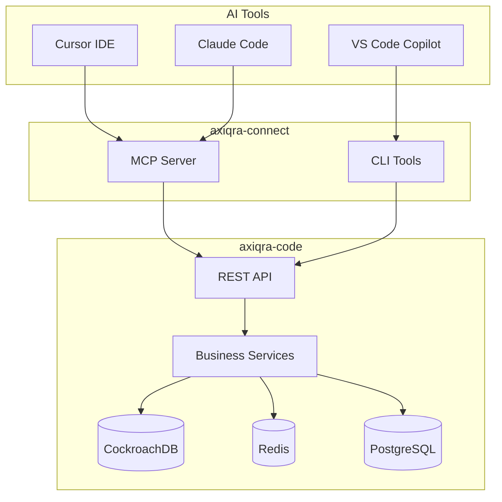

# Axiqra

Agent-ready engineering memory for AI coding tools and open-source maintainers.

Website: https://www.axiqra.com/

---

## Language / 语言

| Language | Docs |
|---|---|
| [English](docs/README.md) | All project documentation |
| [中文](i18n/README_zh.md) | 所有项目文档 |

---

## Quick Start

### Website (local development)

```bash
cd axiqra-project/axiqra-website
docker compose up -d
# http://127.0.0.1:8080
```

### Infrastructure (local middleware)

```bash
cd axiqra-project/axiqra-infra
cp .env.example .env   # fill in secrets
docker compose up -d
```

### Make targets

```bash
make website-up       # start website
make website-down     # stop website
make infra-up        # start infra
make infra-down      # stop infra
make infra-health    # health check
```

## Repository Structure

```text
axiqra-project/
  .github/           GitHub workflows and scripts
  axiqra-website/    public landing page and waitlist API
  axiqra-infra/      local dev middleware
  axiqra-code/       Java backend (Spring Boot)
  axiqra-connect/    AI tool integrations (MCP, CLI)
logo/                Axiqra logo assets
docs/                English documentation
i18n/                Chinese documentation
```

## Architecture



## Key Documentation

### English

- [README](docs/README.md) — project overview
- [Contributing](docs/CONTRIBUTING.md) — how to contribute
- [Open-Source Scope](docs/OPEN_SOURCE_SCOPE.md) — what is open
- [Roadmap](docs/ROADMAP.md) — development phases
- [Security Policy](docs/SECURITY.md) — security reporting
- [Code of Conduct](docs/CODE_OF_CONDUCT.md) — community rules

### 中文

- [项目介绍](i18n/README_zh.md)
- [贡献指南](i18n/CONTRIBUTING_zh.md)
- [开源范围](i18n/OPEN_SOURCE_SCOPE_zh.md)
- [路线图](i18n/ROADMAP_zh.md)
- [安全政策](i18n/SECURITY_zh.md)
- [行为准则](i18n/CODE_OF_CONDUCT_zh.md)

## API Documentation

When the backend is running, access Swagger UI at:
- http://localhost:8080/swagger-ui.html

### Key Endpoints

| Endpoint | Description |
|----------|-------------|
| `POST /search/before-act` | Search solutions before acting |
| `GET /solutions/{id}` | Get solution details |
| `POST /traces` | Submit engineering trace |
| `POST /v1/invocations` | Report AI tool invocation |
| `POST /v1/feedbacks` | Submit feedback |
| `GET /connect/doctor` | Connection diagnostics |

## Running Tests

### Java Backend

```bash
cd axiqra-project/axiqra-code
./mvnw test
```

### MCP Server (Node.js)

```bash
cd axiqra-project/axiqra-connect
npm install
npm test
```

## License

Apache License 2.0 — see [LICENSE](LICENSE)
