# Axiqra 产品闭环图谱

本文档用于补足《00-Axiqra产品介绍与全流程总览.md》中还没有显式展开的闭环图。

Axiqra 的图不应该按页面零散绘制，也不应该只按功能模块横向罗列。Axiqra 的图谱应该先回答一个问题：

```text
一次真实工程活动，如何变成下一次 AI、开发者、团队和企业都能复用的工程记忆？
```

因此，本文档采用三层结构：

| 层级 | 名称 | 作用 |
|---|---|---|
| L0 | 产品总闭环图 | 说明 Axiqra 的完整价值闭环 |
| L1 | 核心闭环图 | 说明每条关键闭环如何独立运转并回流总闭环 |
| L2 | 子图清单 | 说明后续需要继续补哪些流程图、序列图、状态图、泳道图 |

重要原则：

1. 每张子图必须接回一个或多个共享节点。
2. 每个闭环必须有输入、处理、输出、反馈和下一次增强。
3. 图不是为了说明“有这个功能”，而是说明“这个功能如何让系统变强”。
4. Engineering Trace Package、Project Case、Public Case、Solution、Invocation、Review、Authorization 是全图谱的核心共享节点。
5. 后续 Excel 拆功能点时，应从闭环节点继续拆，而不是从孤立页面继续拆。

## 1. L0 产品总闭环图

这是 Axiqra 最核心的一张图。

它表达的是：AI 工具执行真实工程任务前调用 Axiqra，执行后回传完整工程轨迹，平台把真实过程沉淀成 Case，再通过审查、脱敏、融合、验证，把 Case 进化为下一次可调用的 Solution。

```mermaid
flowchart LR
    U["用户 / 团队 / 企业"] --> T["工程任务"]
    T --> AI["外部 AI 工具"]
    AI --> CONN["Axiqra Connect / MCP / CLI / API / SDK"]
    CONN --> SEARCH["任务前搜索"]
    SEARCH --> RET["返回候选 Solution / Public Case / 风险提示"]
    RET --> FIT["适配判断"]
    FIT --> EXEC["AI 执行工程任务"]
    EXEC --> TRACE["生成 Engineering Trace Package / 工程轨迹包"]
    TRACE --> CONFIRM["用户确认结果"]
    CONFIRM --> PKG["Case Package 提交格式"]
    PKG --> PC["Project Case"]
    PC --> CHOICE["私有保存 / 脱敏公开 / 参与融合"]
    CHOICE --> REVIEW["AI 初审 / 规则审查 / 认证审查"]
    REVIEW --> PUB["Public Case"]
    REVIEW --> CAND["Candidate Solution"]
    PUB --> SOL["Solution"]
    CAND --> SOL
    SOL --> INV["Invocation 调用记录"]
    INV --> FB["worked / failed / partial / not_applicable"]
    FB --> SOL
    FB --> REVIEW
    SOL --> SEARCH
```

这张图里真正的闭环不是一条线，而是三个回流：

| 回流 | 含义 |
|---|---|
| `Solution -> Search` | 新方案进入下一次任务前调用 |
| `Project Case / Engineering Trace -> Search` | 私有工程轨迹进入下一次复用、排错、回滚或复盘 |
| `Invocation / Feedback -> Solution` | 真实调用结果修正方案可信度和适用边界 |
| `Feedback -> Review` | 线上失败或争议触发复核、降级、隔离或分叉 |

## 2. 全图谱共享节点

所有子图都应该复用这些节点。后续画子图时，如果某张图完全不连接这些节点，就说明它可能只是页面说明，不是产品闭环的一部分。

| 节点 | 含义 | 典型来源 | 典型去向 |
|---|---|---|---|
| User | 个人开发者、团队成员、企业用户、贡献者、审核者 | 注册、邀请、认证、企业 SSO | 任务、授权、贡献、审查 |
| AI Tool | Cursor、Claude Code、Codex、Gemini CLI、企业 Agent | Connect 接入 | Search、Execute、Return |
| Connect | MCP、CLI、API、SDK、Rule、Skill、doctor | 用户配置 | 搜索、回传、鉴权 |
| Search | 任务前检索和推荐 | AI Tool、用户手动搜索 | Solution、Public Case、Candidate Seed |
| Engineering Trace Package | 一次工程活动的完整轨迹包，包含正向、反向、决策、证据、回滚和演化路径 | AI 执行、用户确认、证据采集 | Case Package、Project Case、Review |
| Project Case | 原始、私有、完整工程过程 | Engineering Trace Package / Case Package 回传 | 私有复用、脱敏、融合 |
| Public Case | 脱敏后的公开学习案例 | Project Case 脱敏和审查 | 学习、引用、融合 |
| Solution | 可被 AI 调用的标准工程方案 | Public Case、Candidate Solution、维护者融合 | Search、Invocation、版本进化 |
| Invocation | 某次真实调用记录 | AI 调用 Solution | worked、failed、partial、not_applicable |
| Feedback | 调用后的真实反馈 | 用户确认、AI 自检、测试结果 | Solution 更新、Review 复核 |
| Review | AI 初审、规则审查、人工复审、认证审查、仲裁 | 提交、反馈、申诉 | 发布、降级、隔离、驳回 |
| Authorization | 可见范围、可信等级、授权范围 | 用户、团队、企业管理员 | 搜索预过滤、公开、训练、商业授权 |
| Contribution Ledger | 贡献账本、积分、认证、权益 | Case、Review、Invocation | 认证、权益、收益池 |
| Audit Log | 审计日志 | 权限变化、调用、发布、删除、撤回 | 企业审计、争议处理、合规导出 |

## 3. L1 核心闭环总览

下表不是产品大类，而是闭环视角。一个产品主线可能参与多个闭环，一个闭环也会横跨多个产品主线。

| 编号 | 闭环 | 核心问题 | 回流点 |
|---:|---|---|---|
| 1 | AI 接入闭环 | 外部 AI 如何可靠接入 Axiqra | doctor 结果回到接入配置 |
| 2 | 任务前调用闭环 | AI 做任务前如何先用历史工程记忆 | Invocation 回到检索排序 |
| 3 | 工程轨迹回传闭环 | 一次真实工程如何变成可追溯、可验证、可复用的完整工程轨迹 | 轨迹质量回到回传模板和下一次复用 |
| 4 | Project Case 闭环 | 私有工程经验如何沉淀为个人 / 团队记忆 | 私有复用回到下一次搜索 |
| 5 | Public Case 闭环 | 私有过程如何脱敏为公开学习资产 | 阅读、引用、反馈回到案例质量 |
| 6 | Solution 进化闭环 | 多个 Case 如何融合成可调用方案 | worked / failed 回到版本升级 |
| 7 | Candidate Seed 闭环 | 无命中场景如何由维护者、认证者和大众共同补齐覆盖范围 | 缺口统计和真实回传回到 Solution 供给 |
| 8 | 审查治理闭环 | 内容如何按风险分层自动通过、拒绝、提升审核、发布、降级或仲裁 | 线上反馈回到复核 |
| 9 | 授权可信闭环 | 可见、可信、授权如何分离并持续生效 | 撤回、删除、审计回到权限过滤 |
| 10 | 团队企业闭环 | 团队和企业如何优先复用内部记忆，并可选择组织内共享或脱敏公开 | 空间优先级和内部 Invocation 回到排序 |
| 11 | 认证身份闭环 | 贡献者如何形成可验证能力档案并升级为认证开发者 / 审核者 | 审核结果回到认证权重 |
| 12 | 商业生态闭环 | 产品使用如何变成生态、API、企业和评测价值 | 收入和授权数据回到平台供给 |

## 4. 闭环 1：AI 接入闭环

AI 接入闭环解决的是“外部工具如何稳定地用上 Axiqra”。

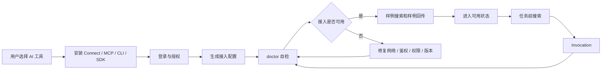

关联子图：

| 子图 | 图类型 | 说明 |
|---|---|---|
| Connect 安装流程图 | 流程图 | 从选择工具到生成配置 |
| OAuth / Token 授权序列图 | 序列图 | 用户、Axiqra、AI 工具之间的授权过程 |
| doctor 自检状态图 | 状态图 | 网络、版本、权限、搜索、回传能力检测 |
| 接入失败修复图 | 流程图 | 常见失败原因和修复路径 |

## 5. 闭环 2：任务前调用闭环

任务前调用闭环解决的是“AI 在动手前先查真实工程方案”。

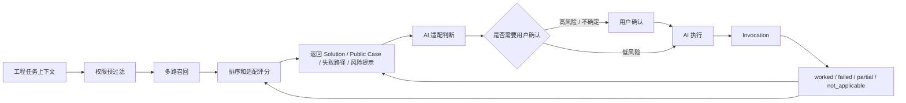

关联子图：

| 子图 | 图类型 | 说明 |
|---|---|---|
| 搜索推荐流程图 | 流程图 | 权限过滤、多路召回、排序、返回 |
| AI 调用 Solution 序列图 | 序列图 | AI Tool、Axiqra Search、用户之间的调用过程 |
| 高风险确认泳道图 | 泳道图 | AI、用户、平台在高风险任务中的职责 |
| 推荐排序反馈图 | 数据流图 | Invocation 如何影响下一次排序 |

## 6. 闭环 3：工程轨迹回传闭环

工程轨迹回传闭环解决的是“真实工程过程如何被记录为完整、可追溯、可验证的工程轨迹”。

这里的核心资产不是 Rule / Skill。Rule / Skill 是 AI 工具侧如何搜索、调用、执行和回传的辅助资产。Axiqra 要沉淀的是完整工程轨迹。

Engineering Trace Package 是工程轨迹包。Case Package 可以作为它的提交格式之一，Project Case 是它沉淀后的资产形态。

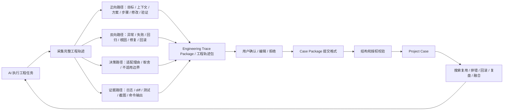

关联子图：

| 子图 | 图类型 | 说明 |
|---|---|---|
| Engineering Trace Package 生成序列图 | 序列图 | AI 工具如何采集正向、反向、决策、证据、回滚和演化路径 |
| 用户确认流程图 | 流程图 | 确认、编辑、拒绝、稍后处理 |
| 工程轨迹结构校验状态图 | 状态图 | draft、valid、invalid、needs_user_input、authorized |
| 正向 / 反向路径图 | 流程图 | 成功执行路径和失败反推路径如何同时保存 |
| 工程轨迹质量评分图 | 规则图 | 完整度、证据、验证、可复用性、可回滚性 |

## 7. 闭环 4：Project Case 闭环

Project Case 闭环解决的是“原始私有工程过程如何成为可复用的内部记忆”。

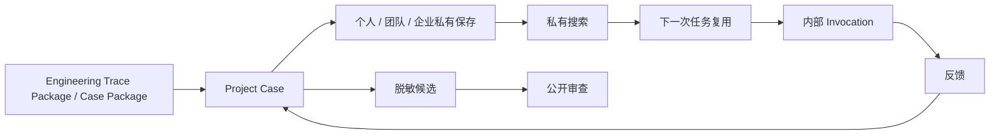

关联子图：

| 子图 | 图类型 | 说明 |
|---|---|---|
| Project Case 生命周期图 | 状态图 | draft、private、archived、deleted、redaction_candidate |
| 私有搜索流程图 | 流程图 | 个人、团队、企业空间内的检索 |
| Project Case 权限图 | 权限图 | owner、member、admin、viewer、auditor |
| 私有复用序列图 | 序列图 | 私有 Case 如何被 AI 调用但不公开 |

## 8. 闭环 5：Public Case 闭环

Public Case 闭环解决的是“私有经验如何变成公开学习材料”。

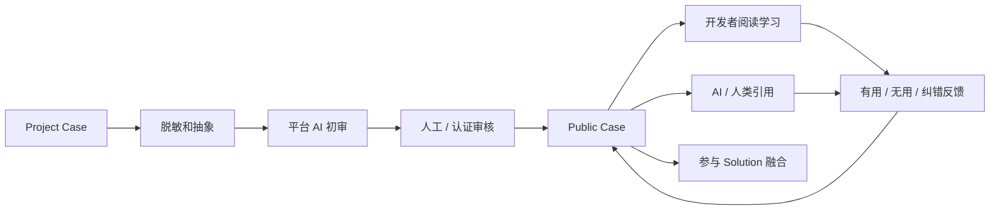

关联子图：

| 子图 | 图类型 | 说明 |
|---|---|---|
| 脱敏流程图 | 流程图 | 删除私密路径、Token、客户名、内网信息 |
| Public Case 审查序列图 | 序列图 | 投稿、初审、复审、发布 |
| Public Case 阅读反馈图 | 流程图 | 收藏、引用、纠错、评论、标注 |
| 公开案例状态图 | 状态图 | submitted、reviewed、published、quarantined、deprecated |

## 9. 闭环 6：Solution 进化闭环

Solution 进化闭环解决的是“案例如何变成 AI 真正可调用的标准方案”。

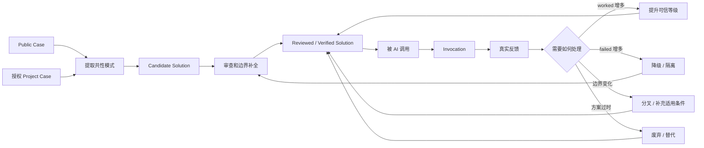

关联子图：

| 子图 | 图类型 | 说明 |
|---|---|---|
| Solution 生命周期图 | 状态图 | candidate、reviewed、verified、stable、deprecated |
| Case 融合流程图 | 流程图 | 多个 Case 如何融合为一个 Solution |
| Solution 版本图 | 版本图 | fork、merge、supersede、rollback |
| 失败反馈复核图 | 流程图 | failed 如何触发降级、隔离或修正 |

## 10. 闭环 7：Candidate Seed 覆盖闭环

Candidate Seed 闭环解决的是“没有现成答案时，系统如何知道下一步该补什么”。

第一阶段可以由维护者、认证开发者和认证审核者认领，保证冷启动质量。后续必须允许大众创建和补充，因为真实工程问题的确认者往往就是普通开发者、团队成员和企业用户。

正确口径是：

```text
低门槛创建，高门槛进入可信资产。
```

大众可以创建 Candidate Seed、补充真实 Case、提交验证结果；但要进入高权重搜索、公开 Solution 或 AI 大规模调用，需要通过基础质量门槛、风险分层和必要审查。

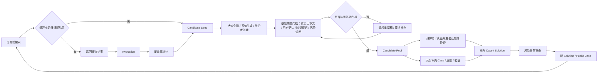

关联子图：

| 子图 | 图类型 | 说明 |
|---|---|---|
| 无命中处理流程图 | 流程图 | 搜索不足时如何提示和记录 |
| Candidate Seed 生命周期图 | 状态图 | draft、community_submitted、qualified、claimed、in_progress、resolved、closed |
| 大众创建与质量门槛流程图 | 流程图 | 普通用户如何创建、补充、验证并进入候选池 |
| 维护者认领流程图 | 泳道图 | 用户、维护者、认证开发者、平台之间的认领和协作关系 |
| 覆盖率看板图 | 数据流图 | 哪些领域缺方案、哪些方案低质量 |

## 11. 闭环 8：审查治理闭环

审查治理闭环解决的是“内容如何从提交走到可信发布，并在上线后继续被复核”。

审查不应该一刀切。特别低风险内容可以由 AI 初审后直接通过、直接拒绝或要求补充；AI 不确定、风险升高、授权不清或影响真实工程安全时，再提升到人工审核、认证开发者审查或多轮审查。

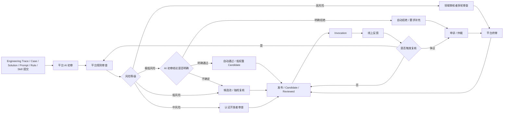

关联子图：

| 子图 | 图类型 | 说明 |
|---|---|---|
| AI 初审序列图 | 序列图 | 结构、敏感信息、危险命令、幻觉风险检查 |
| 风险分层审核流程图 | 流程图 | 极低、低、中、高风险分别如何自动通过、拒绝、抽检或提升审核 |
| 多轮审查泳道图 | 泳道图 | AI、规则、人工、认证、领域、平台终审 |
| 申诉仲裁流程图 | 流程图 | 驳回、降级、隔离后的申诉处理 |
| 上线后复核图 | 流程图 | failed、举报、边界争议如何触发复审 |

## 12. 闭环 9：授权可信闭环

授权可信闭环解决的是“可见、可信、授权三件事如何分离并持续生效”。

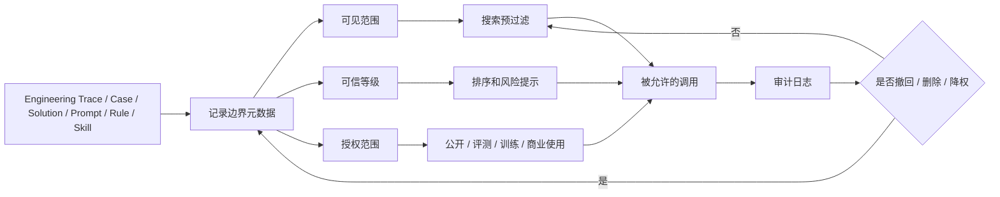

关联子图：

| 子图 | 图类型 | 说明 |
|---|---|---|
| 授权字段关系图 | 数据模型图 | visibility、trust、license_scope 等字段关系 |
| 权限预过滤流程图 | 流程图 | 搜索前如何过滤不可见和未授权内容 |
| 撤回和删除流程图 | 流程图 | 授权撤回、删除、影响传播 |
| 企业审计序列图 | 序列图 | 管理员如何查看调用、导出、追踪 |

## 13. 闭环 10：团队企业闭环

团队企业闭环解决的是“组织如何拥有自己的工程记忆，不依赖公开训练，也不泄露私有资产”。

团队和企业内容不是只能内部使用，也可以在授权、脱敏和审查后公开。搜索和推荐的默认逻辑应该是按用户当前位置优先排序：

```text
当前项目 -> 小组 / Squad -> 团队 -> 企业 / 组织 -> 已授权公共内容 -> 普通公共内容
```

也就是说，先权限过滤，再按空间距离和适配度排序。用户处于哪个空间，系统就优先返回哪个空间的记忆。

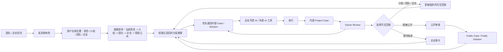

关联子图：

| 子图 | 图类型 | 说明 |
|---|---|---|
| 团队空间权限图 | 权限图 | owner、admin、member、viewer、auditor |
| 空间优先级搜索排序图 | 数据流图 | 当前项目、小组、团队、企业和公共内容如何排序 |
| 企业私有记忆流程图 | 流程图 | 内部 Project Case 到内部 Solution |
| Owner Review 泳道图 | 泳道图 | 负责人如何确认内部资产质量 |
| 组织内共享与公开贡献图 | 流程图 | 企业如何选择小组、团队、企业内可见或脱敏公开 |

## 14. 闭环 11：认证身份闭环

认证身份闭环解决的是“谁有资格审查，审查权重如何被真实结果持续校正”。

认证身份还应预留可验证能力档案和认证凭证能力，用于页面、权限、审核权重和公开验证。对外叙事可以保持克制，产品和数据结构需要知道它存在。

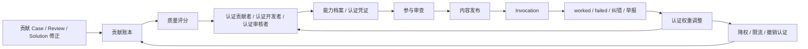

关联子图：

| 子图 | 图类型 | 说明 |
|---|---|---|
| 认证路线图 | 路线图 | 普通用户到认证审核者和 Maintainer |
| 能力档案与认证凭证页面图 | 页面关系图 | 认证领域、等级、有效期、复核周期、撤销状态和公开验证入口 |
| 贡献账本数据流图 | 数据流图 | Case、Review、Invocation 如何进入账本 |
| 审查权重调整图 | 规则图 | worked / failed 如何影响认证权重 |
| 反作弊流程图 | 流程图 | 灌水、抄袭、刷 worked、恶意审核处理 |

## 15. 闭环 12：商业生态闭环

商业生态闭环解决的是“产品价值如何变成可持续商业供给，同时反哺工程记忆层”。

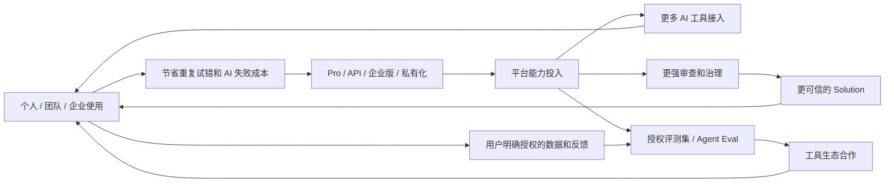

关联子图：

| 子图 | 图类型 | 说明 |
|---|---|---|
| 计费权益流程图 | 流程图 | 免费、Pro、团队、企业、API 权益 |
| 授权数据商业使用图 | 流程图 | 授权、收益池、撤回、结算 |
| Agent Eval 数据流图 | 数据流图 | 授权工程方案如何形成评测集 |
| 生态合作闭环图 | 流程图 | AI 工具、插件、市场、企业合作 |

## 16. 子图之间的关联方式

后续不要把子图编号成互不相干的清单，而要给每张图标记它接入哪些共享节点。

示例：

| 子图 | 输入节点 | 输出节点 | 回流节点 |
|---|---|---|---|
| OAuth / Token 授权序列图 | User、AI Tool | Connect、Authorization | doctor |
| 搜索推荐流程图 | Search、Authorization | Solution、Public Case、Candidate Seed | Invocation |
| Engineering Trace Package 生成序列图 | AI Tool、Execution | Engineering Trace Package、Project Case | 工程轨迹质量评分 |
| 脱敏流程图 | Project Case、Authorization | Public Case | Review |
| Case 融合流程图 | Public Case、Project Case | Candidate Solution、Solution | Invocation |
| 多轮审查泳道图 | Review、Risk | Published、Rejected、Quarantined | Feedback |
| 撤回和删除流程图 | Authorization、Audit Log | Filter、Search | Audit Log |
| 认证路线图 | Contribution Ledger | Certification、Review Power | Feedback |
| 空间优先级搜索排序图 | Team Space、Authorization、Search | Internal Solution、Public Solution | Internal Invocation |
| Agent Eval 数据流图 | Authorized Data | Evaluation Dataset | Tool Ecosystem |

## 17. 后续图谱产出顺序

建议按下面顺序补齐，不要从页面图开始。

| 顺序 | 产物 | 原因 |
|---:|---|---|
| 1 | 产品总闭环图 | 先统一所有图的共同语言 |
| 2 | 12 个核心闭环图 | 先证明产品不是线性流程，而是多闭环系统 |
| 3 | 核心资产生命周期图 | Engineering Trace Package、Project Case、Public Case、Solution 是产品骨架 |
| 4 | 审查治理泳道图 | 审查链路决定可信度和平台边界 |
| 5 | 授权可信关系图 | 可见、可信、授权必须先画清楚 |
| 6 | AI 调用和工程轨迹回传序列图 | 说明外部 AI 工具到底怎么接、怎么查、怎么回传完整工程轨迹 |
| 7 | 团队企业分层搜索与公开贡献闭环图 | 决定 B 端价值、空间优先级和数据安全叙事 |
| 8 | 认证身份和贡献生态图 | 决定供给侧如何持续增长 |
| 9 | 商业生态和 Agent Eval 图 | 决定未来商业化路径 |
| 10 | 页面和功能点拆解图 | 最后再落到页面、API、状态、权限、Excel |

## 18. 对功能点拆解的影响

闭环图谱会直接影响后续 Excel 的结构。

Excel 不应该只包含：

```text
模块 -> 页面 -> 功能点
```

更合理的结构是：

```text
闭环 -> 共享节点 -> 二级路线 -> 页面 / API / 数据对象 / 权限 / 状态 / 测试点
```

建议 Excel 后续字段至少包含：

| 字段 | 说明 |
|---|---|
| 一级闭环 | 属于哪个核心闭环 |
| 共享节点 | 接入哪个产品共享节点 |
| 二级路线 | 具体业务路线 |
| 功能点 | 可交付功能 |
| 用户角色 | 谁使用 |
| 触发条件 | 什么情况下发生 |
| 输入 | 数据、操作或上下文来源 |
| 输出 | 生成什么结果 |
| 状态变化 | 涉及哪些生命周期状态 |
| 路径类型 | 正向路径、反向路径、决策路径、证据路径、回滚路径、演化路径 |
| 权限要求 | 是否受可见、可信、授权边界影响 |
| 审查要求 | 是否需要 AI 初审、人工复审、认证审查 |
| 质量门槛 | 是否达到大众提交、候选池、公开发布或高权重调用门槛 |
| 空间优先级 | 当前项目、小组、团队、企业、授权公共、普通公共的排序位置 |
| 认证影响 | 是否影响能力档案、认证凭证、审核权重或公开验证 |
| 反馈回流 | 结果如何影响下一次搜索、排序、审查或认证 |
| 页面 | 对应前端页面 |
| API | 对应接口 |
| 数据对象 | 对应实体和字段 |
| 测试点 | 如何验证 |
| 优先级 | P0 / P1 / P2 / P3 |
| 版本 | MVP / Beta / V1 / V2 / Enterprise |

## 19. 总结

Axiqra 的图谱核心不是“画很多图”，而是画清楚一套连续增强系统。

它的根闭环是：

```text
AI 调用真实方案 -> 执行真实任务 -> 回传完整工程轨迹 -> 沉淀真实 Case -> 审查和脱敏 -> 融合为 Solution -> 被下一次 AI 调用 -> 用真实反馈继续进化
```

所有子图都应该服务于这个根闭环。

如果一张图不能说明它如何让 Engineering Trace Package、Project Case、Public Case、Solution、Invocation、Review、Authorization 这些核心节点变强，那它暂时就不应该优先画。
