# Axiqra 用户、AI Agent 与人类学习双主线流程

版本：重构版 v0.2  
状态：Draft  
所属体系：D05 / 18  
上游文档：D01 文档总索引与来源继承表、D02 产品核心定位、阶段边界与设计原则、D03 完整原型与页面体系说明、D04 MVP 实施范围与版本路线、00-Axiqra产品闭环图谱  
下游文档：D06 工程记忆对象模型与数据预留规范、D07 Case / Public Case / Project Case 内容规范、D08 Solution 生命周期、状态机与验证等级、D09 AI 工具接入、对话式自动接入、MCP、API、CLI 与插件协议、D12 搜索、索引、推荐、排序与评测体系、D13 权限、空间、数据隔离与企业空间方案、D14 内容治理、审核、可信来源与污染隔离机制

## 1. 文档定位

本文档定义 Axiqra 中用户、外部 AI Agent 和人类学习之间的核心业务流程。

它回答以下问题：

1. 外部 AI 工具如何在任务前调用 Axiqra。
2. AI 执行工程任务后如何生成 Engineering Trace Package。
3. 用户如何确认、编辑、拒绝或回传工程轨迹。
4. Project Case 如何沉淀为个人、团队或企业记忆。
5. Project Case 如何脱敏、授权、审查并形成 Public Case。
6. Public Case 如何服务人类学习。
7. Case 和反馈如何推动 Solution 演进。
8. 搜索无命中时如何进入 Candidate Seed。
9. 内容如何按风险分层进入 AI 初审、抽检、人工审核、认证审核或仲裁。
10. 团队和企业空间如何影响搜索、复用、共享和公开贡献。

本文档不定义对象字段、页面布局、接入协议和治理制度细则。

| 不展开内容 | 归属文档 |
|---|---|
| 对象字段、枚举、表结构 | D06 |
| Case、Public Case、Project Case 内容模板 | D07 |
| Solution 状态机、验证等级、版本关系 | D08 |
| MCP、CLI、API、SDK、接入包协议 | D09 |
| 搜索召回、排序、评测实现 | D12 |
| 权限、空间、租户、企业隔离 | D13 |
| 审核制度、反作弊、污染隔离 | D14、D15、D16 |
| 页面布局和交互细节 | D03 |

## 2. 核心原则

D05 的所有流程必须遵守以下原则：

1. AI 任务前先查真实工程记忆。
2. AI 执行后回传完整工程轨迹，而不是只回传结论。
3. 用户必须能确认、编辑、拒绝或延后提交工程轨迹。
4. Case Package 是提交格式，不是主资产。
5. Engineering Trace Package 是工程轨迹包，Project Case 是沉淀后的资产形态。
6. Public Case 面向人类学习，Solution 面向 AI 调用和人类复用。
7. Candidate Seed 允许大众创建，但必须通过质量门槛进入可信体系。
8. 审查按风险分层，不做一刀切人工审核。
9. 团队和企业优先复用自己的工程记忆，但可以在授权、脱敏和审查后公开贡献。
10. 任何公开、训练、评测、商业使用和收益资格都必须受授权边界控制。

## 3. 共享角色和节点

### 3.1 核心角色

| 角色 | 在流程中的作用 |
|---|---|
| 个人开发者 | 搜索、学习、接入 AI 工具、确认工程轨迹、保存 Project Case、贡献 Public Case |
| AI 工具用户 | 通过 Cursor、Claude Code、Codex、Gemini CLI、企业 Agent 等工具调用 Axiqra |
| 团队成员 | 在团队空间内复用、沉淀、共享 Project Case 和 Team Solution |
| Team Owner / Tech Lead | 审核团队资产、做 Owner Review、决定组织内共享或脱敏公开 |
| 企业管理员 | 管理租户、权限、审计、授权、导出、删除、公开边界 |
| 普通贡献者 | 创建 Candidate Seed、补充 Case、提交反馈、参与公开学习 |
| 认证开发者 / 认证审核者 | 参与中高风险内容审查、修正边界、提升内容可信度 |
| Solution Maintainer | 维护 Solution 版本、融合 Case、处理废弃、降级和分叉 |
| 平台 AI 审查器 | 进行结构、敏感信息、危险命令、重复内容和基础风险初审 |
| 平台治理角色 | 处理申诉、仲裁、污染隔离、严重争议和高风险终审 |

### 3.2 核心共享节点

| 节点 | 说明 |
|---|---|
| AI Tool | 外部 AI 编程工具或企业自研 Agent |
| Connect Session | 对话式自动接入、授权、doctor 自检和绑定状态 |
| Search Context | 工程任务目标、技术栈、错误、环境、风险要求和用户空间 |
| Search Result | Solution、Public Case、Project Case、Candidate Seed、风险提示 |
| Invocation | 一次 AI 或人调用 Solution / Case 的记录 |
| Engineering Trace Package | 一次工程活动的完整轨迹包 |
| Case Package | Engineering Trace Package 的提交格式之一 |
| Project Case | 私有或受限空间内的工程记录 |
| Public Case | 授权、脱敏、审查后的公开学习案例 |
| Candidate Seed | 无命中、低覆盖或大众补充的候选种子 |
| Candidate Solution | 尚未完全验证或维护完成的候选方案 |
| Solution | AI 可调用、可反馈、可演进的工程方案 |
| Feedback | worked、failed、partial、not_applicable、needs_review |
| Review | AI 初审、规则审查、抽检、人工审核、认证审核、仲裁 |
| Authorization | 可见范围、可信等级、授权范围 |
| Contribution Ledger | 贡献、学习、审核、反馈、认证和权益归因 |

## 4. L0 总流程图

双主线不是两条互不相干的线。

Axiqra 的产品流程应理解为：

```text
AI 调用线 + 人类学习线 + 工程资产回流线
```

AI 调用线负责让外部 AI 在工程任务前先用历史工程记忆。  
人类学习线负责让开发者理解真实工程过程和判断。  
工程资产回流线负责把每一次真实工程活动沉淀为下一次可复用资产。

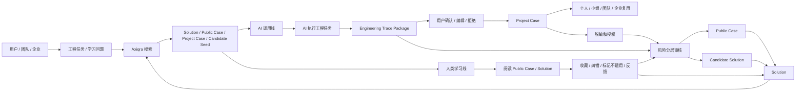

## 5. 流程分层

D05 按以下层级组织流程：

| 层级 | 流程 | 作用 |
|---|---|---|
| L0 | 总流程 | 说明 AI、人类、资产回流如何汇合 |
| L1 | 主流程 | AI 调用、工程轨迹回传、人类学习、Public Case、Solution |
| L2 | 异常分支 | 无命中、无权限、高风险、用户拒绝、审核失败、反馈失败 |
| L3 | 状态流 | Engineering Trace、Candidate Seed、Review、Project Case、Public Case、Solution |
| L4 | 跨文档交接 | 把流程交给 D06、D07、D08、D09、D12、D13、D14 细化 |

## 6. AI Agent 任务前调用流程

### 6.1 目标

AI Agent 任务前调用流程解决的是：

```text
AI 在真正动手前，先查询真实工程方案、失败路径和适用边界。
```

### 6.2 主流程图

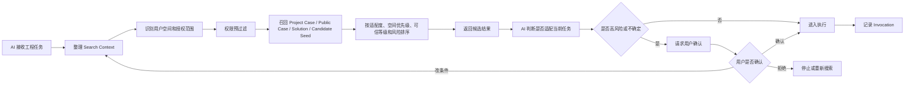

### 6.3 序列图

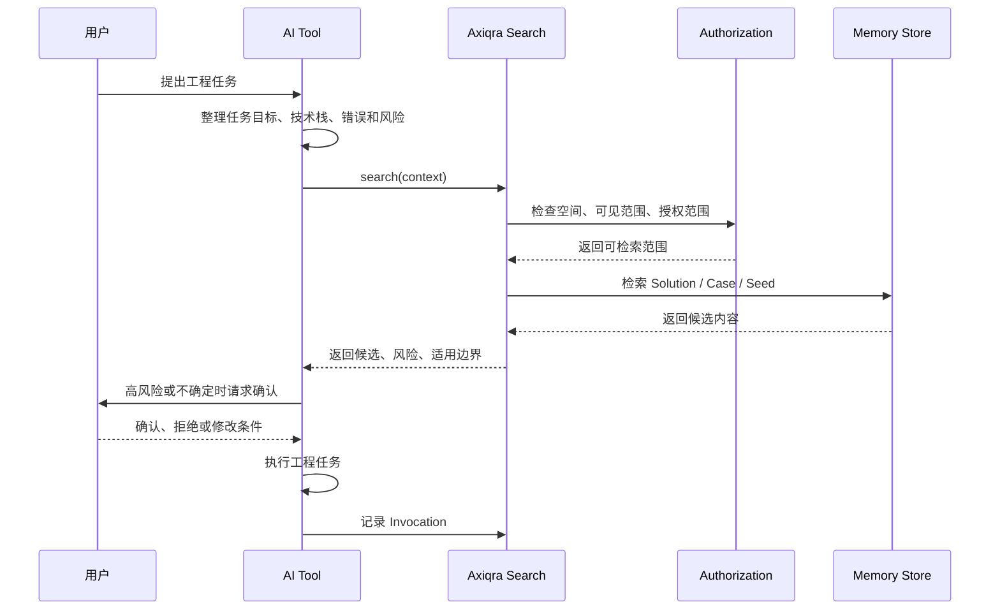

### 6.4 空间优先级排序

任务前搜索必须先做权限预过滤，再做空间优先级排序。

```text
当前项目 -> 小组 / Squad -> 团队 -> 企业 / 组织 -> 已授权公共内容 -> 普通公共内容
```

| 层级 | 说明 | 搜索表现 |
|---|---|---|
| 当前项目 | 当前仓库、项目或工作区已有 Project Case | 最高优先级 |
| 小组 / Squad | 小组内部共享资产 | 高优先级 |
| 团队 | 团队空间内 Project Case 和 Team Solution | 高优先级 |
| 企业 / 组织 | 企业内授权可见资产 | 中高优先级 |
| 已授权公共内容 | 当前用户或企业明确可用的公共资产 | 中优先级 |
| 普通公共内容 | Public Case 和公开 Solution | 基础优先级 |

### 6.5 异常分支

| 异常 | 处理 |
|---|---|
| 无命中 | 进入 Candidate Seed 流程 |
| 低覆盖 | 返回低覆盖提示，并允许创建 Candidate Seed |
| 无权限 | 可以提示存在不可见结果，但不得泄露内容 |
| 高风险 | 要求用户确认或进入人工确认 |
| 结果不适配 | AI 应重新搜索或标记 not_applicable |
| 接入不可用 | 进入 doctor 修复或降级到 CLI / API |
| 搜索结果冲突 | 返回多个候选，并要求用户或 AI 选择适配理由 |

## 7. AI 执行与 Engineering Trace Package 回传流程

### 7.1 目标

工程轨迹回传流程解决的是：

```text
一次真实工程活动，如何被记录为可追溯、可验证、可复用的完整工程轨迹。
```

Engineering Trace Package 必须覆盖：

1. 正向路径：目标、上下文、选用方案、执行步骤、修改内容、验证结果。
2. 反向路径：异常、失败、回归、根因、修复点、回滚过程。
3. 决策路径：为什么选这个方案，为什么不用另一个方案，边界是什么。
4. 证据路径：日志、diff、测试、截图、命令输出、用户确认。
5. 回滚路径：失败后如何恢复、撤销、降级或绕行。
6. 演化路径：这次经验如何进入 Project Case、Public Case、Solution 或 Candidate Seed。

### 7.2 主流程图

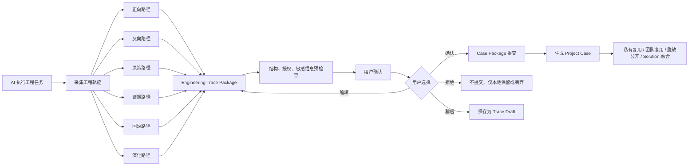

### 7.3 序列图

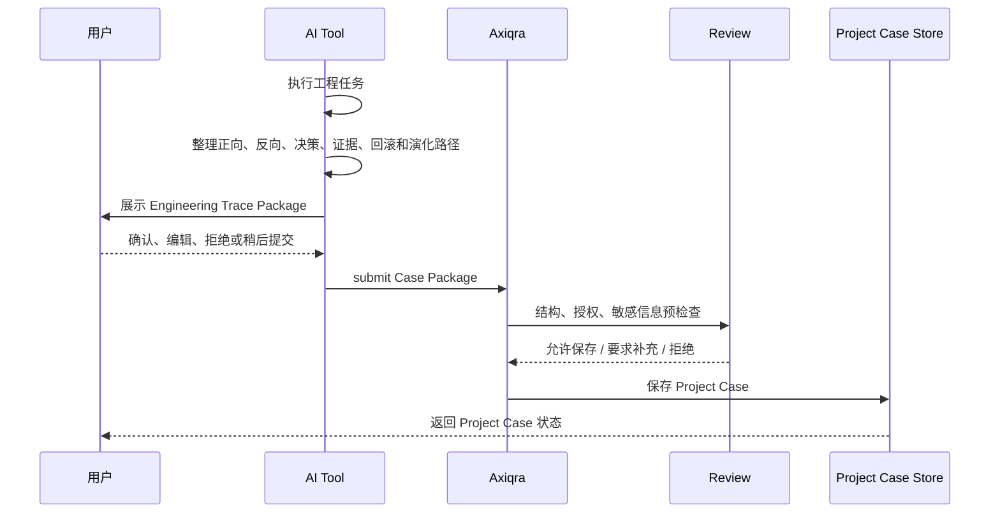

### 7.4 Engineering Trace 状态流

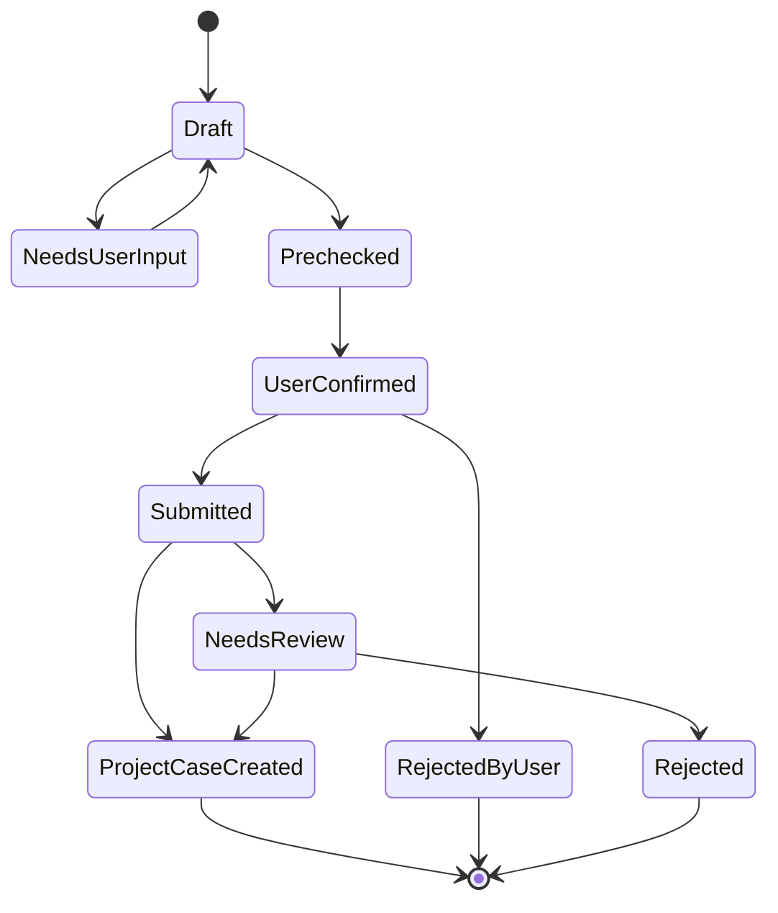

| 状态 | 含义 |
|---|---|
| Draft | AI 或用户生成的工程轨迹草稿 |
| NeedsUserInput | 缺少用户确认、上下文、证据或授权 |
| Prechecked | 已通过基础结构和敏感信息预检查 |
| UserConfirmed | 用户确认可提交 |
| Submitted | 已以 Case Package 等格式提交 |
| ProjectCaseCreated | 已生成 Project Case |
| NeedsReview | 需要平台或人工复核 |
| RejectedByUser | 用户拒绝提交 |
| Rejected | 平台拒绝保存或进入可信体系 |

## 8. Project Case 沉淀与私有复用流程

### 8.1 目标

Project Case 流程解决的是：

```text
工程轨迹如何成为个人、团队或企业空间内的可复用工程记忆。
```

### 8.2 主流程图

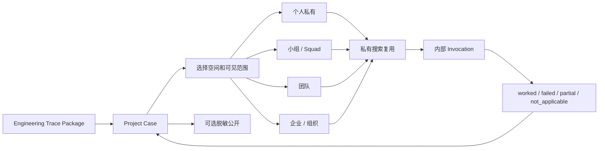

### 8.3 可见范围

| 可见范围 | 说明 | 默认策略 |
|---|---|---|
| private | 仅本人或个人空间可见 | Project Case 默认值 |
| workspace | 当前工作空间成员可见 | 团队协作时使用 |
| enterprise | 企业内授权可见 | 企业空间默认 |
| public | 脱敏审核后公开可见 | 必须明确授权 |
| public_case_allowed | 允许脱敏生成 Public Case | 必须明确授权 |
| solution_merge_allowed | 允许参与 Solution 融合 | 必须明确授权 |

## 9. Project Case 到 Public Case 流程

### 9.1 目标

Public Case 流程解决的是：

```text
私有工程经验如何在授权、脱敏和审查后成为公开学习资产。
```

### 9.2 主流程图

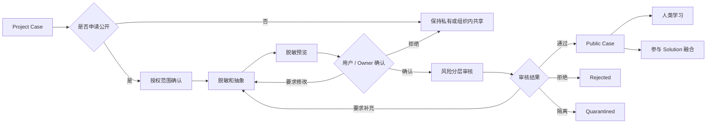

### 9.3 Public Case 必须保留的学习内容

| 内容 | 说明 |
|---|---|
| 工程目标 | 当时要解决什么问题 |
| 技术栈和环境 | 版本、依赖、部署环境、约束 |
| 问题现场 | 报错、现象、影响范围 |
| 排查时间线 | 先看了什么，再判断什么 |
| 失败假设 | 哪些方向尝试过但不成立 |
| 根因判断 | 最终为什么确定根因 |
| 修复步骤 | 具体怎么做 |
| 验证方式 | 如何证明已经解决 |
| 风险和回滚 | 如果失败如何恢复 |
| 学习总结 | 给人类开发者看的工程判断 |

## 10. 人类学习主线流程

### 10.1 目标

人类学习流程解决的是：

```text
开发者如何通过真实工程过程学习判断，而不是只看最终答案。
```

### 10.2 主流程图

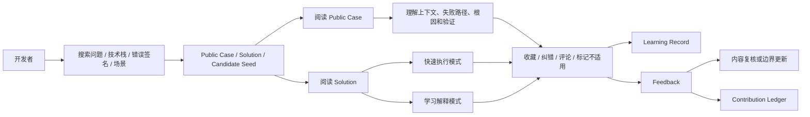

### 10.3 学习模式和执行模式

| 模式 | 面向对象 | 展示重点 |
|---|---|---|
| 快速执行模式 | 高级开发者、AI 工具 | 前置条件、步骤、验证、回滚、风险 |
| 学习解释模式 | 新人、学习型开发者、转岗开发者 | 为什么这样判断、常见误区、失败路径、自检问题 |
| 复盘模式 | 团队、Tech Lead | 影响范围、决策过程、后续改进、团队规范 |

### 10.4 学习反馈类型

| 反馈 | 作用 |
|---|---|
| useful | 内容对学习或执行有帮助 |
| confusing | 内容表达不清，需要补充 |
| wrong | 内容有错误，进入复核 |
| outdated | 内容过时，进入维护队列 |
| not_applicable | 当前场景不适用，应更新边界 |
| needs_review | 用户认为需要人工复核 |

## 11. Candidate Seed 无命中和覆盖补齐流程

### 11.1 目标

Candidate Seed 流程解决的是：

```text
没有合适答案时，Axiqra 如何诚实记录覆盖缺口，并让大众、维护者和认证者共同补齐。
```

### 11.2 主流程图

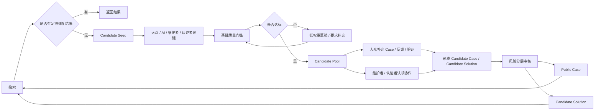

### 11.3 质量门槛

Candidate Seed 支持低门槛创建，但进入可信体系必须满足基础质量门槛。

| 门槛 | 说明 |
|---|---|
| 真实上下文 | 不是泛泛提问，必须有工程现场或明确任务 |
| 用户确认 | 创建者确认该问题真实存在 |
| 验证证据 | 至少包含日志、报错、截图、测试、代码片段或复现描述 |
| 风险说明 | 标记是否涉及生产、数据、安全、权限、支付等风险 |
| 授权边界 | 明确可见范围和是否允许公开、融合、评测 |
| 重复检查 | 与已有 Candidate Seed、Public Case、Solution 做查重 |

### 11.4 Candidate Seed 状态流

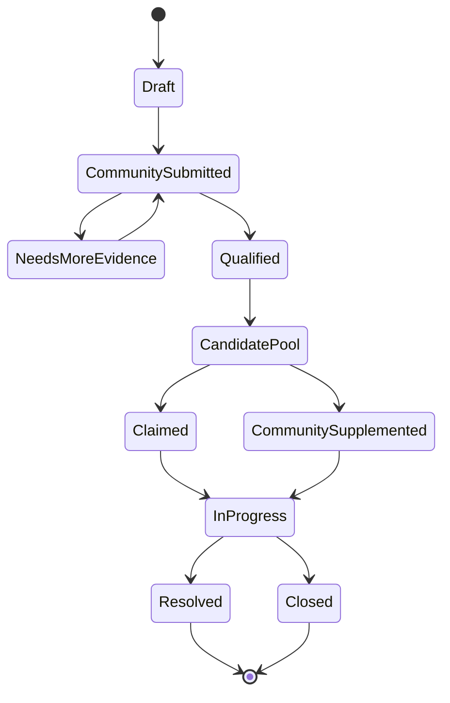

## 12. 风险分层审核流程

### 12.1 目标

风险分层审核流程解决的是：

```text
不同风险内容如何用不同审核成本处理，既保证社区飞轮速度，也保证可信边界。
```

### 12.2 主流程图

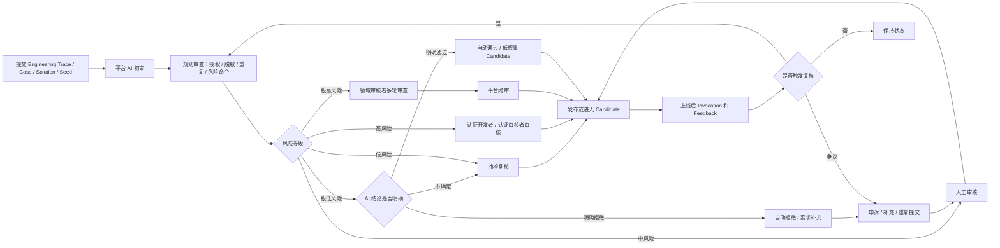

### 12.3 风险处理矩阵

| 风险 | 示例 | 处理 |
|---|---|---|
| 极低风险 | 文档格式、学习总结、低风险本地开发经验 | AI 自动通过、拒绝或要求补充 |
| 低风险 | 常见开发环境问题、非生产配置、学习型案例 | 候选池、抽检复核 |
| 中风险 | 架构改动、依赖升级、权限配置、CI/CD 变更 | 人工审核或认证开发者审核 |
| 高风险 | 生产部署、数据库迁移、安全配置、支付链路 | 认证审核者或领域审核者审核 |
| 极高风险 | 数据删除、生产流量切换、核心业务状态变更 | 多轮审查、平台终审、必要时仲裁 |

### 12.4 审核结果

| 结果 | 含义 |
|---|---|
| approved | 通过 |
| candidate | 进入候选池，低权重展示 |
| needs_more_evidence | 需要补充证据 |
| needs_redaction | 需要继续脱敏 |
| rejected | 拒绝 |
| quarantined | 隔离，仅治理角色可见 |
| escalated | 提升到更高级别审核 |
| appealed | 进入申诉或仲裁 |

## 13. Solution 演进流程

### 13.1 目标

Solution 演进流程解决的是：

```text
多个真实 Case 如何融合为 AI 可调用、可反馈、可维护、可降级的标准方案。
```

### 13.2 主流程图

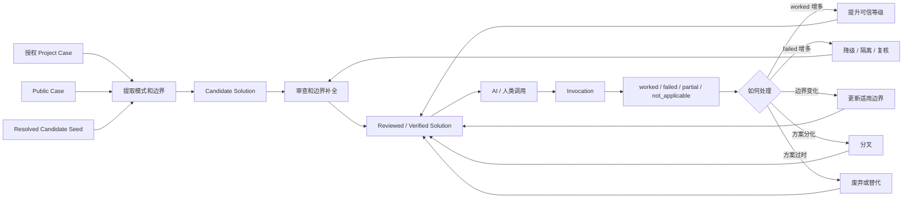

### 13.3 Feedback 影响

| Feedback | 对 Solution 的影响 |
|---|---|
| worked | 增加有效调用样本，可能提升可信等级 |
| partial | 提示步骤或边界不完整 |
| failed | 触发复核、降级、隔离或版本修正 |
| not_applicable | 不算失败，但必须更新适用边界 |
| needs_review | 进入人工复核或认证审核 |

## 14. 团队和企业复用流程

### 14.1 目标

团队企业流程解决的是：

```text
组织如何优先复用自己的工程记忆，并在授权后选择组织内共享或脱敏公开。
```

### 14.2 主流程图

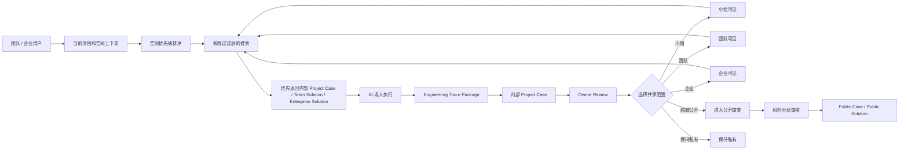

### 14.3 团队企业关键规则

| 规则 | 说明 |
|---|---|
| 默认内部优先 | 当前项目、小组、团队、企业资产优先于公共内容 |
| 默认不公开 | 企业和团队内容不自动公开 |
| 授权后可公开 | 明确授权、脱敏和审查后可贡献为 Public Case 或公共 Solution 证据 |
| 审计必须存在 | 登录、调用、导出、删除、授权、审核都应有 Audit Log |
| Owner Review | 团队或企业负责人可以决定组织内共享和公开申请 |

## 15. 贡献和认证身份流程

### 15.1 目标

贡献和认证流程在 D05 中只定义业务流关系，不定义积分、收益和认证规则细节。

详细制度进入 D15 和 D16。

### 15.2 主流程图

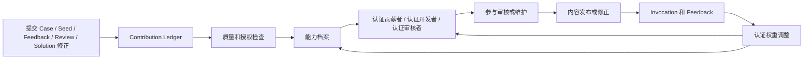

### 15.3 页面和数据预留

| 预留 | 说明 |
|---|---|
| 能力档案 | 领域、贡献类型、审核记录、维护记录、质量评分 |
| 认证凭证 | 认证等级、有效期、复核周期、撤销状态、公开验证入口 |
| 审核权重 | 由后续 worked / failed、纠错、举报和复核结果持续调整 |
| 反作弊状态 | 抄袭、刷量、灌水、恶意审核等需要影响认证和权益 |

## 16. 关键异常流程

| 场景 | 触发条件 | 处理 |
|---|---|---|
| 搜索无命中 | 没有足够适配结果 | 进入 Candidate Seed |
| 搜索低覆盖 | 结果不足或验证等级低 | 展示覆盖不足，允许补充 Seed |
| 无权限结果 | 存在不可见内容 | 提示存在受限内容，不泄露详情 |
| AI 判断不适配 | 候选方案不符合上下文 | 重新搜索或标记 not_applicable |
| 高风险执行 | 生产、数据、安全、支付等 | 要求用户确认或人工审核 |
| 工程轨迹缺证据 | 没有验证、日志或用户确认 | NeedsUserInput 或 needs_more_evidence |
| 用户拒绝回传 | 用户认为轨迹不准确或不想保存 | 不提交，或本地保留草稿 |
| 脱敏失败 | 存在敏感字段或授权不清 | 返回脱敏流程 |
| 审核拒绝 | 质量低、危险、未授权、重复 | Rejected，可申诉或补充 |
| 上线后 failed 增多 | Invocation 反馈失败 | 复核、降级、隔离或分叉 |
| 认证审核失误 | 审核内容后续多次 failed 或被举报 | 降低审核权重，必要时暂停认证 |

## 17. 流程和页面交接

D05 不定义页面布局，但每条流程都必须能在 D03 页面体系中找到承接。

| 流程 | 页面承接 |
|---|---|
| AI 接入 | `/connect`、接入抽屉、doctor 状态 |
| 任务前搜索 | `/search`、首页搜索、Solution 详情页 |
| 工程轨迹确认 | 工程轨迹确认页、Project Case 详情页、演示台 |
| Project Case 私有复用 | `/profile`、`/team`、企业空间 |
| Public Case 学习 | `/cases`、`/case/:id` |
| Solution 调用 | `/solutions`、`/solution/:id` |
| Candidate Seed | `/coverage`、搜索空结果、列表空结果 |
| 风险分层审核 | 内容治理后台、脱敏审核后台、风险分层审核页 |
| 团队企业复用 | `/team`、`/enterprise`、空间优先级搜索页 |
| 贡献和认证 | 贡献者中心、能力档案、认证凭证页 |

## 18. 流程和对象交接

| 流程节点 | D06 需要定义的对象 |
|---|---|
| Search Context | Search Query、Workspace、Project、Authorization |
| Search Result | Solution、Public Case、Project Case、Candidate Seed |
| Invocation | Invocation、Feedback |
| Engineering Trace Package | Trace、Evidence、Decision、Rollback、Validation |
| Case Package | 提交格式、导入导出格式、schema_version |
| Project Case | Project Case、Visibility、Authorization |
| Public Case | Public Case、Redaction、Source、Review |
| Solution | Solution、Solution Version、Validation Level、Risk Level |
| Candidate Seed | Seed、Coverage Gap、Claim、Quality Gate |
| Review | Review、Risk、Appeal、Quarantine |
| Contribution Ledger | Contribution Event、Certification、Reward Eligibility |
| Audit Log | Audit Event、Actor、Target、Action、Result |

## 19. 流程和协议交接

| 流程节点 | D09 需要定义的协议能力 |
|---|---|
| Connect Session | 创建接入会话、授权码、过期时间、状态 |
| search | AI 工具任务前搜索 |
| get_solution | 拉取 Solution 执行视图 |
| submit_trace | 提交 Engineering Trace Package / Case Package |
| submit_feedback | 提交 worked / failed / partial / not_applicable |
| doctor | 检测鉴权、网络、版本、搜索、回传能力 |
| fallback | MCP 不可用时降级到 CLI / REST API |

## 20. 流程和治理交接

| 流程节点 | D14 / D15 / D16 需要定义 |
|---|---|
| 风险分层审核 | 审核策略、队列、权限、时限、升级规则 |
| AI 初审 | 检查项、拒绝项、自动通过边界 |
| 认证审核 | 认证角色、领域、权重、有效期、降权和撤销 |
| 申诉仲裁 | 申诉入口、仲裁角色、处理状态 |
| 反作弊 | 抄袭、刷 worked、重复提交、恶意审核 |
| 贡献账本 | 积分、权益、收益池资格、认证影响 |

## 21. MVP 和后续阶段边界

| 阶段 | D05 流程要求 |
|---|---|
| P0 完整原型 | 所有主流程可见，复杂能力可灰态 |
| S1 MVP | 搜索、Public Case、Solution、Engineering Trace Package、Project Case、接入、反馈、基础审核必须跑通 |
| S2 团队协作 | 团队空间、Owner Review、Team Solution、团队学习复盘真实启用 |
| S3 企业可信 | 企业空间、权限、审计、企业内部 Solution、私有内容治理启用 |
| S4 规模化生态 | 搜索评测、Agent Eval、数据授权、贡献生态和商业闭环扩展 |

## 22. 验收清单

D05 通过验收，需要满足：

1. 能看清 AI 工具从任务前搜索到执行后的工程轨迹回传。
2. 能看清用户如何确认、编辑、拒绝和提交 Engineering Trace Package。
3. 能看清 Project Case 如何私有复用、组织内共享和脱敏公开。
4. 能看清 Public Case 如何服务人类学习。
5. 能看清 Candidate Seed 如何从无命中进入大众创建、质量门槛和维护协作。
6. 能看清风险分层审核如何区分自动处理、抽检、人工、认证和多轮审查。
7. 能看清 Solution 如何从 Case、Invocation 和 Feedback 中演进。
8. 能看清团队和企业如何按空间优先级复用内部记忆。
9. 能看清贡献、认证、能力档案和审核权重之间的流转关系。
10. 每条流程都能交接到 D06、D07、D08、D09、D12、D13、D14 等后续文档。

## 23. 总结

D05 的核心不是把页面点击路径写成说明书，而是把 Axiqra 的工程记忆流转讲清楚：

```text
AI 任务前调用真实方案
-> AI 执行真实工程任务
-> 回传完整工程轨迹
-> 用户确认后形成 Project Case
-> 授权、脱敏和风险分层审核
-> 形成 Public Case 和 Solution
-> 人类学习、AI 再调用、团队复用
-> Invocation 和 Feedback 推动下一轮演进
```

这条流程成立，Axiqra 才不是知识库、提示词库或普通社区，而是 AI Agent 时代的工程方案记忆层。

## 24. 流程节点到 v0.2 开发规格映射

本节用于把 D05 的流程图继续落到 D06-D18 的开发规格，后续扩 Excel 时优先按此表拆功能点。

| D05 流程节点 | 需要落到的规格 | 对应文档 | Excel 拆解方向 |
|---|---|---|---|
| 用户创建接入会话 | Connect Session 状态、tool capability、token scope、doctor 检测 | D09、D10、D13 | 接入功能、API、权限、错误码 |
| AI 任务前搜索 | 查询理解、权限预过滤、多路召回、排序解释、Invocation | D12、D13、D08 | 搜索功能、排序规则、评测用例 |
| AI 获取 Solution | AI 执行视图、风险等级、确认策略、失败路径 | D08、D09 | Solution 详情、调用确认、风险提示 |
| AI 执行工程任务 | 外部工具执行，Axiqra 只记录上下文和调用 | D02、D09、D10 | Invocation、审计、工具接入 |
| 生成 Engineering Trace Package | forward_path、reverse_path、decision_path、evidence、rollback | D06、D07 | Trace 字段、校验、证据上传 |
| 用户确认回传 | confirmed / edited / rejected / later 状态 | D03、D06、D09 | 前端确认页、提交 API、暂存重试 |
| 形成 Project Case | 私有保存、空间可见性、授权边界、审计 | D06、D07、D13 | Case 管理、权限、删除导出 |
| 申请 Public Case | 脱敏清单、授权范围、Review 队列 | D07、D13、D14 | 发布申请、脱敏预检、审核台 |
| 生成或更新 Solution | 提取规则、状态迁移、验证等级、版本 | D08、D12、D14 | Solution 生命周期、合并分叉、等级更新 |
| 提交 Feedback | worked / failed / partial / not_applicable 影响规则 | D08、D12、D15 | Feedback API、排序影响、贡献账本 |
| 创建 Candidate Seed | 无命中、质量门槛、大众创建、认领解决 | D05、D12、D16、D17 | Seed 创建、认领、关闭、覆盖率 |
| 团队企业复用 | 空间优先级、RBAC、ABAC、企业审计 | D13、D10、D11 | 团队空间、企业空间、权限验收 |
| 审核治理 | R0-R4、AI 初审、人工审核、申诉、隔离 | D14、D16 | 审核队列、Reason Code、申诉流程 |
| 贡献和认证 | Contribution Ledger、权益分层、认证凭证 | D15、D16 | 贡献记录、能力档案、反作弊 |

流程验收时不只看图是否完整，还要检查每个节点是否能追溯到对象、接口、权限、状态、审核和测试。
