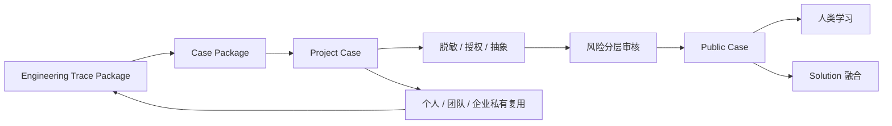

# Axiqra Case、Public Case 与 Project Case 内容规范

版本：重构版 v0.2  
状态：Draft  
所属体系：D07 / 18

## 1. 文档定位

本文档定义 Engineering Trace Package、Case Package、Project Case、Public Case 的内容结构、生成路径、脱敏路径、权限路径、人类学习路径和 AI 调用路径。

## 2. 四类内容的关系



| 类型 | 定义 | 默认可见 | 面向对象 |
|---|---|---|---|
| Engineering Trace Package | 一次工程活动完整轨迹 | 私有 | 回传、确认、沉淀 |
| Case Package | 工程轨迹提交格式 | 私有 | 提交、导入、导出 |
| Project Case | 原始私有工程案例 | 私有 / 团队 / 企业 | 私有复用、脱敏源 |
| Public Case | 脱敏公开学习案例 | 公共 | 人类学习、Solution 证据 |

## 3. Engineering Trace Package 内容结构

| 模块 | 必填 | 说明 |
|---|---|---|
| 工程目标 | 是 | 本次任务要解决什么 |
| 项目上下文 | 是 | 技术栈、版本、环境、约束 |
| 检索引用 | 否 | 调用了哪些 Solution / Case |
| 正向路径 | 是 | 正常执行步骤和验证 |
| 反向路径 | 否 | 从失败或异常反推根因 |
| 决策路径 | 是 | 选型、取舍、不适用边界 |
| 证据路径 | 是 | 日志、diff、测试、截图、命令输出 |
| 回滚路径 | 否 | 失败后的恢复方式 |
| 演化路径 | 否 | 是否适合生成 Public Case / Solution / Seed |
| 用户确认 | 是 | 确认、编辑、拒绝或稍后 |

## 4. Project Case 内容规范

Project Case 必须保留原始工程过程，但不能默认公开。

| 内容 | 要求 |
|---|---|
| 原始上下文 | 保留 |
| 原始证据 | 保留 |
| AI 对话摘要 | 保留 |
| 修改动作 | 保留 |
| 验证结果 | 保留 |
| 私有路径和客户信息 | 保留在私有空间，不公开 |
| 授权边界 | 必须记录 |
| 删除和导出 | 必须支持 |

## 5. Public Case 内容规范

Public Case 面向人类学习，必须让人看到工程思维。

| 内容 | 要求 |
|---|---|
| 问题现场 | 必须有 |
| 技术栈 | 必须有 |
| 排查时间线 | 必须有 |
| 失败假设 | 必须有 |
| 根因判断 | 必须有 |
| 修复步骤 | 必须有 |
| 验证方式 | 必须有 |
| 学习总结 | 必须有 |
| 私有数据 | 必须脱敏 |

## 6. 脱敏规则

| 敏感项 | 处理 |
|---|---|
| Token、密码、密钥 | 删除或替换为占位符 |
| 内网 IP | 删除或泛化 |
| 客户名 | 删除或替换为行业描述 |
| 仓库地址 | 删除或替换为匿名仓库 |
| 真实路径 | 泛化为相对路径 |
| 私有业务数据 | 删除或抽象 |
| 日志中的用户数据 | 删除、截断或脱敏 |

## 7. 审核规则

| 风险 | 审核要求 |
|---|---|
| 极低风险 | AI 自动通过 / 拒绝 / 要求补充 |
| 低风险 | 候选池或抽检 |
| 中风险 | 人工审核 |
| 高风险 | 认证开发者 / 认证审核者审核 |
| 极高风险 | 领域审核者多轮审核和平台终审 |

## 8. 示例结构

```text
标题：Spring Boot 接入 Redis 后连接池耗尽排查
场景：SaaS 后端服务，Redis 作为缓存
问题现场：接口延迟升高，Redis 连接数持续上涨
失败假设：网络抖动、Redis 服务端故障、连接池配置错误
根因：业务代码未正确释放异步任务中的连接
修复：调整连接池配置，修复连接释放逻辑
验证：压测 30 分钟，连接数稳定，接口 P95 恢复
回滚：恢复旧版本配置，禁用高风险异步任务
适用边界：适合 Lettuce / Jedis 连接池类问题，不适合 Redis 服务端容量不足
```

## 9. 验收标准

| 编号 | 验收内容 |
|---|---|
| AC-D07-001 | 用户能区分 Engineering Trace Package、Case Package、Project Case、Public Case |
| AC-D07-002 | Public Case 不包含私有敏感信息 |
| AC-D07-003 | Project Case 默认不公开 |
| AC-D07-004 | 脱敏发布必须经过用户或 Owner 确认 |
| AC-D07-005 | Public Case 必须能服务人类学习和 Solution 融合 |

## 10. Project Case 字段级内容规范

| 区块 | 字段 | 必填 | 说明 |
|---|---|---|---|
| 基本信息 | title | 是 | 私有案例标题 |
| 基本信息 | problem_summary | 是 | 问题摘要 |
| 基本信息 | project_context | 是 | 项目、技术栈、环境 |
| 工程路径 | forward_path | 是 | 正向执行路径 |
| 工程路径 | reverse_path | 条件必填 | 反向排查路径 |
| 工程路径 | decision_path | 是 | 决策和取舍 |
| 工程路径 | failure_path | 条件必填 | 失败尝试和误判 |
| 证据 | evidence_refs | 是 | 日志、diff、测试、截图 |
| 验证 | validation_result | 是 | 如何证明问题解决 |
| 风险 | risk_notes | 是 | 生产、数据、安全、权限风险 |
| 授权 | authorization_id | 是 | 公开、融合、评测、训练、商业使用 |
| 脱敏 | redaction_status | 是 | pending / approved / rejected |
| 审计 | confirmed_by | 是 | 谁确认保存 |

Project Case 是真实工程记忆，允许保留原始上下文，但必须受空间权限保护。

## 11. Public Case 页面结构

Public Case 既要能被人读懂，也要能被机器提取为 Solution 证据。

| 页面区块 | 内容 | 面向 |
|---|---|---|
| 标题和摘要 | 问题一句话、技术栈、风险等级 | 人类 / AI |
| 问题现场 | 现象、报错、影响范围 | 人类 |
| 环境上下文 | 框架、版本、部署、依赖 | 人类 / AI |
| 排查时间线 | 尝试顺序、证据、失败假设 | 人类 |
| 根因判断 | 为什么是这个根因 | 人类 / AI |
| 修复步骤 | 修改动作和执行过程 | 人类 / AI |
| 验证结果 | 测试、日志、指标、截图 | 人类 / AI |
| 失败路径 | 试过但不成立的方向 | AI |
| 适用边界 | 什么时候适用 | AI |
| 不适用边界 | 什么时候不要用 | AI |
| 学习总结 | 工程经验和注意事项 | 人类 |
| 来源和可信 | 来源、验证等级、审核状态 | 人类 / AI |

## 12. 脱敏检查清单

| 类型 | 检查方式 | 替换方式 |
|---|---|---|
| 密钥 | 正则 + AI 语义检查 | `<SECRET_REDACTED>` |
| Token | 正则 + 长字符串检测 | `<TOKEN_REDACTED>` |
| 邮箱 | 正则 | `<EMAIL_REDACTED>` |
| 手机号 | 正则 | `<PHONE_REDACTED>` |
| 客户名 | 用户确认 + AI 检查 | 行业或角色描述 |
| 内网 IP | 正则 | `<INTERNAL_IP>` |
| 真实域名 | 规则 + 用户确认 | `<PRIVATE_DOMAIN>` |
| 仓库地址 | URL 检测 | `<PRIVATE_REPOSITORY>` |
| 本地路径 | 路径模式 | 相对路径或 `<PRIVATE_PATH>` |
| 业务数据 | 用户确认 | 抽象样例 |

脱敏不是删除所有细节。要保留工程判断所需的技术上下文，同时移除可识别私有主体的信息。

## 13. Case 到 Solution 的提取规则

| 提取对象 | 从哪里来 | 进入 Solution 的条件 |
|---|---|---|
| problem_signature | 问题现场、错误签名 | 可泛化到多个场景 |
| applicability | 环境上下文、成功案例 | 有明确适用条件 |
| execution_steps | 修复步骤 | 可复现、可验证 |
| validation_steps | 验证结果 | 有客观证据 |
| failure_paths | 失败假设、误判 | 对 AI 有避坑价值 |
| rollback_steps | 回滚路径 | 高风险场景必填 |
| risk_notes | 风险说明 | 能指导确认策略 |

只有 Public Case 或获得授权的 Project Case 可以参与公开 Solution 融合。

## 14. 内容质量评分

| 维度 | 好 | 差 |
|---|---|---|
| 上下文 | 技术栈、环境、版本清楚 | 只有一句报错 |
| 证据 | 有日志、diff、测试、截图 | 只有“已解决” |
| 过程 | 有排查和失败路径 | 只有最终答案 |
| 边界 | 说明适用和不适用 | 过度泛化 |
| 脱敏 | 保留技术细节，移除私有信息 | 删除到无法学习或泄露隐私 |
| 可复用 | 能被提取为 Solution | 只适合一次性阅读 |
