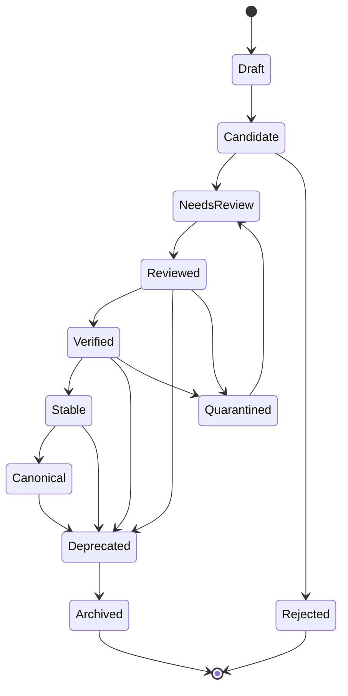
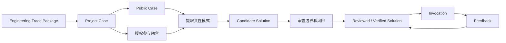
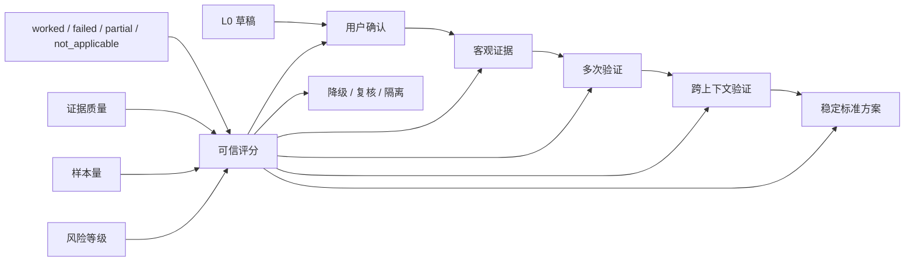

# Axiqra Solution 生命周期、状态机与验证等级

版本：重构版 v0.2  
状态：Draft  
所属体系：D08 / 18

## 1. 文档定位

本文档定义 Solution（工程方案记忆对象）的创建、聚合、调用、反馈、更新、合并、降级、归档、验证等级升级和污染隔离。

## 2. Solution 定义

Solution 不是文章，不是论坛回答，不是提示词模板。

Solution 是从真实 Case 中提取、经过审查、可被 AI 调用、可被反馈、可被持续验证和演进的工程方案记忆对象。

## 3. Solution 生命周期图

## 4. 状态定义

| 状态 | 定义 | AI 调用策略 |
|---|---|---|
| Draft | 草稿，不公开默认调用 | 不推荐 |
| Candidate | 候选，可参考 | 低权重 |
| Needs Review | 需要审核 | 不默认调用 |
| Reviewed | 已审核 | 可推荐，需提示等级 |
| Verified | 有验证证据 | 可推荐 |
| Stable | 多次验证稳定 | 高权重推荐 |
| Canonical | 多 Case 融合标准方案 | 高权重推荐 |
| Deprecated | 已过时或不推荐 | 仅历史参考 |
| Rejected | 被拒绝 | 不进入推荐 |
| Quarantined | 隔离 | 仅治理角色可见 |
| Archived | 归档 | 不默认调用 |

## 5. Case 到 Solution 聚合图

## 6. Verification Level

| 等级 | 名称 | 准入条件 | AI 调用策略 |
|---|---|---|---|
| L0 | 草稿 / 未验证 | 无真实验证 | 仅背景参考 |
| L1 | 用户确认 | 至少一次用户确认或 Project Case | 可低权重参考 |
| L2 | 客观证据验证 | 有测试、日志、CI、截图、PR 等证据 | 可候选推荐 |
| L3 | 多次验证 | 多个独立 Case 或可复现环境 | 可推荐 |
| L4 | 跨上下文验证 | 不同项目、团队或环境多次 worked | 高权重 |
| L5 | 稳定标准方案 | 多轮验证、维护者确认、低失败率 | Canonical 候选 |

## 7. 验证等级升级图

## 8. Feedback 规则

| Feedback | 影响 |
|---|---|
| worked | 增加有效样本 |
| partial | 补充边界或步骤 |
| failed | 触发复核、降级或隔离 |
| not_applicable | 更新适用边界，不计失败 |
| needs_review | 进入审核队列 |

## 9. Failure Path 关系

Failure Path（失败路径）是 Solution 的核心资产。

| 失败路径 | 作用 |
|---|---|
| 已尝试但不成立 | 防止 AI 重复错误方向 |
| 常见误判 | 提醒 AI 和用户 |
| 失败后的回滚 | 控制风险 |
| not_applicable 边界 | 改善推荐排序 |

## 10. 验收标准

| 编号 | 验收内容 |
|---|---|
| AC-D08-001 | Solution 状态机完整且能闭环 |
| AC-D08-002 | Verification Level 有明确准入条件 |
| AC-D08-003 | worked / failed / partial / not_applicable 影响规则清楚 |
| AC-D08-004 | 高风险内容不能因 L 等级高而自动执行 |
| AC-D08-005 | Deprecated 和 Quarantined 不进入默认推荐 |

## 11. 状态迁移触发条件

| 当前状态 | 目标状态 | 触发事件 | 必要条件 | 允许角色 |
|---|---|---|---|---|
| Draft | Candidate | submit_candidate | 内容结构完整，有来源 Case 或 Seed | Creator、Maintainer |
| Candidate | Needs Review | request_review | 风险等级不为 R0，或需要公开推荐 | Creator、Maintainer、System |
| Candidate | Rejected | reject_candidate | 缺证据、重复、无授权、明显错误 | Reviewer、System |
| Needs Review | Reviewed | approve_review | 审核通过，边界和风险完整 | Reviewer |
| Reviewed | Verified | attach_objective_evidence | 至少一条客观证据通过校验 | Maintainer、Reviewer |
| Verified | Stable | promote_stable | 多次 worked，失败率低于阈值 | Maintainer |
| Stable | Canonical | promote_canonical | 跨上下文验证，维护者确认 | Maintainer、Certified Reviewer |
| Reviewed | Deprecated | deprecate | 技术过时、替代方案出现 | Maintainer |
| Verified | Quarantined | quarantine | 高风险失败、未授权、污染信号 | Reviewer、System |
| Quarantined | Needs Review | reopen_review | 补证据、申诉通过或风险解除 | Reviewer |
| Deprecated | Archived | archive | 无继续维护价值 | Maintainer |

状态迁移约束：

1. `Rejected` 不能直接恢复为 `Reviewed`，必须重新创建 Candidate 或进入申诉。
2. `Quarantined` 不能被 AI 默认调用，即使 Verification Level 很高。
3. `Canonical` 可以降级，不能因为曾经稳定就永久高权重。
4. 每次迁移必须记录 reason_code、operator、evidence_refs、previous_state、new_state。

## 12. 验证等级评分维度

Verification Level 不是单纯靠点赞或 worked 次数升级，必须综合证据质量、样本独立性、失败反馈和风险等级。

| 维度 | 说明 | 示例 | 对等级影响 |
|---|---|---|---|
| evidence_quality | 证据质量 | 测试输出、CI、日志、PR、截图 | 决定能否超过 L1 |
| sample_count | 有效样本数 | 独立 worked 次数 | 决定能否超过 L2 |
| sample_independence | 样本独立性 | 不同项目、不同团队、不同环境 | 决定能否超过 L3 |
| failure_rate | 失败率 | failed / worked 比例 | 触发降级或复核 |
| not_applicable_rate | 不适用率 | 场景不匹配比例 | 调整适用边界 |
| recency | 新鲜度 | 最近验证时间 | 旧方案降权 |
| maintainer_review | 维护者确认 | 审核记录 | 提升可信 |
| risk_level | 风险等级 | R0-R4 | 限制自动调用 |

建议阈值：

| 等级 | 最低证据 | 最低样本 | 独立性 | 失败限制 |
|---|---|---|---|---|
| L0 | 无 | 0 | 无 | 不限制 |
| L1 | 用户确认 | 1 | 无 | 无重大 failed |
| L2 | 客观证据 | 1 | 无 | 无高风险 failed |
| L3 | 客观证据 | 3 | 至少 2 个上下文 | 失败需解释 |
| L4 | 客观证据 | 8 | 至少 3 个项目或团队 | 失败率低 |
| L5 | 客观证据 + 维护者确认 | 15 | 跨环境稳定 | 长期低失败率 |

S1 可以先做规则引擎，不强制做复杂机器学习评分。评分结果必须可解释。

## 13. Feedback 对等级的详细影响

| Feedback 类型 | 必填内容 | 对 Solution 的影响 | 是否进入 Review |
|---|---|---|---|
| worked | 上下文、执行结果、验证证据 | 增加有效样本，可能升级 | 否，异常高频时抽检 |
| partial | 哪部分有效、哪部分失败 | 不直接升级，要求补边界 | 条件进入 |
| failed | 失败步骤、错误、环境、是否可回滚 | 降权，达到阈值触发复核 | 是 |
| not_applicable | 不适用原因和上下文 | 更新不适用边界，不计失败 | 否 |
| needs_review | 风险说明、证据 | 暂停部分推荐 | 是 |

失败处理规则：

1. 高风险场景一次明确 failed 可以触发 `Needs Review` 或 `Quarantined`。
2. 低风险场景连续 failed 才触发降级。
3. `not_applicable` 不能被算作失败，但要影响搜索排序。
4. 未带 Invocation 的反馈不能修改等级，只能作为低可信信号。

## 14. Solution 内容结构

| 区块 | 必填 | 面向 AI | 面向人类 | 说明 |
|---|---|---|---|---|
| title | 是 | 是 | 是 | 简短说明解决什么问题 |
| problem_signature | 是 | 是 | 是 | 错误签名、症状、上下文 |
| applicability | 是 | 是 | 是 | 适用条件 |
| non_applicability | 是 | 是 | 是 | 不适用边界 |
| prerequisites | 是 | 是 | 是 | 前置条件和权限 |
| execution_steps | 是 | 是 | 是 | 执行步骤 |
| validation_steps | 是 | 是 | 是 | 验证步骤 |
| rollback_steps | 条件必填 | 是 | 是 | 高风险必须有 |
| failure_paths | 是 | 是 | 是 | 已知失败路径 |
| evidence_refs | 是 | 是 | 是 | 来源证据 |
| risk_notes | 是 | 是 | 是 | 风险提示 |
| prompt_rule_skill_refs | 否 | 是 | 否 | AI 工具执行资产 |
| human_learning_notes | 否 | 否 | 是 | 人类学习总结 |

AI 执行视图必须比人类学习视图更结构化，但不能隐藏风险、边界和回滚。

## 15. 合并、分叉与废弃规则

| 动作 | 场景 | 规则 |
|---|---|---|
| merge | 多个 Solution 本质相同 | 保留来源、贡献归因、证据链，生成新版本 |
| fork | 同一问题在不同技术栈或环境下差异明显 | 保留共同根源，生成独立分支 |
| supersede | 新方案明显替代旧方案 | 旧方案 Deprecated，新方案增加替代说明 |
| split | 一个 Solution 覆盖范围过大 | 拆成多个更精确 Solution |
| rollback | 新版本被证明有问题 | 恢复旧 active version，保留失败记录 |

禁止行为：

1. 禁止直接覆盖旧 Solution 内容而不生成版本。
2. 禁止删除失败路径来维持高等级。
3. 禁止把未经授权的 Project Case 作为公开证据展示。
4. 禁止把 Prompt / Rule / Skill 当作 Solution 主体。

## 16. AI 调用策略矩阵

| 状态 / 等级 | R0 低风险 | R1 轻风险 | R2 中风险 | R3 高风险 | R4 极高风险 |
|---|---|---|---|---|---|
| L0 Draft | 不推荐 | 不推荐 | 不推荐 | 不推荐 | 不推荐 |
| L1 | 低权重参考 | 低权重参考 | 需确认 | 不推荐 | 不推荐 |
| L2 | 可候选推荐 | 可候选推荐 | 需确认 | 不推荐 | 不推荐 |
| L3 | 可推荐 | 可推荐 | 需确认 | 只读参考 | 不推荐 |
| L4 | 高权重 | 高权重 | 需确认 | 只读参考 | 不推荐 |
| L5 | 高权重 | 高权重 | 需确认 | 只读参考 | 不推荐 |
| Quarantined | 不推荐 | 不推荐 | 不推荐 | 不推荐 | 不推荐 |

R2 以上永远不能静默执行。Axiqra 可以给 AI 工具建议，但是否执行必须由工具和用户确认。
