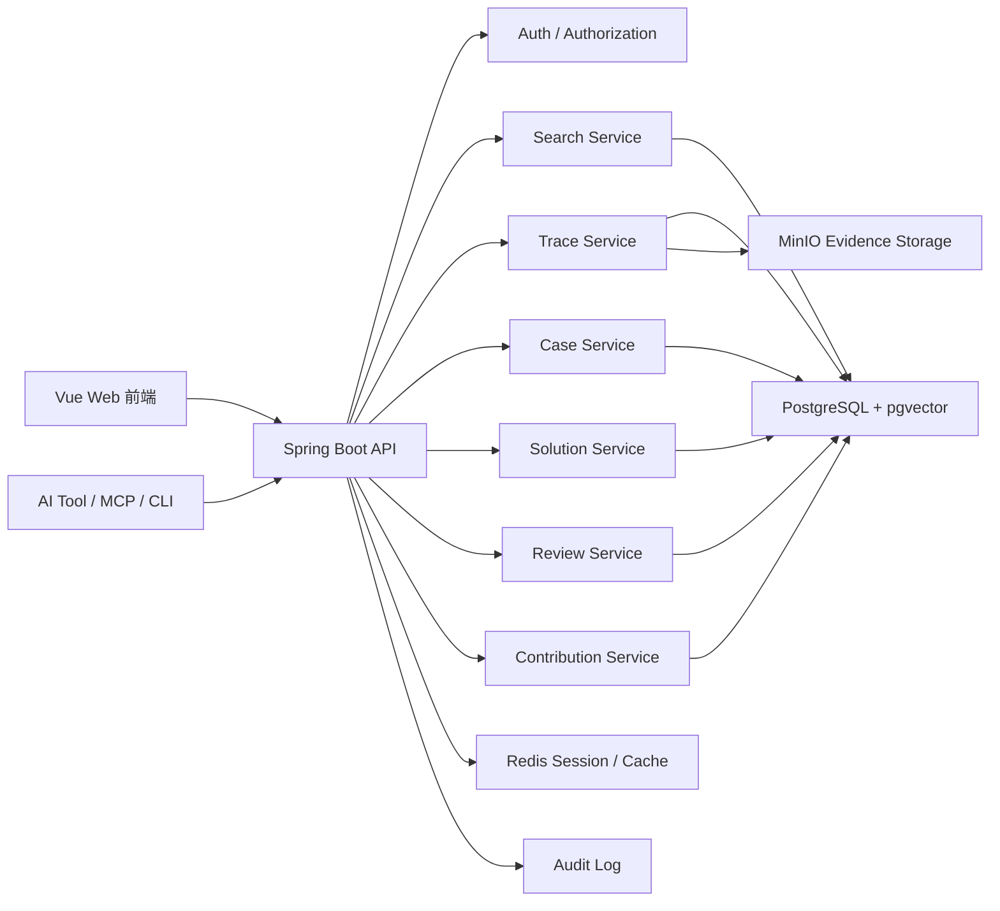
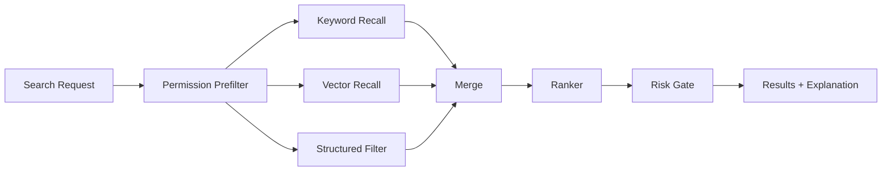

# Axiqra 技术架构设计说明书

版本：重构版 v0.2  
状态：Draft  
所属体系：D10 / 18

## 1. 文档定位

本文档定义 S1 MVP 的总体技术架构。它不定义终局百亿级搜索架构，规模化升级进入 D11 和 D12。

## 2. 架构原则

1. Axiqra 是工程方案记忆层，不是自动研发平台。
2. 外部 AI 工具负责执行，Axiqra 负责记忆、检索、回传、治理和反馈。
3. S1 采用模块化单体，保留后续拆分空间。
4. 权限预过滤必须先于搜索召回。
5. 私有数据默认不公开、不训练、不商业使用。

## 3. MVP 架构图

## 4. 模块划分

| 模块 | 责任 |
|---|---|
| Web Frontend | 页面、搜索、确认、审核、贡献、企业展示 |
| API Gateway | 鉴权、路由、限流、错误处理 |
| Auth Service | 登录、授权码、Token、空间权限 |
| Search Service | 权限预过滤、多路召回、排序 |
| Trace Service | Engineering Trace Package 接收、校验、确认 |
| Case Service | Project Case、Public Case、脱敏发布 |
| Solution Service | Solution 状态、版本、反馈、融合 |
| Review Service | AI 初审、人工审核、风险分层 |
| Contribution Service | 贡献账本、认证凭证、权益资格 |
| Audit Service | 审计日志 |

## 5. 数据存储

| 存储 | 用途 |
|---|---|
| PostgreSQL | 主对象、权限、状态、审计 |
| pgvector | S1 轻量向量检索 |
| Redis | 会话、缓存、接入状态 |
| MinIO | 日志、截图、diff、附件证据 |

## 6. 安全边界

| 边界 | 要求 |
|---|---|
| 权限预过滤 | 搜索前必须过滤不可见内容 |
| 脱敏 | 公开前必须脱敏 |
| 授权 | 评测、训练、商业使用必须明确授权 |
| 审计 | 调用、发布、删除、导出、审核必须记录 |
| 高风险 | 不能让 AI 自动执行生产级高风险操作 |

## 7. 验收标准

| 编号 | 验收内容 |
|---|---|
| AC-D10-001 | 架构支持搜索、接入、回传、Case、Solution、Review |
| AC-D10-002 | 权限预过滤在搜索前执行 |
| AC-D10-003 | Engineering Trace Package 能保存证据引用 |
| AC-D10-004 | 审计日志覆盖关键动作 |
| AC-D10-005 | 技术路线不锁死 S2-S4 升级 |

## 8. S1 技术栈建议

技术栈可以根据团队熟悉度微调，但 S1 不建议为了“未来很大”一开始就拆成复杂微服务。

| 层 | 建议 | 原因 |
|---|---|---|
| 前端 | Vue 3 + TypeScript | 页面体系复杂，适合组件化和类型约束 |
| 后端 | Spring Boot | 适合权限、审核、企业空间、审计类业务 |
| 数据库 | PostgreSQL | 对象关系复杂，事务和查询稳定 |
| 向量检索 | pgvector | S1 足够，避免过早上独立向量库 |
| 缓存 | Redis | 会话、接入状态、搜索缓存、限流 |
| 对象存储 | MinIO 或兼容 S3 | 日志、截图、diff、证据附件 |
| 搜索增强 | PostgreSQL FTS + pgvector | S1 做混合召回 |
| 异步任务 | Spring Task / Queue 预留 | S1 可轻量，S2 再独立队列 |
| 审计 | 独立 Audit 表 + append only | 保证可追溯 |

## 9. 模块边界和服务职责

| 模块 | 输入 | 输出 | 不能做什么 |
|---|---|---|---|
| Connect Module | 接入会话、工具能力、doctor 结果 | 接入状态、指令、token scope | 不直接读取私有数据 |
| Search Module | task_goal、context、权限上下文 | ranked results、risk hints | 不绕过权限预过滤 |
| Trace Module | Engineering Trace Package | Project Case 候选、缺失项 | 不直接公开内容 |
| Case Module | Project Case、Public Case | 案例详情、发布申请 | 不自行提升 Solution 等级 |
| Solution Module | Case 证据、Feedback、Review | Solution、Version、AI 执行视图 | 不跳过审核发布高风险方案 |
| Review Module | Review Target、Risk Signal | 审核决策、隔离、复核 | 不修改授权边界 |
| Authorization Module | license_scope、visibility_scope | policy decision | 不保存业务内容 |
| Ledger Module | 贡献事件 | 贡献账本、认证输入 | 不直接发放复杂收益 |
| Audit Module | 所有关键动作 | immutable audit record | 不被业务删除影响 |

每个模块必须有单独的领域对象和应用服务，避免所有业务逻辑堆在 Controller。

## 10. 数据表映射草案

| 表 | 对应对象 | S1 必须 | 说明 |
|---|---|---|---|
| users | User | 是 | 用户基础信息 |
| workspaces | Workspace | 是 | 个人、团队、企业、公共空间 |
| workspace_members | Membership | 是 | 成员和角色 |
| projects | Project | 是 | 项目归属 |
| connect_sessions | Connect Session | 是 | 对话式接入状态 |
| tool_tokens | Tool Token | 是 | 工具授权和 scope |
| engineering_traces | Engineering Trace Package | 是 | 工程轨迹主表 |
| trace_steps | Forward / Reverse Path | 是 | 路径步骤 |
| evidences | Evidence | 是 | 证据引用 |
| project_cases | Project Case | 是 | 私有案例 |
| public_cases | Public Case | 是 | 公开案例 |
| solutions | Solution | 是 | 方案主表 |
| solution_versions | Solution Version | 是 | 版本快照 |
| invocations | Invocation | 是 | 调用记录 |
| feedbacks | Feedback | 是 | 调用反馈 |
| candidate_seeds | Candidate Seed | 是 | 无命中候选 |
| reviews | Review | 是 | 审核记录 |
| authorizations | Authorization | 是 | 授权边界 |
| audit_logs | Audit Log | 是 | 审计日志 |
| contribution_ledgers | Contribution Ledger | 预留 | 贡献归因 |
| certification_credentials | Certification Credential | 预留 | 认证凭证 |

## 11. 搜索与索引管线

开发要求：

1. 权限预过滤必须在召回前执行，不能召回后再遮盖。
2. 搜索结果必须说明来源：Solution、Public Case、Project Case、Candidate Seed。
3. 排序必须使用可解释字段：fit_score、verification_level、risk_level、recency、space_priority。
4. Quarantined、Rejected、Removed 默认不进入结果。
5. 企业空间搜索不得把企业内容泄露到公共召回。

## 12. 异步任务与 Outbox

S1 可先用轻量异步，但必须预留任务表，避免长任务阻塞用户请求。

| 任务 | 触发 | 处理 |
|---|---|---|
| evidence_scan | Evidence 上传 | 敏感信息扫描 |
| redaction_precheck | 申请公开 | 脱敏初检 |
| review_enqueue | 内容提交 | 进入审核队列 |
| index_refresh | Case / Solution 变更 | 更新搜索索引 |
| feedback_aggregate | Feedback 提交 | 更新统计和等级候选 |
| audit_export | 企业导出 | 后台生成导出包 |

Outbox 规则：

1. 业务写入和 outbox 事件必须同事务。
2. 事件处理失败可重试。
3. 重试必须幂等。
4. 事件处理结果要写入可观测日志。

## 13. 可观测性与审计

| 类型 | 记录内容 | 用途 |
|---|---|---|
| Request Log | request_id、user_id、path、status、latency | 排障 |
| Audit Log | actor、action、target、result、reason | 合规和追溯 |
| Policy Decision Log | subject、object、action、decision、policy_version | 权限排障 |
| Search Log | query_hash、result_count、top_result_type、latency | 搜索质量 |
| AI Invocation Log | tool、target、risk、confirmation | AI 调用治理 |
| Review Log | reviewer、decision、risk、reason | 审核质量 |

敏感信息不得直接进入普通日志。日志需要区分业务审计和技术排障。

## 14. 环境和部署分层

| 环境 | 用途 | 数据要求 |
|---|---|---|
| local | 开发自测 | 本地样例数据 |
| dev | 联调 | 可重置测试数据 |
| staging | 验收 | 脱敏真实结构数据 |
| production | 正式 | 完整审计和备份 |

生产要求：

1. 数据库每日备份，重要对象支持恢复。
2. MinIO 证据文件有生命周期和访问权限。
3. Redis 不作为核心数据来源。
4. 后端必须支持配置化开关：公共发布、企业功能、认证功能、自动审核阈值。
5. 关键配置变更写入 Audit Log。

## 15. S1 性能与容量目标

| 指标 | S1 目标 |
|---|---|
| Search Before Act P95 | 2 秒内返回 |
| Solution 详情 P95 | 800ms 内返回 |
| Trace 提交 P95 | 3 秒内完成校验和入库 |
| Evidence 上传 | 支持分片或对象存储直传预留 |
| 并发接入会话 | 支持早期试点规模 |
| 审核队列 | 支持按风险和时间排序 |

这些指标是 S1 验收目标，不代表终局规模。D11 负责 S2-S4 扩展方案。
