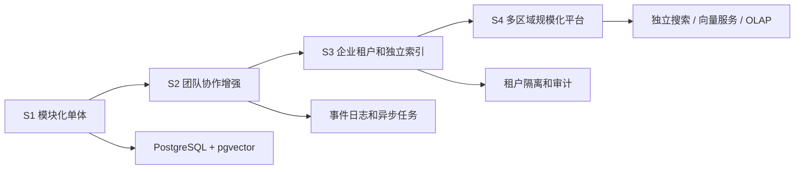

# Axiqra 架构演进、升级迁移与规模化实施方案

版本：重构版 v0.2  
状态：Draft  
所属体系：D11 / 18

## 1. 文档定位

本文档定义 Axiqra 从 S1 MVP 到 S4 规模化平台的架构演进、迁移原则、索引迁移、服务拆分、多区域和压测门槛。

## 2. 演进阶段

| 阶段 | 架构形态 | 目标 |
|---|---|---|
| S1 MVP | Spring Boot 模块化单体 + PostgreSQL + pgvector | 跑通真实闭环 |
| S2 团队协作 | 增强权限、事件日志、团队空间 | 支持团队复用 |
| S3 企业可信 | 租户隔离、独立索引、审计增强 | 支持企业试点 |
| S4 规模化生态 | 多集群搜索、向量服务、事件流、OLAP、多区域 | 支持大规模平台 |

## 3. 架构演进图

## 4. 不可锁死原则

| 领域 | S1 做法 | 后续迁移要求 |
|---|---|---|
| 搜索 | PostgreSQL 全文 + pgvector | 可迁移到 OpenSearch / 专用向量服务 |
| 权限 | 应用层 + 数据字段 | 可迁移到租户级隔离策略 |
| 事件 | 同步写入为主 | 可迁移到事件流 |
| 证据存储 | MinIO | 可迁移对象湖 |
| 审计 | PostgreSQL 日志 | 可迁移 OLAP |

## 5. 迁移门槛

| 触发指标 | 迁移动作 |
|---|---|
| 搜索延迟持续超过验收阈值 | 拆分搜索服务 |
| 向量索引回填影响主库 | 独立向量服务 |
| 企业租户数量增加 | 租户分片 |
| 审计查询影响业务 | 独立 OLAP |
| 多区域客户出现 | Cell 架构评估 |

## 6. 验收标准

| 编号 | 验收内容 |
|---|---|
| AC-D11-001 | S1 架构不阻碍搜索、向量、租户和审计拆分 |
| AC-D11-002 | 所有核心对象都有 schema_version |
| AC-D11-003 | 删除和授权撤回能传播到索引 |
| AC-D11-004 | 迁移路径不依赖重写产品模型 |

## 7. 分阶段能力边界

| 阶段 | 必须完成 | 不建议提前做 |
|---|---|---|
| S1 MVP | 个人空间、接入、搜索、Trace、Project Case、Public Case、Solution、Review、基础权限、审计 | 多区域、复杂收益结算、独立大数据平台 |
| S2 团队协作 | 团队空间、Owner Review、团队内部 Solution、贡献账本增强、插件生态起步 | 过早私有化部署 |
| S3 企业可信 | 租户隔离、SSO、企业审计、数据导出、企业策略、私有内容索引隔离 | 面向全行业证书市场 |
| S4 规模化生态 | 独立搜索、事件流、OLAP、跨区域、生态市场、评测平台 | 无验证的泛化商业模式 |

阶段边界的核心原则：S1 必须跑通闭环，S2 才扩大协作，S3 才强化企业可信，S4 才追求平台规模。

## 8. 服务拆分路线

| 当前模块 | S1 形态 | 拆分触发 | 未来服务 |
|---|---|---|---|
| Search Module | 单体内模块 | 搜索延迟和索引更新影响主业务 | Search Service |
| Trace Module | 单体内模块 | Trace 写入量大，证据处理异步化 | Trace Service |
| Review Module | 单体内模块 | 审核队列复杂、自动审核独立迭代 | Review Service |
| Authorization Module | 单体内模块 | 企业策略复杂、权限排障增多 | Policy Service |
| Audit Module | 单体内模块 | 审计查询影响主库 | Audit / OLAP Service |
| Ledger Module | 单体内模块 | 贡献、权益、认证规则复杂 | Contribution Service |

服务拆分前必须先稳定领域边界和数据所有权，不能因为文件变多就拆服务。

## 9. 数据迁移策略

| 场景 | 策略 |
|---|---|
| 新增字段 | 默认值 + schema_version + 兼容旧客户端 |
| 枚举新增 | 后端允许 unknown，前端显示兜底文案 |
| 对象拆表 | 双写期 + 回填 + 读切换 + 旧表冻结 |
| 索引迁移 | 旧索引和新索引并行，对比召回和排序 |
| 权限模型升级 | 先记录 policy decision，再逐步强制 |
| 租户隔离升级 | 先逻辑隔离，再物理分片或独立库 |

迁移要求：

1. 所有核心对象必须有 `schema_version`。
2. 数据迁移必须有回滚方案。
3. 索引迁移不能改变授权边界。
4. 迁移前后要抽样验证搜索结果和权限结果。

## 10. 索引演进路线

| 阶段 | 索引形态 | 适合规模 |
|---|---|---|
| S1 | PostgreSQL FTS + pgvector | 早期试点 |
| S2 | 独立索引表 + 异步更新 | 团队协作增长 |
| S3 | 租户级索引隔离 | 企业试点 |
| S4 | OpenSearch / 专用向量服务 / 多路召回服务 | 平台规模 |

任何阶段都必须保留权限预过滤，不能因为换搜索引擎而降低权限标准。

## 11. 企业和多租户演进

| 能力 | S1 | S2 | S3 | S4 |
|---|---|---|---|---|
| tenant_id 字段 | 是 | 是 | 是 | 是 |
| 企业展示 | 可选 | 是 | 是 | 是 |
| 企业成员管理 | 基础 | 完整 | 完整 | 完整 |
| 租户级策略 | 预留 | 基础 | 完整 | 完整 |
| 租户索引隔离 | 否 | 可选 | 是 | 是 |
| 私有化部署 | 否 | 方案 | 试点 | 可规模化 |
| 多区域 | 否 | 否 | 评估 | 是 |

## 12. 压测与升级门槛

| 指标 | 观察方式 | 触发动作 |
|---|---|---|
| Search P95 超阈值 | Search Log | 优化索引或拆 Search |
| Trace 提交堆积 | Queue / DB 指标 | 异步化证据处理 |
| 审核队列超时 | Review 指标 | 增加自动规则和审核角色 |
| 权限误判 | Policy Decision Log | 强化策略测试 |
| 审计查询慢 | DB 指标 | 拆 Audit / OLAP |
| 向量索引更新慢 | Index Job 指标 | 独立向量服务 |

升级不是凭感觉做，必须由指标触发。
