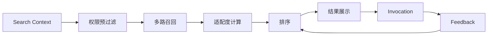

# Axiqra 搜索、索引、推荐、排序与评测体系

版本：重构版 v0.2  
状态：Draft  
所属体系：D12 / 18

## 1. 文档定位

本文档定义 Search Before Act 的输入、召回、排序、权限预过滤、低可信隔离、评测和展示结构。

## 2. 搜索总流程



## 3. Search Before Act 输入

| 输入 | 说明 |
|---|---|
| task_goal | 工程任务目标 |
| error_signature | 错误签名 |
| tech_stack | 技术栈、版本 |
| environment | 运行环境 |
| project_context | 当前项目 |
| workspace_context | 当前空间 |
| risk_hint | 风险等级 |
| expected_action | AI 需要执行还是学习 |

## 4. 召回维度

| 维度 | 说明 |
|---|---|
| 关键词 | 标题、错误、技术栈 |
| 向量 | 语义相似 |
| 结构化字段 | 框架、版本、风险、状态 |
| 失败路径 | 已失败假设和误判 |
| 空间 | 项目、小组、团队、企业、公共 |
| 验证等级 | L0-L5 |
| 风险等级 | R0-R4 |

## 5. 空间优先级

```text
当前项目 -> 小组 / Squad -> 团队 -> 企业 / 组织 -> 已授权公共内容 -> 普通公共内容
```

权限预过滤必须先于召回，不能先召回后过滤。

## 6. 排序因素

| 因素 | 影响 |
|---|---|
| 上下文适配度 | 越高越靠前 |
| 技术栈匹配 | 越精确越靠前 |
| 验证等级 | L 越高越靠前，但受风险限制 |
| 风险等级 | 高风险需要确认，不一定靠前 |
| worked / failed | worked 提升，failed 降低 |
| not_applicable | 降低相似上下文推荐 |
| 最近验证时间 | 越新越高 |
| 空间距离 | 越接近用户当前空间越高 |
| 审核状态 | Rejected / Quarantined 不展示 |

## 7. 搜索结果结构

| 字段 | 说明 |
|---|---|
| result_id | 结果 ID |
| result_type | Solution / Public Case / Project Case / Candidate Seed |
| title | 标题 |
| fit_reason | 为什么匹配 |
| verification_level | 验证等级 |
| risk_level | 风险等级 |
| sample_count | 样本量 |
| failure_paths | 失败路径 |
| required_confirmation | 是否需要确认 |
| authorization_hint | 授权提示 |

## 8. 低可信隔离

| 内容 | 策略 |
|---|---|
| Draft | 不默认展示 |
| Candidate | 低权重展示 |
| Needs Review | 仅提示或治理可见 |
| Rejected | 不展示 |
| Quarantined | 仅治理角色可见 |

## 9. 评测体系

| 指标 | 说明 |
|---|---|
| 命中率 | 是否返回相关结果 |
| 适配准确率 | 用户或 AI 是否认为适配 |
| worked 比例 | 调用后有效比例 |
| failed 复核率 | 失败后是否触发处理 |
| not_applicable 边界修正率 | 不适用是否改善边界 |
| 搜索延迟 | 搜索响应时间 |
| 权限误召回 | 不允许出现 |

## 10. 验收标准

| 编号 | 验收内容 |
|---|---|
| AC-D12-001 | 搜索必须先做权限预过滤 |
| AC-D12-002 | 空结果进入 Candidate Seed |
| AC-D12-003 | 搜索结果显示适配理由、验证等级、风险等级 |
| AC-D12-004 | Rejected / Quarantined 不进入默认结果 |
| AC-D12-005 | Feedback 能影响下一次排序 |

## 11. 查询理解

Search Before Act 输入必须先被解析成结构化上下文。

| 字段 | 来源 | 用途 |
|---|---|---|
| problem_type | 用户任务、错误签名 | 区分构建、部署、性能、安全、权限等 |
| tech_stack | 用户输入、项目配置 | 技术栈匹配 |
| error_signature | 日志、报错 | 精确召回 |
| environment | OS、运行时、数据库、云环境 | 判断适用边界 |
| intent | fix / learn / compare / validate / rollback | 决定返回形态 |
| risk_hint | 用户、AI、规则推断 | 控制确认和排序 |
| current_space | workspace / project | 权限和空间优先级 |
| prior_attempts | AI 已尝试路径 | 避免重复错误 |

## 12. 多路召回设计

| 召回路 | 数据源 | 适合问题 |
|---|---|---|
| exact_error_recall | error_signature、日志片段 | 明确报错 |
| keyword_recall | 标题、摘要、标签 | 普通关键词 |
| vector_recall | Solution、Public Case、Trace 摘要向量 | 语义相似 |
| structured_recall | 技术栈、版本、风险、状态 | 精确过滤 |
| failure_path_recall | 失败路径和误判 | 避免重复尝试 |
| space_recall | 项目、团队、企业、公共 | 组织内复用 |
| seed_recall | Candidate Seed | 无成熟方案时提示覆盖缺口 |

召回合并必须去重，并保留每个结果的命中原因。

## 13. 排序公式草案

S1 不需要复杂模型，但排序必须可解释。

| 因素 | 方向 |
|---|---|
| context_fit_score | 越高越靠前 |
| exact_error_match | 精确命中报错大幅加权 |
| tech_stack_match | 技术栈越精确越靠前 |
| verification_level | L 越高越靠前 |
| risk_penalty | 风险越高越谨慎 |
| space_priority | 越接近当前空间越靠前 |
| recency_score | 最近验证越新越靠前 |
| feedback_score | worked 提升，failed 降低 |
| not_applicable_penalty | 相似上下文不适用时降权 |
| review_status | reviewed / verified 加权，quarantined 排除 |

建议输出：

```text
rank_score = context_fit + evidence + verification + space_priority + recency + feedback - risk_penalty - not_applicable_penalty
```

公式只作为 S1 可解释排序起点，后续可由评测数据调整权重。

## 14. 结果解释结构

每个搜索结果都要告诉 AI 和人类为什么推荐。

| 字段 | 说明 |
|---|---|
| matched_terms | 命中的关键词或错误签名 |
| matched_context | 匹配的技术栈和环境 |
| fit_reason | 推荐原因 |
| caution_reason | 谨慎原因 |
| evidence_summary | 证据摘要 |
| verification_explanation | 为什么是当前等级 |
| risk_explanation | 风险提示 |
| space_source | 来自项目、团队、企业还是公共 |
| recommended_next_action | 执行、学习、确认、创建 Seed |

## 15. 空结果和 Candidate Seed 策略

| 场景 | 系统行为 |
|---|---|
| 完全无结果 | 创建 Candidate Seed 候选，提示用户确认 |
| 只有低可信结果 | 返回低可信提示，并建议补充 Seed |
| 有相似但不适用 | 展示不适用原因，建议创建新 Seed |
| 企业空间无内部结果 | 按权限展示公共结果，但明确来源 |
| 高风险无验证结果 | 不给执行建议，只给学习和确认路径 |

Candidate Seed 创建要保留原始搜索上下文，后续被解决后能回填搜索覆盖。

## 16. 评测数据集

| 数据集 | 来源 | 用途 |
|---|---|---|
| golden_queries | 官方种子和人工整理 | 基础相关性评测 |
| real_search_logs | 脱敏搜索日志 | 真实需求覆盖 |
| failed_invocations | failed Feedback | 发现排序问题 |
| not_applicable_cases | 不适用反馈 | 改善边界 |
| enterprise_private_eval | 企业授权数据 | 企业场景评测 |
| seed_gap_set | Candidate Seed | 覆盖缺口评测 |

评测必须遵守授权范围。企业私有评测不能进入公共训练或公共展示。

## 17. 搜索验收用例

| 用例 | 预期 |
|---|---|
| 当前项目存在高适配 Solution | 项目内容优先于公共内容 |
| 公共 Solution L5 但技术栈不匹配 | 不能排第一 |
| Solution 已 Quarantined | 默认不展示 |
| 用户无团队权限 | 不召回团队私有内容 |
| 返回结果风险 R2 | required_confirmation = true |
| 搜索无命中 | 进入 Candidate Seed 创建路径 |
