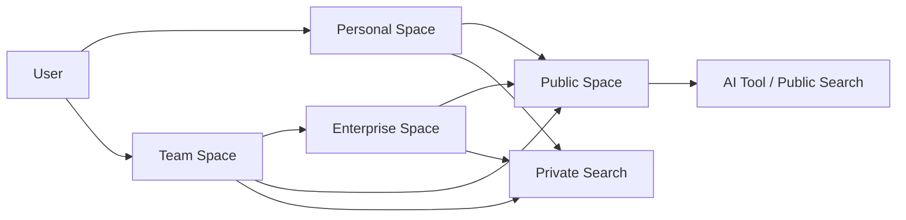
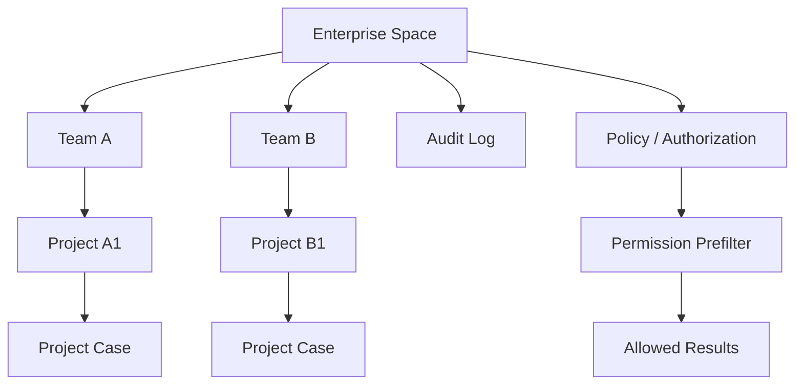
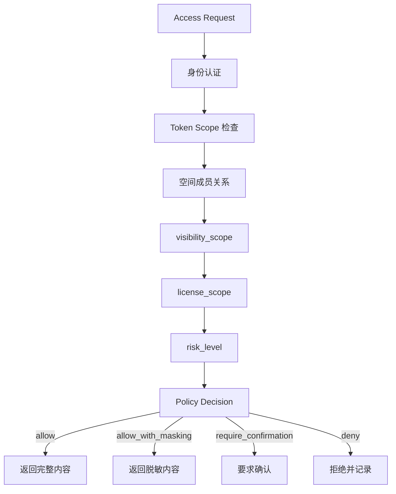

# Axiqra 权限、空间、数据隔离与企业空间方案

版本：重构版 v0.2  
状态：Draft  
所属体系：D13 / 18

## 1. 文档定位

本文档定义 Personal Space、Team Space、Enterprise Space、Public Space 的权限、可见性、调用方管理、审计、私有化、数据导出、删除和授权撤回。

## 2. 空间关系图

## 3. 空间定义

| 空间 | 定义 | 默认公开 |
|---|---|---|
| Personal Space | 个人资产空间 | 否 |
| Team Space | 团队共享空间 | 否 |
| Enterprise Space | 企业租户空间 | 否 |
| Public Space | 授权、脱敏、审查后公开空间 | 是 |

## 4. 权限角色

| 角色 | 权限 |
|---|---|
| owner | 管理空间、授权、删除、公开申请 |
| admin | 管理成员、项目、审计 |
| member | 使用和贡献 |
| viewer | 查看授权内容 |
| auditor | 查看审计日志 |
| reviewer | 审核内容 |

## 5. 可见范围

| 范围 | 说明 |
|---|---|
| private | 仅本人或个人空间 |
| workspace | 当前工作空间 |
| enterprise | 企业内授权可见 |
| public | 公开 |

## 6. 企业空间权限图

## 7. 授权范围

| 授权 | 说明 |
|---|---|
| public_case_allowed | 允许生成 Public Case |
| solution_merge_allowed | 允许参与 Solution 聚合 |
| eval_allowed | 允许进入评测集 |
| training_allowed | 允许训练使用 |
| commercial_allowed | 允许商业授权 |
| anonymous_stats_only | 只允许匿名统计 |

## 8. 审计要求

必须审计：

1. 登录和授权。
2. 搜索和 AI 调用。
3. Project Case 创建、导出、删除。
4. Public Case 发布。
5. Solution 融合。
6. 授权撤回。
7. 企业导出和私有化操作。

## 9. 验收标准

| 编号 | 验收内容 |
|---|---|
| AC-D13-001 | 私有内容默认不公开 |
| AC-D13-002 | 企业内容不默认训练、评测或商业使用 |
| AC-D13-003 | 搜索前必须按空间和权限预过滤 |
| AC-D13-004 | 删除和授权撤回必须可审计 |
| AC-D13-005 | 公开贡献必须授权、脱敏和审核 |

## 10. 空间优先级规则

用户和 AI 工具搜索时，必须优先返回用户当前所属上下文里的内容。

| 优先级 | 空间 | 说明 |
|---|---|---|
| P1 | 当前项目 | 当前 Project Case、Project Solution、项目内 Seed |
| P2 | 当前小组 | Squad 内共享内容 |
| P3 | 当前团队 | Team Space 内容 |
| P4 | 当前企业 | Enterprise Space 内容 |
| P5 | 个人历史 | 用户自己的 Personal Space 历史内容 |
| P6 | 公共高可信 | Public Space 中 L3 以上或官方种子 |
| P7 | 公共普通 | Public Case、低等级 Solution、Candidate Seed |

排序不是简单按公共热度排序。对团队和企业用户，优先复用自己组织内的工程记忆，再看公开内容。

## 11. RBAC 权限矩阵

| 动作 | owner | admin | member | viewer | reviewer | auditor |
|---|---|---|---|---|---|---|
| 管理空间设置 | 是 | 部分 | 否 | 否 | 否 | 否 |
| 管理成员 | 是 | 是 | 否 | 否 | 否 | 否 |
| 创建 Project | 是 | 是 | 是 | 否 | 否 | 否 |
| 提交 Trace | 是 | 是 | 是 | 否 | 否 | 否 |
| 查看 Project Case | 是 | 是 | 是 | 条件 | 条件 | 否 |
| 删除 Project Case | 是 | 条件 | 自己创建的可申请 | 否 | 否 | 否 |
| 申请 Public Case | 是 | 是 | 条件 | 否 | 否 | 否 |
| 审核 Public Case | 否 | 否 | 否 | 否 | 是 | 否 |
| 查看 Audit Log | 是 | 条件 | 否 | 否 | 否 | 是 |
| 导出企业数据 | 是 | 条件 | 否 | 否 | 否 | 条件 |
| 撤回授权 | 是 | 条件 | 自己授权的可撤回 | 否 | 否 | 否 |

`条件` 必须由 ABAC 策略继续判断。

## 12. ABAC 策略字段

除了角色，还必须根据对象、上下文、授权范围判断。

| 字段 | 来源 | 用途 |
|---|---|---|
| subject.user_id | 当前用户 | 判断本人数据 |
| subject.workspace_roles | Membership | 判断角色 |
| subject.certification_level | Certification Credential | 判断审核资格 |
| object.workspace_id | 业务对象 | 判断空间归属 |
| object.visibility_scope | 业务对象 | 判断可见范围 |
| object.license_scope | Authorization | 判断公开、融合、评测等 |
| object.risk_level | 业务对象 | 判断是否需要高权限 |
| context.current_project_id | 请求上下文 | 搜索优先级 |
| context.access_channel | Web / API / MCP / CLI | 判断工具权限 |
| context.tenant_id | 企业上下文 | 企业隔离 |

策略判断输出：

| 输出 | 说明 |
|---|---|
| allow | 允许 |
| deny | 拒绝 |
| allow_with_masking | 允许但脱敏 |
| require_confirmation | 要求用户确认 |
| require_review | 需要审核 |
| require_owner_approval | 需要 Owner 授权 |

## 13. 可见性决策流程

所有 `deny` 和 `allow_with_masking` 都必须可解释，至少返回 policy_code 和 request_id。

## 14. 授权撤回影响

| 撤回类型 | 影响范围 | 处理 |
|---|---|---|
| public_case_allowed | Public Case 下架或转 removed | 搜索移除，保留审计 |
| solution_merge_allowed | 停止后续融合 | 已融合版本重新计算来源权重 |
| eval_allowed | 从评测集移除 | 保留历史评测审计 |
| training_allowed | 停止后续训练使用 | 已训练模型影响需要按政策说明 |
| commercial_allowed | 停止商业授权 | 通知相关方 |
| anonymous_stats_only | 停止匿名统计 | 后续统计排除 |

撤回不等于删除历史审计。用户可撤回授权，平台必须保留必要审计和安全记录。

## 15. 企业空间能力清单

| 能力 | S1 | S2 | S3 |
|---|---|---|---|
| 企业字段预留 | 是 | 是 | 是 |
| 企业展示页 | 可做 | 是 | 是 |
| 企业成员管理 | 基础 | 完整 | 完整 |
| SSO | 否 | 可选 | 是 |
| 审计日志 | 是 | 完整 | 完整 |
| 数据导出 | 基础 | 完整 | 完整 |
| 私有化部署 | 否 | 方案 | 可做 |
| 企业内部 Solution | 演示或试点 | 是 | 是 |
| 企业策略模板 | 预留 | 是 | 是 |

S1 可以把团队和企业作为未来能力展示，但数据结构必须从一开始预留 tenant_id 和 workspace_id。

## 16. 数据隔离验收用例

| 用例编号 | 场景 | 预期 |
|---|---|---|
| SEC-D13-001 | A 团队成员搜索 B 团队 Project Case | 不返回 |
| SEC-D13-002 | 企业成员搜索公共内容 | 可以返回公共内容，但排序在企业内容之后 |
| SEC-D13-003 | Public Case 查看来源 Project Case | 无授权不能查看原始私有数据 |
| SEC-D13-004 | AI 工具 token 只具备 search:read | 不能提交 Trace |
| SEC-D13-005 | 用户撤回 public_case_allowed | Public Case 从默认公共搜索移除 |
| SEC-D13-006 | reviewer 审核非授权租户内容 | 拒绝并记录审计 |
| SEC-D13-007 | auditor 查看业务内容 | 只能查看审计范围，不自动获得内容读取权 |
