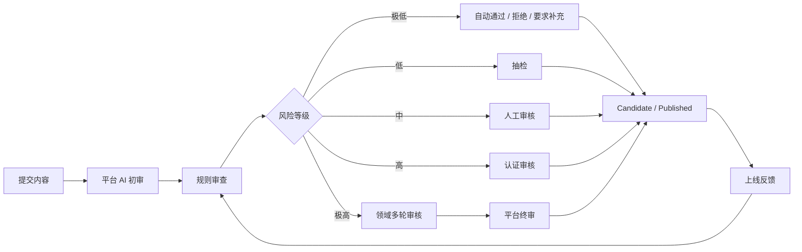
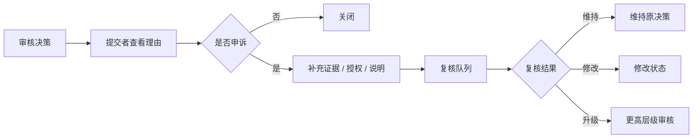

# Axiqra 内容治理、审核、可信来源与污染隔离机制

版本：重构版 v0.2  
状态：Draft  
所属体系：D14 / 18

## 1. 文档定位

本文档定义内容治理、风险分层审核、可信来源、反作弊、污染隔离、举报和申诉接口。

## 2. 风险分层审核图

## 3. 审核检查项

| 检查项 | 说明 |
|---|---|
| 结构完整 | 是否有目标、上下文、证据、验证 |
| 授权 | 是否允许公开、融合、评测、训练 |
| 脱敏 | 是否包含敏感信息 |
| 重复 | 是否与已有内容重复 |
| 危险命令 | 是否包含危险操作 |
| 幻觉风险 | 是否缺少证据或过度泛化 |
| 风险等级 | 是否涉及生产、数据、安全、支付 |

## 4. 可信来源

| 来源 | 初始可信度 |
|---|---|
| 官方种子 | 中高 |
| Dogfooding | 中高 |
| 早期可信开发者 | 中 |
| 企业授权 | 高，但默认私有 |
| 大众贡献 | 低，需门槛和审核 |
| 未确认 AI 生成 | 低，不得高权重 |

## 5. 污染隔离

| 情况 | 处理 |
|---|---|
| 低质内容 | 降权或要求补充 |
| 抄袭 | 拒绝、标记贡献风险 |
| 刷 worked | 反作弊处理 |
| 危险方案 | Quarantined |
| 未授权公开 | 下架、审计、通知 |
| 多次 failed | 复核、降级、隔离 |

## 6. 验收标准

| 编号 | 验收内容 |
|---|---|
| AC-D14-001 | 审核按风险分层处理 |
| AC-D14-002 | 极低风险可自动处理但必须记录 |
| AC-D14-003 | 中高风险进入人工或认证审核 |
| AC-D14-004 | 污染内容不进入默认 AI 调用 |
| AC-D14-005 | 举报、申诉和复核路径存在 |

## 7. 风险等级定义

| 等级 | 定义 | 示例 | 默认处理 |
|---|---|---|---|
| R0 极低风险 | 内容完整、无危险操作、无敏感信息、影响范围小 | 普通前端样式问题、文档修复 | AI 初审后可自动通过或拒绝 |
| R1 低风险 | 有工程操作但影响可控 | 本地构建失败、开发环境配置 | AI 初审 + 抽检 |
| R2 中风险 | 涉及后端、数据库、权限、部署 | API 鉴权、数据库迁移、CI/CD | 人工审核 |
| R3 高风险 | 涉及生产、支付、安全、客户数据 | 生产回滚、权限绕过、数据删除 | 认证审核 |
| R4 极高风险 | 可能造成重大安全、法律或经济影响 | 绕过安全控制、批量删除、泄露密钥 | 领域多轮审核或拒绝 |

风险等级不只由内容关键词决定，还要看执行上下文、影响范围、证据质量和授权状态。

## 8. AI 初审规则

| 检查项 | 自动通过条件 | 自动拒绝条件 | 需要补充 |
|---|---|---|---|
| 结构完整 | 目标、上下文、步骤、证据齐全 | 完全无工程事实 | 缺少验证步骤 |
| 敏感信息 | 无密钥、token、客户名、内网地址 | 明文密钥、真实客户数据 | 疑似路径或日志需确认 |
| 授权范围 | 授权明确 | 明确未授权公开 | 授权字段缺失 |
| 危险操作 | 无危险命令 | 删除、绕权、生产破坏且无回滚 | 有风险但可控 |
| 重复内容 | 与已有内容互补 | 完全重复且无新证据 | 相似但有差异 |
| 证据质量 | 有测试、日志、diff | 无任何证据却声称稳定 | 证据不足 |

自动审核输出必须包含：

1. risk_level。
2. decision。
3. reason_codes。
4. missing_fields。
5. suggested_next_step。
6. 是否进入人工审核。

## 9. 审核队列设计

| 队列 | 进入条件 | 排序 |
|---|---|---|
| auto_pass_log | R0 自动通过 | 时间倒序，供抽检 |
| auto_reject_log | 明显不合格 | 时间倒序，供申诉 |
| low_risk_sampling | R1 抽检 | 随机 + 贡献者信誉 |
| human_review_queue | R2 或 AI 不确定 | 风险、等待时间、影响范围 |
| certified_review_queue | R3 | 领域、认证等级、影响范围 |
| domain_review_queue | R4 | 平台优先级 |
| appeal_queue | 用户申诉 | 原审核等级、申诉时间 |

审核后台至少要显示：

1. 提交内容摘要。
2. 风险理由。
3. 敏感字段提示。
4. 来源对象。
5. 授权范围。
6. 历史贡献者信誉。
7. 相似内容。
8. 推荐决策和可编辑理由。

## 10. 审核决策类型

| 决策 | 影响 |
|---|---|
| approve | 通过，进入目标状态 |
| approve_with_edits | 修改后通过，记录修改 |
| request_more_info | 要求补充证据或授权 |
| reject | 拒绝，不进入默认推荐 |
| quarantine | 隔离，仅治理角色可见 |
| downgrade | 降级，不下架 |
| deprecate | 标记过时 |
| remove | 下架公开内容 |
| escalate | 升级到更高审核层级 |

所有拒绝、隔离、下架、升级都必须有 reason_code，不能只写“审核不通过”。

## 11. Reason Code 字典

| reason_code | 说明 |
|---|---|
| MISSING_EVIDENCE | 缺少验证证据 |
| MISSING_CONTEXT | 缺少工程上下文 |
| SENSITIVE_DATA | 包含敏感信息 |
| LICENSE_MISSING | 授权缺失 |
| LICENSE_CONFLICT | 授权冲突 |
| DANGEROUS_OPERATION | 危险操作 |
| PRODUCTION_RISK | 生产风险 |
| DUPLICATE_LOW_VALUE | 重复且价值低 |
| HALLUCINATION_RISK | 可能幻觉或过度泛化 |
| PLAGIARISM_RISK | 抄袭风险 |
| ABUSE_SIGNAL | 刷反馈或作弊 |
| OUTDATED | 内容过时 |

## 12. 申诉与复核流程

复核规则：

1. 原审核者不能单独完成最终复核。
2. R3/R4 申诉必须至少一名认证审核者参与。
3. 申诉通过要记录原决策问题，反哺审核规则。
4. 恶意申诉影响贡献者信誉。

## 13. 反作弊与污染信号

| 信号 | 处理 |
|---|---|
| 同一用户短期大量 worked | 降低反馈权重，进入抽检 |
| 同一 IP 或工具批量反馈 | 标记异常 |
| 无 Invocation 的 worked | 不计入等级升级 |
| 互刷贡献 | 贡献账本冻结 |
| 抄袭公共内容 | 拒绝并记录风险 |
| AI 生成无证据内容 | 低权重或拒绝 |
| 高失败率 Solution | 降级或隔离 |

## 14. 治理指标

| 指标 | 用途 |
|---|---|
| auto_pass_rate | 观察自动审核是否过松 |
| auto_reject_appeal_success_rate | 观察自动拒绝是否过严 |
| human_review_latency | 观察人工审核积压 |
| quarantine_rate | 观察污染风险 |
| false_positive_rate | 观察误杀 |
| false_negative_rate | 观察漏审 |
| public_case_removed_rate | 观察公开内容质量 |
| failed_feedback_trigger_count | 观察 Solution 失效 |

治理指标必须进入运营和产品复盘，不只做后台统计。
