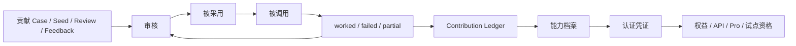

# Axiqra 贡献者激励、收益池、积分与权益机制

版本：重构版 v0.2  
状态：Draft  
所属体系：D15 / 18

## 1. 文档定位

本文档定义贡献者类型、贡献记录、积分、权益、能力档案、认证凭证、未来收益池资格和防刷机制。

不编价格，不写固定现金分配比例。

## 2. 贡献者闭环图

## 3. 贡献类型

| 类型 | 示例 |
|---|---|
| Case 贡献 | Project Case 脱敏成 Public Case |
| Seed 贡献 | Candidate Seed 创建和补充 |
| Solution 贡献 | 创建、融合、修正 Solution |
| Feedback 贡献 | worked / failed / not_applicable |
| Review 贡献 | 审核、纠错、补充边界 |
| Learning 贡献 | 学习反馈、纠错、标注 |

## 4. 能力档案和认证凭证

| 项 | 说明 |
|---|---|
| 能力领域 | 后端、前端、数据库、DevOps、安全、架构、测试等 |
| 认证等级 | 贡献者、认证开发者、认证审核者、领域审核者、Maintainer |
| 有效期 | 需要复核 |
| 撤销状态 | 可降权、暂停、撤销 |
| 公开验证入口 | 可验证凭证真实性 |

## 5. 权益类型

| 权益 | 阶段 |
|---|---|
| 学习积分 | S1 |
| 贡献积分 | S1 |
| API 权益 | S1/S2 |
| Pro 抵扣 | S2 |
| 试点资格 | S2 |
| 收益池资格 | 商业化阶段 |

## 6. 防刷机制

| 风险 | 处理 |
|---|---|
| 重复提交 | 合并或拒绝 |
| 抄袭 | 取消资格 |
| 刷 worked | 降权和风控 |
| 恶意审核 | 暂停认证 |
| 未授权导入 | 拒绝并审计 |

## 7. 验收标准

| 编号 | 验收内容 |
|---|---|
| AC-D15-001 | 每次贡献可追溯 |
| AC-D15-002 | 权益不只按数量计算 |
| AC-D15-003 | 能力档案和认证凭证预留 |
| AC-D15-004 | 收益池只写资格，不写固定比例 |
| AC-D15-005 | 反作弊影响积分和认证 |

## 8. Contribution Ledger 事件模型

| 事件 | 说明 | 是否直接加权 |
|---|---|---|
| case_submitted | 提交 Project Case 或 Public Case 候选 | 否，需审核 |
| case_published | Public Case 发布 | 是 |
| seed_created | 创建 Candidate Seed | 低权重 |
| seed_resolved | Seed 被解决 | 是 |
| solution_created | 创建 Candidate Solution | 条件 |
| solution_merged | Solution 被融合采纳 | 是 |
| feedback_worked | 提交有效 worked | 是 |
| feedback_failed | 提交有效 failed | 是，纠错也有价值 |
| review_approved | 完成有效审核 | 是 |
| review_reversed | 审核被推翻 | 降权 |
| abuse_detected | 作弊或污染 | 降权或冻结 |

贡献账本必须记录事件来源、目标对象、审核状态、证据和影响，不只记录积分数字。

## 9. 积分计算原则

| 原则 | 说明 |
|---|---|
| 质量优先 | 被采用、被验证、被复用比提交数量更重要 |
| 纠错有价值 | failed、not_applicable、边界补充也应计入贡献 |
| 风险折扣 | 高风险内容需要更严格审核，不能快速刷分 |
| 反作弊约束 | 异常 worked、互刷、重复提交会降权 |
| 延迟确认 | 部分贡献要等调用反馈后再确认价值 |
| 可解释 | 用户能看到积分来源和状态 |

## 10. 权益分层

| 等级 | 条件 | 权益 |
|---|---|---|
| Learner | 学习、收藏、反馈 | 学习记录、基础积分 |
| Contributor | 有有效贡献 | 贡献档案、API 试用额度 |
| Trusted Contributor | 多次有效贡献，低违规 | 更高初始可信度 |
| Certified Developer | 通过平台认证和贡献验证 | 可审核中风险内容 |
| Certified Reviewer | 通过审核能力验证 | 可审核高风险内容 |
| Maintainer | 长期维护领域内容 | Solution 合并、废弃、维护权限 |

认证身份要服务产品质量，不要早期过度包装成外部证书叙事。

## 11. 收益池资格预留

收益池只在商业化阶段启用，S1 不写固定比例。

| 资格来源 | 说明 |
|---|---|
| Public Case 被高频学习 | 说明内容有学习价值 |
| Solution 被高频调用且 worked | 说明方案有工程价值 |
| 企业授权内容产生试点价值 | 说明私有场景有商业价值 |
| 审核和维护贡献稳定 | 说明治理有价值 |
| 纠错降低风险 | failed 和隔离贡献也有价值 |

收益池设计必须先解决授权、归因、反作弊和合规。

## 12. 贡献者页面

| 页面区块 | 内容 |
|---|---|
| 能力概览 | 领域、等级、认证状态 |
| 贡献统计 | Case、Seed、Solution、Feedback、Review |
| 被采用记录 | 发布、融合、调用、worked |
| 质量指标 | 通过率、撤回率、被申诉率 |
| 权益状态 | API、Pro、试点、认证资格 |
| 风险记录 | 违规、误审、申诉 |
| 公开凭证 | 可验证认证入口 |

## 13. 防刷验收用例

| 用例 | 预期 |
|---|---|
| 同一用户短期提交重复 Seed | 合并或降权 |
| worked 无 Invocation | 不计入等级升级 |
| 互相刷 worked | 标记异常 |
| 审核者多次误审 | 暂停审核资格 |
| 抄袭已有 Public Case | 拒绝并记录风险 |
