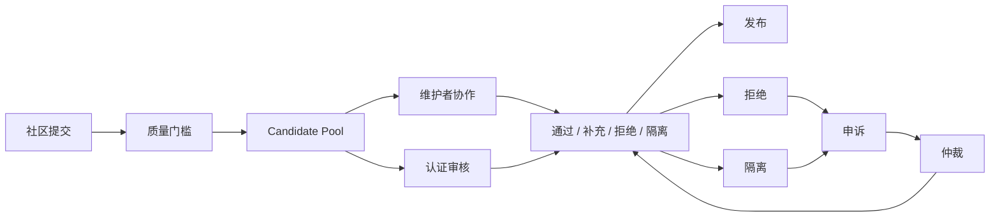

# Axiqra 社区贡献、维护者、仲裁与争议处理机制

版本：重构版 v0.2  
状态：Draft  
所属体系：D16 / 18

## 1. 文档定位

本文档定义社区贡献层级、维护者、举报、申诉、仲裁和行为边界。

## 2. 社区治理流程

## 3. 角色层级

| 角色 | 权限 |
|---|---|
| 普通用户 | 创建 Seed、反馈、学习 |
| 贡献者 | 提交 Case、补充证据 |
| 认证贡献者 | 更高初始可信度 |
| 认证开发者 | 审核中风险内容 |
| 认证审核者 | 审核高风险内容 |
| 领域审核者 | 多轮审查 |
| Maintainer | 维护 Solution 和领域内容 |
| 平台仲裁 | 处理争议和严重风险 |

## 4. 争议处理

| 争议 | 处理 |
|---|---|
| 内容被拒 | 可补充证据或申诉 |
| 贡献归属争议 | 查贡献账本 |
| 审核争议 | 进入复审 |
| 企业授权争议 | 以授权记录和审计为准 |
| 安全风险争议 | 先隔离再审查 |

## 5. 验收标准

| 编号 | 验收内容 |
|---|---|
| AC-D16-001 | 社区贡献有质量门槛 |
| AC-D16-002 | 拒绝和隔离可申诉 |
| AC-D16-003 | 仲裁流程可追踪 |
| AC-D16-004 | 维护者权限不是永久不变 |
| AC-D16-005 | 争议处理不泄露私有数据 |

## 6. 质量门槛

大众可以创建 Candidate Seed，但进入候选池必须满足最低质量门槛。

| 门槛 | 要求 |
|---|---|
| 真实问题 | 有明确工程目标或错误现象 |
| 上下文 | 至少包含技术栈、环境或场景 |
| 非重复 | 与已有 Seed / Case / Solution 不完全重复 |
| 风险说明 | 标明是否涉及生产、数据、安全 |
| 授权 | 不提交未授权私有内容 |
| 证据 | 有日志、截图、命令输出或描述 |

门槛不能太高，否则大众飞轮起不来；但也不能无门槛，否则污染搜索。

## 7. 维护者职责

| 职责 | 说明 |
|---|---|
| 认领 Candidate Seed | 把覆盖缺口推进成 Case 或 Solution |
| 合并重复内容 | 减少重复和分裂 |
| 维护 Solution 边界 | 更新适用和不适用条件 |
| 处理 failed | 判断降级、修正、隔离 |
| 更新领域规范 | 维护标签、分类、风险规则 |
| 指导贡献者 | 给出补充证据和改进建议 |

维护者不是管理员特权，而是持续维护责任。长期不维护可降级。

## 8. 仲裁触发条件

| 场景 | 是否仲裁 |
|---|---|
| 内容被拒但提交者有新证据 | 复核，不一定仲裁 |
| 审核者和维护者意见冲突 | 仲裁 |
| 贡献归属争议 | 仲裁 |
| 企业授权和公共发布冲突 | 仲裁 |
| 高风险内容是否隔离 | 仲裁 |
| 认证身份撤销争议 | 仲裁 |

仲裁结果必须写入审计，并能反哺规则。

## 9. 行为边界

| 禁止行为 | 处理 |
|---|---|
| 泄露私有数据 | 下架、审计、暂停资格 |
| 刷贡献 | 冻结积分和权益 |
| 恶意审核 | 暂停或撤销审核身份 |
| 抄袭 | 拒绝、降权 |
| 绕过授权 | 隔离内容，严重时封禁 |
| 人身攻击或骚扰 | 社区处理 |

## 10. 社区治理指标

| 指标 | 用途 |
|---|---|
| seed_to_case_rate | Seed 是否被解决 |
| review_latency | 审核是否积压 |
| appeal_success_rate | 审核质量 |
| maintainer_response_time | 维护者活跃度 |
| duplicate_rate | 重复污染 |
| quarantine_rate | 高风险或低质比例 |
| contributor_retention | 贡献者是否留下 |

## 11. 角色升降级

| 动作 | 条件 |
|---|---|
| 普通用户 -> 贡献者 | 有有效 Seed、Feedback 或 Case |
| 贡献者 -> 认证贡献者 | 多次贡献通过且无风险记录 |
| 认证贡献者 -> 认证开发者 | 通过领域能力验证 |
| 认证开发者 -> 认证审核者 | 审核准确率达标 |
| 认证审核者 -> Maintainer | 长期维护领域内容 |
| 降级 | 长期不活跃、误审、违规、恶意行为 |

升降级必须可解释，用户能看到原因和申诉入口。
