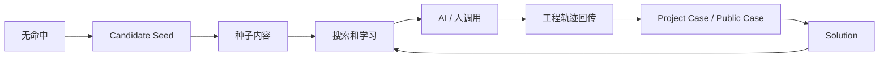

# Axiqra 冷启动、种子内容、传播页面与商业验证方案

版本：重构版 v0.2  
状态：Draft  
所属体系：D17 / 18

## 1. 文档定位

本文档定义种子内容、历史导入、试点、传播页面、ROI、绿色工程测算和商业验证路径。

## 2. 冷启动来源

| 来源 | 作用 |
|---|---|
| 官方种子 | 建立初始质量 |
| Dogfooding | 验证自身闭环 |
| 早期可信开发者 | 补充真实外部场景 |
| 企业试点 | 验证私有高可信记忆 |
| 大众 Candidate Seed | 快速发现覆盖缺口 |
| 开源项目案例 | 传播和学习 |

## 3. 冷启动闭环

## 4. 商业化路径

| 路径 | 付费理由 |
|---|---|
| Personal | 私有空间、高级搜索、接入额度 |
| Team | 团队复用、Owner Review、团队学习 |
| Enterprise | 权限、审计、数据隔离、私有 Agent |
| API / Platform | 工具调用、平台集成 |
| Agent Eval | 授权工程方案评测 |
| 数据授权 | 明确授权后的评测、训练、商业使用 |

不编价格。价格、套餐和分成比例进入商业化阶段。

## 5. 验证指标

| 指标 | 说明 |
|---|---|
| 搜索命中率 | 是否找到相关方案 |
| worked 比例 | 调用后是否有效 |
| 回传率 | AI 执行后是否形成工程轨迹 |
| Public Case 学习率 | 是否有人阅读和收藏 |
| Team 复用率 | 团队是否复用内部资产 |
| 企业试点 ROI | 是否减少重复排查 |
| Candidate Seed 解决率 | 覆盖缺口是否被补齐 |

## 6. 验收标准

| 编号 | 验收内容 |
|---|---|
| AC-D17-001 | 冷启动来源不依赖低质开放投稿 |
| AC-D17-002 | 大众 Seed 能进入质量门槛流程 |
| AC-D17-003 | 商业路径不编价格 |
| AC-D17-004 | 企业试点默认私有 |
| AC-D17-005 | 传播页面不把产品写成知识库或论坛 |

## 7. 冷启动内容池

| 内容池 | 目标数量 | 质量要求 | 用途 |
|---|---|---|---|
| 官方 Solution Seed | 50-100 | 结构完整，有验证路径 | 建立初始搜索体验 |
| Public Case Seed | 100-300 | 真实问题、脱敏、可学习 | 支撑人类学习页 |
| Failure Path Seed | 100+ | 记录失败尝试和误判 | 让 AI 少走弯路 |
| Candidate Seed | 持续增长 | 有上下文和风险说明 | 发现覆盖缺口 |
| Team Pilot Case | 20-50 | 团队真实复用 | 验证团队价值 |
| Enterprise Pilot Case | 5-20 | 私有、可审计 | 验证企业 ROI |

数量是启动建议，不是承诺。质量低的内容宁可少，也不能污染第一批搜索体验。

## 8. 种子内容主题

| 主题 | 示例 |
|---|---|
| 构建失败 | Node、Java、Python、Go、Rust 构建问题 |
| 部署故障 | Docker、Nginx、CI/CD、环境变量 |
| 数据库 | 连接池、迁移、索引、锁、慢查询 |
| 权限鉴权 | JWT、OAuth、RBAC、跨域 |
| AI 工具协作 | 如何让 AI 搜索、执行、回传 |
| 测试和回归 | 单测、集成测试、快照、CI |
| 性能问题 | 缓存、队列、连接、热点 |
| 安全风险 | 密钥泄露、危险命令、脱敏 |

第一批内容要覆盖“AI 工具最容易重复犯错”的场景。

## 9. 传播页面结构

传播页不能写成普通知识库介绍，要直接表达 Axiqra 的差异。

| 区块 | 内容 |
|---|---|
| 首屏 | Axiqra 是 AI Agent 时代的工程解决方案记忆层 |
| 痛点 | AI 每次从零推理、团队经验无法复用、案例不可验证 |
| 核心闭环 | 搜索、执行、回传、审核、验证、再推荐 |
| AI 工具接入 | 对话式接入、MCP、CLI、API |
| 人类学习 | Public Case 展示真实排查过程 |
| 团队企业 | 私有工程记忆、权限、审计、内部优先 |
| 贡献飞轮 | Seed、Case、Solution、Feedback、Review |
| 可信机制 | 验证等级、风险等级、审核和隔离 |
| CTA | 加入试点、提交 Seed、接入 AI 工具 |

## 10. 商业验证假设

| 假设 | 验证方式 | 成功信号 |
|---|---|---|
| AI 工具用户愿意接入 | 对话式接入转化 | 接入成功率、doctor 通过率 |
| Search Before Act 有价值 | 搜索后 worked | worked 比例提升 |
| 回传不会太麻烦 | Trace 提交率 | 用户确认率 |
| Public Case 能带学习 | 阅读和收藏 | 学习完成率 |
| 团队愿意私有复用 | 团队试点 | Team Case 复用率 |
| 企业愿意为可信和审计付费 | 企业访谈和试点 | 审计、权限、ROI 认可 |
| 贡献者愿意参与 | Seed 和 Feedback 增长 | 有效贡献留存 |

## 11. ROI 计算方向

| 指标 | 计算思路 |
|---|---|
| 重复排查减少 | 相同问题二次解决时间下降 |
| AI 成功率提升 | worked 比例提升 |
| Onboarding 提速 | 新人通过 Public Case 学习时间下降 |
| 审核成本 | 自动审核和人工审核耗时 |
| 企业风险降低 | 未授权公开、危险方案、错误调用减少 |
| 内容资产增长 | 可复用 Solution 和 Public Case 增长 |

ROI 不要只讲节省时间，也要讲风险控制和组织记忆沉淀。

## 12. 试点计划

| 阶段 | 时间 | 目标 |
|---|---|---|
| Pilot 0 | 内部 Dogfooding | 用自己的开发任务回传 Trace |
| Pilot 1 | 可信开发者 | 验证 AI 接入和 Public Case 学习 |
| Pilot 2 | 小团队 | 验证团队内部优先搜索和复用 |
| Pilot 3 | 企业访谈 | 验证权限、审计、数据隔离需求 |
| Pilot 4 | 公共开放 Seed | 验证大众覆盖缺口飞轮 |

## 13. 风险和反证

| 风险 | 反证信号 | 应对 |
|---|---|---|
| 用户不愿回传 | Trace 提交率低 | 降低确认成本、强化价值反馈 |
| 搜索不准 | not_applicable 高 | 强化上下文解析和排序 |
| 内容质量低 | 审核拒绝率高 | 提高门槛和引导 |
| 企业担心泄露 | 企业试点阻力大 | 强化私有默认、审计、授权撤回 |
| 贡献者不活跃 | Seed 无人认领 | 增加认领机制和权益 |
| AI 工具不接 | 接入失败率高 | 改善 doctor 和接入包 |
