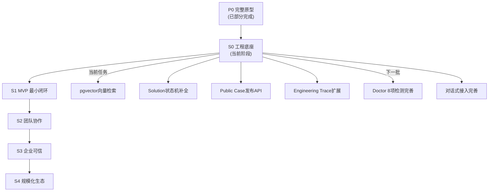

# Axiqra 完整开发计划

> 版本：v1.0  
> 生成时间：2026-06-24  
> 状态：Active  
> 基于：D04 MVP实施范围与版本路线、D08 Solution状态机、D12 搜索体系

---

## 一、阶段路线总览



---

## 二、S0 当前阶段：核心功能补全

### 2.1 P0 优先级任务（必须完成）

#### 2.1.1 pgvector 向量检索 ⭐⭐⭐

| 属性 | 内容 |
|------|------|
| **优先级** | P0 |
| **影响** | AI Agent搜索核心能力 |
| **工作量** | 中 |
| **文档依据** | D12 搜索体系、D10 技术架构 |

**实现内容：**
- [ ] 向量嵌入生成服务（EmbeddingService）
- [ ] pgvector 向量存储配置
- [ ] 向量召回 SQL/Mapper
- [ ] 关键词+向量混合召回
- [ ] 搜索服务集成向量召回路

**实现方案：**

```sql
-- 1. 安装 pgvector 扩展
CREATE EXTENSION IF NOT EXISTS vector;

-- 2. solution 表添加向量字段
ALTER TABLE axiqra_solution ADD COLUMN embedding vector(1536);

-- 3. 向量索引
CREATE INDEX idx_solution_embedding ON axiqra_solution USING ivfflat (embedding vector_cosine_ops);

-- 4. 召回查询
SELECT s.*, 
       1 - (s.embedding <=> '[0.1, 0.2, ...]') AS similarity
FROM axiqra_solution s
WHERE s.visibility_scope = 'PUBLIC'
  AND s.status IN ('VERIFIED', 'STABLE', 'CANONICAL')
ORDER BY s.embedding <=> '[0.1, 0.2, ...]'
LIMIT 20;
```

**代码任务：**
```
axiqra-common/
├── domain/service/EmbeddingService.java       # 向量嵌入接口
├── domain/service/impl/EmbeddingServiceImpl.java # OpenAI/Cohere实现

axiqra-core/
├── mapper/SolutionVectorMapper.java            # 向量检索Mapper
├── service/impl/VectorSearchServiceImpl.java    # 向量搜索服务
└── service/impl/SearchServiceImpl.java         # 混合召回整合
```

---

#### 2.1.2 Solution 状态机补全

| 属性 | 内容 |
|------|------|
| **优先级** | P0 |
| **影响** | Solution生命周期完整性 |
| **工作量** | 低 |
| **文档依据** | D08 Solution状态机 |

**当前状态：**
```java
public enum SolutionStatus {
    DRAFT, CANDIDATE, REVIEWED, VERIFIED, STABLE, CANONICAL, DEPRECATED
}
```

**缺失状态：**
- [ ] `NEEDS_REVIEW` - 需要审核
- [ ] `QUARANTINED` - 隔离态
- [ ] `ARCHIVED` - 归档态

**完整状态机（10状态）：**
```
Draft → Candidate → Needs Review → Reviewed → Verified → Stable → Canonical
                   ↓               ↓          ↓          ↓
                Rejected      Deprecated   Deprecated   Deprecated → Archived
                   ↓
               Quarantined → Needs Review
```

**代码任务：**
```
1. SolutionStatus.java - 添加3个枚举值
2. SolutionStateMachine.java - 添加状态迁移规则
3. SolutionServiceImpl - 实现状态迁移服务
4. SolutionMapper.xml - 更新状态相关SQL
```

---

#### 2.1.3 Public Case 发布 API

| 属性 | 内容 |
|------|------|
| **优先级** | P0 |
| **影响** | 核心闭环：Project Case → Public Case |
| **工作量** | 中 |
| **文档依据** | D05/D07 |

**实现内容：**
- [ ] PublicCase 发布请求接口
- [ ] 脱敏检查服务
- [ ] 发布状态机
- [ ] 审核队列入口
- [ ] 授权检查

**API 设计：**
```
POST   /api/v1/public-cases/publish     # 发布Public Case
GET    /api/v1/public-cases/{id}        # 获取Public Case详情
POST   /api/v1/public-cases/{id}/submit # 提交发布申请
GET    /api/v1/public-cases/{id}/review-status # 审核状态
```

---

#### 2.1.4 Engineering Trace 扩展

| 属性 | 内容 |
|------|------|
| **优先级** | P0 |
| **影响** | Trace Package 完整性 |
| **工作量** | 中 |
| **文档依据** | D05/D06/D07 |

**当前实现：** forward_path ✅  
**缺失路径：**
- [ ] `decision_path` - 决策路径
- [ ] `rollback_path` - 回滚路径
- [ ] `evolution_hint` - 演化路径
- [ ] `reverse_path` - 反向路径（部分）

**代码任务：**
```
InvocationEntity.java - 添加字段
  - decision_path JSON
  - rollback_path JSON
  - evolution_hint TEXT
  - reverse_path JSON

InvocationServiceImpl - 实现路径记录
  - recordDecisionPath()
  - recordRollbackPath()
  - recordEvolutionHint()
  - recordReversePath()
```

---

### 2.2 P1 优先级任务（应该完成）

#### 2.2.1 Doctor 8项检测完善

| 属性 | 内容 |
|------|------|
| **优先级** | P1 |
| **影响** | 接入体验 |
| **工作量** | 中 |
| **文档依据** | D09 接入协议 |

**当前状态：** doctor_status 字段存在  
**需完善检测项：**

| 检测项 | 说明 | 状态 |
|--------|------|:----:|
| 环境检测 | Python/Node/Java 环境 | ❌ |
| 网络检测 | API 可达性 | ❌ |
| 认证检测 | Token 有效性 | ❌ |
| 权限检测 | 读写权限 | ❌ |
| 依赖检测 | 必要包安装 | ❌ |
| 配置检测 | 配置文件有效性 | ❌ |
| 版本检测 | 兼容性版本 | ❌ |
| 模拟检测 | 模拟调用测试 | ❌ |

---

#### 2.2.2 对话式接入指令生成

| 属性 | 内容 |
|------|------|
| **优先级** | P1 |
| **影响** | 接入易用性 |
| **工作量** | 中 |
| **文档依据** | D09 |

**实现内容：**
- [ ] 接入指令模板引擎
- [ ] Skill Pack 生成
- [ ] MCP 配置生成
- [ ] CLI 安装脚本生成
- [ ] API Key 管理

---

#### 2.2.3 覆盖范围统计 API

| 属性 | 内容 |
|------|------|
| **优先级** | P1 |
| **影响** | 搜索能力展示 |
| **工作量** | 低 |
| **文档依据** | D12 |

**实现内容：**
- [ ] 技术栈覆盖率统计
- [ ] 错误类型覆盖率
- [ ] 框架/库覆盖统计
- [ ] Candidate Seed 缺口展示

---

### 2.3 P2 优先级任务（规划完成）

#### 2.3.1 AI 初审服务

| 属性 | 内容 |
|------|------|
| **优先级** | P2 |
| **影响** | 治理基础 |
| **工作量** | 高 |
| **文档依据** | D14 |

**实现内容：**
- [ ] 结构完整性检查
- [ ] 敏感信息检测
- [ ] 重复内容检测
- [ ] 质量评分服务

---

#### 2.3.2 审核队列管理

| 属性 | 内容 |
|------|------|
| **优先级** | P2 |
| **影响** | 治理完整性 |
| **工作量** | 高 |
| **文档依据** | D14 |

**实现内容：**
- [ ] ReviewQueue 实体和服务
- [ ] 审核任务分配
- [ ] 审核状态流转
- [ ] Reason Code 字典

---

#### 2.3.3 Contribution Ledger 完善

| 属性 | 内容 |
|------|------|
| **优先级** | P2 |
| **影响** | 激励体系 |
| **工作量** | 中 |
| **文档依据** | D15 |

**实现内容：**
- [ ] 贡献记录实体
- [ ] 积分计算服务
- [ ] 贡献统计API
- [ ] 贡献排名服务

---

### 2.4 P3 优先级任务（未来规划）

| 功能 | 优先级 | 工作量 | 文档依据 |
|------|:------:|:------:|----------|
| MCP Server 完整实现 | P3 | 高 | D09 |
| 完整 CLI 工具 | P3 | 中 | D09 |
| SSO/SCIM 企业身份 | P3 | 高 | D13 |
| CertificationCredential | P3 | 中 | D15 |
| 权益分层体系 | P3 | 高 | D15 |
| 收益池分配 | P3 | 高 | D15 |
| 仲裁机制 | P3 | 中 | D16 |

---

## 三、S1 MVP 成功标准

### 3.1 产品闭环标准

| 闭环 | 成功标准 | 对应任务 |
|------|----------|----------|
| 搜索闭环 | 用户能输入错误/技术栈/任务，得到 Solution 或 Candidate Seed | P0 pgvector |
| 学习闭环 | 用户能阅读 Solution 并区分执行/学习/证据/风险 | 已有实现 |
| 工程轨迹回传闭环 | 能生成完整 Engineering Trace Package | P0 Trace扩展 |
| 沉淀闭环 | 用户能创建/导入 Project Case | 已有实现 |
| 发布闭环 | 能从 Project Case 发起脱敏发布 | P0 Public Case API |
| Solution 闭环 | Solution 能展示完整状态/等级/证据 | P0 状态机 |
| AI 接入闭环 | 外部 AI 能完成一次真实检索 | P1 接入完善 |
| 反馈闭环 | 能记录 worked/failed/partial | 已有实现 |
| 治理闭环 | 内容能经过基础审核 | P2 审核队列 |

### 3.2 技术闭环标准

| 闭环 | 成功标准 | 状态 |
|------|----------|:----:|
| 前端闭环 | Vue 原型核心页面可用 | ⚠️ 待整合 |
| 后端闭环 | Spring Boot 支撑核心功能 | ✅ |
| 数据闭环 | PostgreSQL + pgvector | ⚠️ pgvector待完成 |
| 文件闭环 | MinIO 保存证据 | ⚠️ |
| 缓存闭环 | Redis 支撑会话 | ⚠️ |
| 接入闭环 | MCP/CLI/API 可运行 | ⚠️ |
| 日志闭环 | 调用/审核/反馈可追踪 | ✅ |
| 部署闭环 | 轻量部署可运行 | ⚠️ |

---

## 四、详细任务清单

### 4.1 S0 阶段任务表

| 任务ID | 任务名称 | 优先级 | 工作量 | 依赖 | 负责人 | 状态 |
|--------|----------|:------:|:------:|------|--------|:----:|
| T-001 | pgvector 向量检索 | P0 | 中 | - | - | 🔲 |
| T-002 | Solution状态机补全 | P0 | 低 | - | - | 🔲 |
| T-003 | Public Case发布API | P0 | 中 | T-002 | - | 🔲 |
| T-004 | Engineering Trace扩展 | P0 | 中 | - | - | 🔲 |
| T-005 | Doctor 8项检测 | P1 | 中 | T-001 | - | 🔲 |
| T-006 | 对话式接入完善 | P1 | 中 | T-005 | - | 🔲 |
| T-007 | 覆盖范围统计 | P1 | 低 | T-001 | - | 🔲 |
| T-008 | AI初审服务 | P2 | 高 | T-003 | - | 🔲 |
| T-009 | 审核队列管理 | P2 | 高 | T-008 | - | 🔲 |
| T-010 | Contribution Ledger | P2 | 中 | - | - | 🔲 |

### 4.2 S1 阶段任务表

| 任务ID | 任务名称 | 优先级 | 工作量 | 依赖 | 状态 |
|--------|----------|:------:|:------:|------|:----:|
| T-101 | 前端整合 | P0 | 高 | T-001~T-010 | 🔲 |
| T-102 | MCP Server | P1 | 高 | T-006 | 🔲 |
| T-103 | 完整CLI | P1 | 中 | T-006 | 🔲 |
| T-104 | 申诉流程 | P2 | 中 | T-009 | 🔲 |
| T-105 | 反作弊检测 | P2 | 中 | T-008 | 🔲 |

### 4.3 S2-S4 阶段任务表

| 任务ID | 任务名称 | 阶段 | 优先级 | 状态 |
|--------|----------|:----:|:------:|:----:|
| T-201 | 团队空间 | S2 | P0 | 🔲 |
| T-202 | Owner Review | S2 | P0 | 🔲 |
| T-203 | 贡献账本API | S2 | P1 | 🔲 |
| T-301 | SSO/SCIM | S3 | P1 | 🔲 |
| T-302 | 审计日志完善 | S3 | P1 | 🔲 |
| T-303 | 数据隔离 | S3 | P0 | 🔲 |
| T-401 | 搜索升级 | S4 | P0 | 🔲 |
| T-402 | 向量服务拆分 | S4 | P1 | 🔲 |
| T-403 | 事件流 | S4 | P1 | 🔲 |
| T-404 | 多区域架构 | S4 | P2 | 🔲 |

---

## 五、里程碑计划

### 5.1 里程碑定义

| 里程碑 | 目标日期 | 交付内容 |
|--------|----------|----------|
| M0 | 2026-06-30 | S0 P0任务完成：向量检索+状态机+Public Case API |
| M1 | 2026-07-15 | S0 P1任务完成：Doctor+接入+覆盖统计 |
| M2 | 2026-08-01 | S1 MVP可用：完整闭环可演示 |
| M3 | 2026-09-01 | S1 MVP试点：真实用户测试 |
| M4 | 2026-10-01 | S2团队版：团队空间+协作 |
| M5 | 2026-12-01 | S3企业版：企业隔离+SSO |
| M6 | 2027-Q1 | S4规模化：搜索升级+多区域 |

### 5.2 验收检查清单

#### M0 检查点
- [ ] pgvector 向量检索可返回结果
- [ ] SolutionStatus 包含10个状态
- [ ] Public Case 可提交发布申请
- [ ] Engineering Trace 可记录6条路径

#### M1 检查点
- [ ] Doctor 可检测8项状态
- [ ] 对话式接入生成完整指令
- [ ] 覆盖范围页面展示统计

#### M2 检查点
- [ ] 前端页面与后端API对接
- [ ] 完整搜索→Solution→调用→反馈闭环
- [ ] 部署脚本可用

---

## 六、技术债务清单

### 6.1 枚举命名规范
- [ ] 统一枚举命名风格（snake_case）
- [ ] 清理废弃枚举值

### 6.2 字段命名规范
- [ ] 统一蛇形命名（如 `error_signature`）
- [ ] 清理冗余字段

### 6.3 测试覆盖
- [ ] 核心服务单元测试覆盖 80%
- [ ] Integration Test 覆盖 API
- [ ] E2E 测试覆盖核心闭环

### 6.4 文档同步
- [ ] 代码注释引用文档章节
- [ ] API 文档自动生成
- [ ] 更新 D19 分析报告

---

## 七、风险与依赖

### 7.1 关键风险

| 风险 | 影响 | 概率 | 缓解措施 |
|------|------|:----:|----------|
| pgvector 性能 | 中 | 低 | 预留索引优化、读写分离 |
| 向量嵌入成本 | 中 | 中 | 批量处理、缓存已生成向量 |
| 前端整合复杂度 | 高 | 中 | 分模块对接、Mock API |
| AI 初审准确性 | 高 | 高 | 渐进式引入、人工兜底 |

### 7.2 关键依赖

| 依赖 | 影响 | 负责方 |
|------|------|--------|
| PostgreSQL + pgvector | 核心数据 | DBA/后端 |
| OpenAI/Cohere API | 向量嵌入 | 后端 |
| Vue 前端 | 用户界面 | 前端 |
| MinIO | 文件存储 | 运维 |
| Redis | 会话缓存 | 运维 |

---

## 八、附录

### 8.1 文档映射

| 文档 | 代码模块 | 核心实现 |
|------|----------|----------|
| D04 MVP范围 | - | 本计划 |
| D08 Solution | SolutionStatus, SolutionStateMachine | T-002 |
| D09 接入 | ConnectService, Doctor | T-005, T-006 |
| D12 搜索 | SearchService, VectorSearchService | T-001 |
| D14 治理 | ReviewQueue, AI初申 | T-008, T-009 |
| D15 激励 | ContributionLedger | T-010 |

### 8.2 变更记录

| 版本 | 日期 | 变更内容 | 作者 |
|------|------|----------|------|
| v1.0 | 2026-06-24 | 初始版本 | - |

---

*计划制定完毕。核心原则：pgvector向量检索是P0优先级，产品闭环优先于治理功能。*
