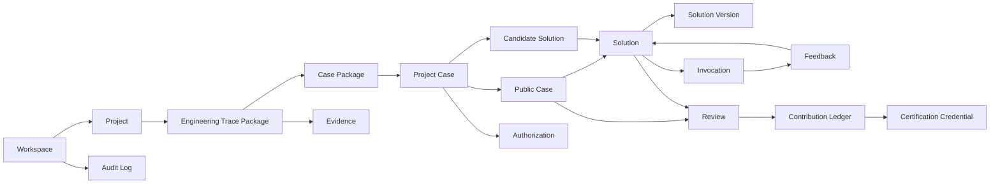

# Axiqra 工程记忆对象模型与数据预留规范

版本：重构版 v0.2  
状态：Draft  
所属体系：D06 / 18  
上游文档：D01、D02、D03、D04、D05  
下游文档：D07、D08、D09、D10、D12、D13、D14、D15、D18

## 1. 文档定位

本文档定义 Axiqra 的核心数据对象、关系、状态、权限字段和升级预留。

本文档不写数据库建表 SQL。D10 负责技术实现，D12 负责搜索索引，D13 负责权限隔离，D14-D16 负责治理制度。

## 2. 对象总览

| 对象编号 | 对象 | 中文定义 | 是否核心 | 主要作用 |
|---|---|---|---|---|
| OBJ-001 | Workspace | 空间 | 是 | 承载个人、团队、企业、公共资产 |
| OBJ-002 | Project | 项目 | 是 | 绑定仓库、系统、任务和 Project Case |
| OBJ-003 | Engineering Trace Package | 工程轨迹包 | 是 | 记录一次工程活动完整轨迹 |
| OBJ-004 | Case Package | 案例提交包 | 是 | 工程轨迹回传、导入导出的提交格式 |
| OBJ-005 | Project Case | 项目私有案例 | 是 | 保存原始、私有、可追溯工程过程 |
| OBJ-006 | Public Case | 公开学习案例 | 是 | 脱敏后面向人类学习和公开传播 |
| OBJ-007 | Solution | 工程方案记忆对象 | 是 | AI 可调用、可反馈、可进化方案 |
| OBJ-008 | Solution Version | Solution 版本 | 是 | 支持融合、分叉、废弃和回滚 |
| OBJ-009 | Invocation | 调用记录 | 是 | 记录 AI 或人调用内容和结果 |
| OBJ-010 | Feedback | 调用反馈 | 是 | worked / failed / partial / not_applicable |
| OBJ-011 | Candidate Seed | 候选种子 | 是 | 无命中和低覆盖场景的候选入口 |
| OBJ-012 | Review | 审核记录 | 是 | AI 初审、人工审核、认证审核、仲裁 |
| OBJ-013 | Authorization | 授权边界 | 是 | 控制可见、公开、评测、训练、商业使用 |
| OBJ-014 | Evidence | 证据 | 是 | 日志、diff、测试、截图、命令输出等 |
| OBJ-015 | Prompt Memory | Prompt 记忆 | 是 | 从真实工程中沉淀的提示资产 |
| OBJ-016 | Rule Memory | Rule 记忆 | 是 | AI 工具行为规则和回传规范 |
| OBJ-017 | Skill Memory | Skill 记忆 | 是 | AI 工具技能说明和配置资产 |
| OBJ-018 | Contribution Ledger | 贡献账本 | 是 | 记录贡献、反馈、审核、认证和权益 |
| OBJ-019 | Certification Credential | 认证凭证 | 是 | 能力档案、认证等级、有效期和公开验证 |
| OBJ-020 | Audit Log | 审计日志 | 是 | 权限、调用、发布、删除、审核等动作记录 |

## 3. 对象关系图

## 4. Engineering Trace Package

Engineering Trace Package（工程轨迹包）是一次真实工程活动的完整过程记录。

| 项 | 内容 |
|---|---|
| 谁创建 | AI Tool、用户、导入工具 |
| 谁确认 | 用户、Team Owner、企业 Owner |
| 输入 | 任务目标、上下文、检索结果、执行过程、证据 |
| 输出 | Case Package、Project Case、Review 输入 |
| 状态 | draft、needs_user_input、prechecked、user_confirmed、submitted、rejected |
| 权限 | 默认继承 Project / Workspace 可见范围 |
| 生命周期 | 生成 -> 预检查 -> 用户确认 -> 提交 -> Project Case |

### 字段草案

| 字段 | 类型 | 必填 | 说明 |
|---|---|---|---|
| trace_id | string | 是 | 工程轨迹 ID |
| workspace_id | string | 是 | 所属空间 |
| project_id | string | 否 | 所属项目 |
| source_tool | string | 是 | 来源 AI 工具 |
| task_goal | text | 是 | 工程任务目标 |
| forward_path | json | 是 | 正向路径 |
| reverse_path | json | 否 | 反向路径 |
| decision_path | json | 是 | 决策路径 |
| evidence_refs | json | 是 | 证据引用 |
| rollback_path | json | 否 | 回滚路径 |
| evolution_hint | json | 否 | 演化建议 |
| user_confirmation_status | enum | 是 | pending / confirmed / rejected |
| authorization_id | string | 是 | 授权边界 |
| schema_version | string | 是 | 结构版本 |

## 5. Case Package

Case Package（案例提交包）是 Engineering Trace Package 的提交格式之一，不是主资产。

| 项 | 内容 |
|---|---|
| 作用 | 用于回传、导入、导出、批量迁移 |
| 输入 | Engineering Trace Package |
| 输出 | Project Case |
| 必须包含 | task_goal、context、paths、evidence、authorization、schema_version |
| 不允许 | 未确认私有数据直接公开 |

## 6. Project Case

Project Case（项目私有案例）保存原始、私有、完整工程过程。

| 项 | 内容 |
|---|---|
| 谁创建 | 用户确认后的 Case Package |
| 谁使用 | 用户、团队、企业、AI Tool |
| 默认可见 | private_only、project_only、team_only 或 enterprise_only |
| 可流转 | 脱敏生成 Public Case，授权参与 Solution 融合 |
| 生命周期 | draft -> private -> redaction_candidate -> archived / deleted |

## 7. Public Case

Public Case（公开学习案例）是从 Project Case 脱敏、抽象、审查后的公开内容。

| 项 | 内容 |
|---|---|
| 面向 | 人类学习、公开传播、Solution 证据 |
| 必须保留 | 目标、上下文、排查、失败路径、根因、修复、验证、学习总结 |
| 必须删除 | Token、密码、密钥、客户名、内网 IP、私有路径、仓库地址 |
| 生命周期 | submitted -> reviewed -> published -> deprecated / quarantined |

## 8. Solution

Solution（工程方案记忆对象）是 AI 可调用、可反馈、可融合、可进化的标准方案。

| 项 | 内容 |
|---|---|
| 来源 | Public Case、授权 Project Case、Candidate Solution |
| 使用者 | AI Tool、人类开发者、团队、企业 |
| 必须包含 | 适用条件、不适用边界、执行步骤、验证步骤、风险、回滚、失败路径 |
| 生命周期 | Draft、Candidate、Reviewed、Verified、Stable、Canonical、Deprecated、Archived、Quarantined |

## 9. Invocation 和 Feedback

Invocation（调用记录）记录谁在什么上下文调用了什么内容。  
Feedback（调用反馈）记录调用结果。

| Feedback | 含义 | 影响 |
|---|---|---|
| worked | 有效 | 提升可信度 |
| partial | 部分有效 | 补充边界 |
| failed | 无效或失败 | 复核、降级、隔离 |
| not_applicable | 场景不适用 | 更新适用边界 |
| needs_review | 需要复核 | 进入 Review |

## 10. Candidate Seed

Candidate Seed（候选种子）用于无命中和低覆盖场景。

| 项 | 内容 |
|---|---|
| 谁创建 | 大众、AI、维护者、认证者 |
| 基础门槛 | 真实上下文、用户确认、验证证据、风险说明 |
| 状态 | draft、community_submitted、qualified、candidate_pool、claimed、resolved、closed |
| 输出 | Candidate Case、Candidate Solution、Public Case |

## 11. Prompt / Rule / Skill Memory

Prompt、Rule、Skill 不是普通提示词收藏。

| 对象 | 定义 | 绑定关系 |
|---|---|---|
| Prompt Memory | 从真实工程反馈中沉淀的提示资产 | 绑定 Solution、Case、Invocation |
| Rule Memory | 指导 AI 工具搜索、执行、回传的行为规则 | 绑定接入包、工具、Solution |
| Skill Memory | AI 工具可读取的技能描述和配置资产 | 绑定接入包、工具能力 |

## 12. 权限与授权字段

所有核心对象必须预留：

| 字段 | 说明 |
|---|---|
| workspace_id | 所属空间 |
| tenant_id | 所属租户 |
| visibility_scope | 可见范围 |
| license_scope | 授权范围 |
| trust_level | 可信等级 |
| risk_level | 风险等级 |
| redaction_status | 脱敏状态 |
| audit_required | 是否需要审计 |
| commercial_allowed | 是否允许商业使用 |
| eval_allowed | 是否允许评测 |
| training_allowed | 是否允许训练 |
| solution_merge_allowed | 是否允许参与 Solution 融合 |

## 13. 验收标准

| 编号 | 验收内容 |
|---|---|
| AC-D06-001 | 每个核心对象都有定义、创建者、使用者、输入、输出、状态、权限和生命周期 |
| AC-D06-002 | Engineering Trace Package 和 Case Package 的关系表达清楚 |
| AC-D06-003 | Project Case 和 Public Case 不混淆 |
| AC-D06-004 | Solution 与普通文章、论坛帖子、提示词模板区分清楚 |
| AC-D06-005 | 所有对象都能追溯到权限、授权、审计和反馈 |

## 14. 对象实现分层

为了避免后续开发把所有内容都做成一张大表，S1 起必须按对象职责分层。

| 分层 | 对象 | 说明 | S1 是否必须 |
|---|---|---|---|
| Identity Layer | User、Workspace、Project、Membership | 解决谁在什么空间里操作什么项目 | 是 |
| Memory Layer | Engineering Trace Package、Project Case、Public Case、Solution、Solution Version | 解决工程记忆沉淀和复用 | 是 |
| Activity Layer | Invocation、Feedback、Search Query、Connect Session | 解决 AI 调用、搜索、接入和反馈事实 | 是 |
| Governance Layer | Review、Risk Signal、Moderation Queue、Appeal | 解决审核、隔离、申诉和治理 | 是 |
| Rights Layer | Authorization、License Scope、Contribution Ledger、Certification Credential | 解决授权、贡献归因和认证身份 | S1 预留，S2 强化 |
| Evidence Layer | Evidence、Attachment、Diff Snapshot、Command Output | 解决证据文件、截图、日志、测试输出 | 是 |
| Audit Layer | Audit Log、Policy Decision Log、Export Log | 解决可追溯、企业合规和安全审计 | 是 |

开发约束：

1. Case Package 只能作为提交包或导入导出格式，不作为长期主资产表。
2. Project Case 必须保留原始工程事实，Public Case 必须是脱敏后的学习内容。
3. Solution 必须和 Case、Invocation、Feedback 有可追溯关系，不能孤立存在。
4. Authorization 必须能被 Project Case、Public Case、Solution Merge、Eval、Training、Commercial 使用共同引用。
5. Audit Log 不依赖业务表状态，即使业务动作失败，也要记录失败动作和失败原因。

## 15. 核心对象字段矩阵

下表不是最终建表 SQL，但开发拆表时必须能从这里追溯字段来源。

| 对象 | 主键 | 必填字段 | 关键状态字段 | 权限字段 | 审计字段 |
|---|---|---|---|---|---|
| Workspace | workspace_id | name、space_type、owner_user_id | status | tenant_id、visibility_scope | created_at、updated_at |
| Project | project_id | workspace_id、name、project_type | status | workspace_id、owner_user_id | created_at、updated_at |
| Engineering Trace Package | trace_id | workspace_id、task_goal、source_tool、forward_path、decision_path | user_confirmation_status、submit_status | authorization_id、visibility_scope | created_by、created_at、schema_version |
| Case Package | package_id | trace_id、schema_version、payload_hash | package_status | authorization_id | exported_at、imported_at |
| Project Case | project_case_id | trace_id、workspace_id、title、problem_summary、evidence_refs | case_status、redaction_status | visibility_scope、authorization_id | created_by、confirmed_by、created_at |
| Public Case | public_case_id | source_project_case_id、title、public_summary、redacted_content | publish_status、review_status | public_visibility、license_scope | reviewed_by、published_at |
| Solution | solution_id | title、applicability、steps、validation_steps、risk_level | solution_status、verification_level | visibility_scope、license_scope | created_by、updated_at |
| Solution Version | solution_version_id | solution_id、version_no、content_snapshot | version_status | inherited_license_scope | created_by、created_at |
| Invocation | invocation_id | caller_type、target_type、target_id、context_hash | invocation_status | workspace_id、visibility_scope | called_at、caller_id |
| Feedback | feedback_id | invocation_id、feedback_type、evidence_refs | feedback_status | workspace_id | submitted_by、submitted_at |
| Candidate Seed | seed_id | task_goal、source_type、coverage_gap、evidence_hint | seed_status、claim_status | visibility_scope | created_by、created_at |
| Review | review_id | target_type、target_id、risk_level、review_type | review_status、decision | reviewer_scope | reviewed_by、reviewed_at |
| Authorization | authorization_id | owner_id、target_type、target_id、license_scope | authorization_status | workspace_id、tenant_id | granted_by、granted_at、revoked_at |
| Evidence | evidence_id | target_type、target_id、evidence_type、storage_ref | evidence_status | visibility_scope、redaction_status | uploaded_by、created_at |
| Audit Log | audit_id | actor_id、action、target_type、target_id、result | immutable | tenant_id、workspace_id | occurred_at、request_id |

## 16. Engineering Trace Package 详细结构

Engineering Trace Package 是 Axiqra 的核心入口，必须能表达完整工程路径，而不只是结果摘要。

| 区块 | 必填 | 内容 | 示例 |
|---|---|---|---|
| task | 是 | 任务目标、用户原始意图、成功条件 | 修复部署失败并验证服务恢复 |
| environment | 是 | 技术栈、运行环境、仓库类型、版本信息 | Node 版本、OS、框架、数据库 |
| search_context | 否 | AI 执行前搜索到的 Solution、Case、Seed | solution_id、fit_score、risk_level |
| forward_path | 是 | 正向执行路径，包含步骤、命令、修改、验证 | step_no、action、reason、result |
| reverse_path | 条件必填 | 回看路径，说明为什么不是其他方案 | rejected_option、reason、evidence |
| decision_path | 是 | 关键决策点和取舍 | 为什么改配置而不是改代码 |
| failure_path | 条件必填 | 失败尝试、误判、回滚 | 尝试 A 失败，原因是端口冲突 |
| evidence | 是 | 日志、diff、测试、截图、CI、命令输出 | evidence_id 列表 |
| rollback_path | 条件必填 | 风险操作的恢复路径 | 回滚版本、恢复配置 |
| security_notes | 是 | 敏感信息、权限、生产风险 | 是否包含 token、客户名 |
| user_confirmation | 是 | 用户确认、编辑、拒绝、稍后处理 | confirmed / rejected |
| writeback_meta | 是 | 工具、版本、幂等键、schema 版本 | source_tool、idempotency_key |

字段要求：

1. `forward_path` 至少包含一个验证步骤，否则不能进入 `user_confirmed`。
2. 生产、数据库、权限、安全相关任务必须填写 `rollback_path`。
3. `reverse_path` 不是可选装饰，它用于防止 AI 下次重复错误路线。
4. `evidence` 必须引用 Evidence 对象，不能只写自然语言“已验证”。
5. `writeback_meta.idempotency_key` 必须用于防重复提交。

## 17. 状态与事件命名规范

状态用名词或形容词，事件用动词过去式或动作短语。

| 对象 | 状态字段 | 允许状态 | 关键事件 |
|---|---|---|---|
| Engineering Trace Package | submit_status | draft、prechecked、needs_user_input、user_confirmed、submitted、rejected、expired | generated、prechecked、confirmed、submitted、rejected |
| Project Case | case_status | draft、private_active、publish_requested、archived、deleted | created、confirmed、publish_requested、archived、deleted |
| Public Case | publish_status | pending_review、published、deprecated、quarantined、removed | submitted、approved、rejected、quarantined、removed |
| Solution | solution_status | draft、candidate、needs_review、reviewed、verified、stable、canonical、deprecated、quarantined、archived | promoted、downgraded、merged、forked、quarantined |
| Candidate Seed | seed_status | draft、community_submitted、qualified、candidate_pool、claimed、resolved、closed | submitted、qualified、claimed、resolved |
| Review | review_status | queued、ai_checked、human_reviewing、approved、rejected、needs_more_info、appealed、closed | assigned、decided、appealed、closed |
| Authorization | authorization_status | active、revoked、expired、superseded | granted、revoked、expired、superseded |

开发约束：

1. 状态迁移必须由明确事件触发。
2. 每次状态变化必须写入 Audit Log。
3. 禁止前端直接修改状态枚举，必须通过后端动作接口完成。
4. 状态字段要保留未知值处理，避免旧客户端遇到新状态崩溃。

## 18. 关系、唯一性与幂等规则

| 规则编号 | 规则 |
|---|---|
| REL-001 | 一个 Engineering Trace Package 可以生成一个 Project Case，但同一个 `trace_id + idempotency_key` 不能重复生成 |
| REL-002 | 一个 Project Case 可以申请生成多个 Public Case 版本，但同一时间只能有一个 active published 版本 |
| REL-003 | 一个 Public Case 可以作为多个 Solution 的证据，但必须记录贡献归因 |
| REL-004 | 一个 Solution 可以有多个 Solution Version，默认调用最新 active version |
| REL-005 | Invocation 必须绑定调用目标和调用上下文，不能只记录反馈结果 |
| REL-006 | Feedback 必须绑定 Invocation，不能直接孤立修改 Solution 等级 |
| REL-007 | Review 必须绑定目标对象，Review 结果不能脱离目标对象生效 |
| REL-008 | Authorization 变更必须影响后续可见性和融合资格，但不删除历史审计 |

幂等键建议：

| 场景 | 幂等键组成 |
|---|---|
| 提交工程轨迹 | workspace_id + source_tool + task_run_id + payload_hash |
| 创建 Project Case | trace_id + user_confirmation_version |
| 提交 Feedback | invocation_id + submitter_id + feedback_type + evidence_hash |
| 申请公开 | project_case_id + redaction_version |
| 审核决策 | review_id + reviewer_id + decision_version |

## 19. S1 最小对象集合与预留对象

S1 必须实现：

| 必须对象 | 最小能力 |
|---|---|
| Workspace | 个人空间、团队展示预留、企业字段预留 |
| Project | 项目绑定、Project Case 归属 |
| Engineering Trace Package | 接收、校验、确认、提交 |
| Project Case | 私有保存、查看、申请公开 |
| Public Case | 脱敏展示、审核后公开 |
| Solution | 基础详情、调用视图、验证等级 |
| Invocation | 调用记录 |
| Feedback | worked / failed / partial / not_applicable |
| Candidate Seed | 无命中创建、认领、关闭 |
| Review | AI 初审、人工审核、风险分层 |
| Authorization | 授权公开、融合、评测、训练、商业预留 |
| Evidence | 上传、引用、脱敏状态 |
| Audit Log | 关键动作审计 |

S1 只预留但不强做完整商业闭环：

| 预留对象 | S1 要做到什么 |
|---|---|
| Contribution Ledger | 记录贡献来源和归因，不结算复杂收益 |
| Certification Credential | 记录认证状态字段，不强做证书市场 |
| Prompt / Rule / Skill Memory | 能从 Solution 绑定，不做独立 marketplace |
| Enterprise Policy | 表结构预留，S1 可做演示或试点 |

## 20. 数据删除、撤回与历史保留

| 动作 | 对业务对象影响 | 对审计影响 | 对搜索影响 |
|---|---|---|---|
| 用户删除 Project Case | 标记 deleted，不默认展示 | 保留删除审计 | 从默认搜索移除 |
| 撤回公开授权 | Public Case 下架或转 removed | 保留授权撤回记录 | 不再进入公共召回 |
| 撤回融合授权 | Solution 保留历史版本，后续融合停止引用 | 记录撤回影响 | 重新计算证据权重 |
| 企业导出 | 不改变对象状态 | 记录导出范围和操作者 | 无影响 |
| Quarantine | 对象进入隔离态 | 记录触发原因 | 不进入默认 AI 调用 |
