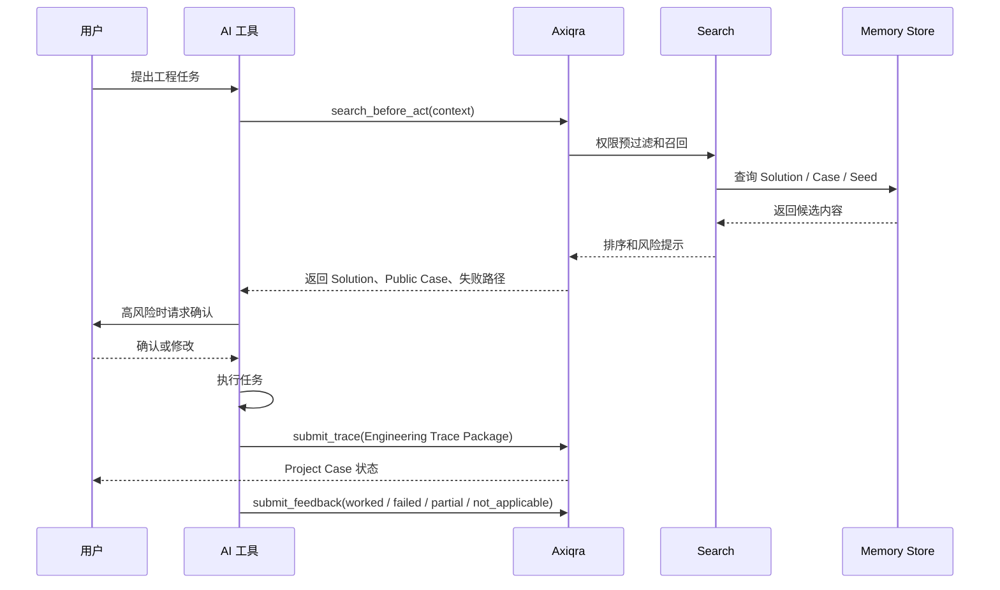

# Axiqra AI 工具接入、对话式自动接入、MCP、API、CLI 与插件协议

版本：重构版 v0.2  
状态：Draft  
所属体系：D09 / 18

## 1. 文档定位

本文档定义外部 AI 工具如何接入 Axiqra，如何 Search Before Act，如何调用 Solution，如何提交 Engineering Trace Package，如何回传 Feedback。

Axiqra 不替代 Cursor、Claude Code、Codex、Gemini CLI 或企业 Agent。

## 2. 接入方式

| 接入方式 | 作用 | 阶段 |
|---|---|---|
| 对话式自动接入 | 用户复制指令给 AI 工具，AI 自动完成安装、授权、doctor | S1 |
| 接入包 | 包含配置、规则、说明、降级路径 | S1 |
| MCP | AI 工具调用 Axiqra 能力 | S1 |
| CLI | 本地搜索、回传、doctor | S1 |
| REST API | 企业和平台集成 | S1/S2 |
| SDK | 深度集成 | S3 |
| 插件 | IDE / 工具生态 | S2+ |

## 3. AI 调用时序图



## 4. Search Before Act

输入：

| 字段 | 说明 |
|---|---|
| task_goal | 任务目标 |
| tech_stack | 技术栈 |
| error_signature | 错误签名 |
| environment | 环境 |
| risk_hint | 风险提示 |
| workspace_context | 当前空间 |
| expected_output | AI 期望得到的格式 |

输出：

| 字段 | 说明 |
|---|---|
| result_type | Solution / Public Case / Project Case / Candidate Seed |
| fit_score | 适配分 |
| verification_level | 验证等级 |
| risk_level | 风险等级 |
| usage_instruction | AI 可读执行说明 |
| failure_paths | 失败路径 |
| required_confirmation | 是否需要用户确认 |

## 5. Writeback 回传

AI 工具执行后必须提交 Engineering Trace Package。

| 情况 | 处理 |
|---|---|
| 用户确认 | 提交 Case Package |
| 用户编辑 | 重新生成或补充 |
| 用户拒绝 | 不提交 |
| 网络失败 | 本地暂存并重试 |
| 权限不足 | 提示重新授权 |
| 缺证据 | 标记 needs_user_input |

## 6. 接口草案

| API | 方法 | 路径 | 说明 |
|---|---|---|---|
| 创建接入会话 | POST | /api/connect/sessions | 生成接入指令 |
| doctor 检测 | POST | /api/connect/doctor | 检查状态 |
| 搜索 | POST | /api/search/before-act | 任务前搜索 |
| 获取 Solution | GET | /api/solutions/{id} | 获取 AI 执行视图 |
| 提交工程轨迹 | POST | /api/traces | 提交 Engineering Trace Package |
| 提交反馈 | POST | /api/invocations/{id}/feedback | worked / failed 等反馈 |

## 7. Prompt / Rule / Skill 边界

Prompt、Rule、Skill 是给 AI 工具使用的执行资产。

| 类型 | 作用 | 不是什么 |
|---|---|---|
| Prompt | 提示 AI 如何理解任务 | 不是独立售卖模板 |
| Rule | 约束 AI 搜索、执行、回传行为 | 不是主资产 |
| Skill | 描述工具能力和调用方式 | 不是全部接入方式 |

## 8. 验收标准

| 编号 | 验收内容 |
|---|---|
| AC-D09-001 | 用户可以完成真实接入会话 |
| AC-D09-002 | AI 工具能在任务前调用搜索 |
| AC-D09-003 | 高风险结果要求用户确认 |
| AC-D09-004 | AI 工具能提交 Engineering Trace Package |
| AC-D09-005 | 写回失败有重试、暂存和错误提示 |

## 9. 接入会话状态机

| 状态 | 定义 | 入口动作 | 出口动作 |
|---|---|---|---|
| created | 用户在平台创建接入会话 | create_connect_session | copied_instruction |
| instruction_copied | 用户复制接入指令 | copy_instruction | tool_started |
| tool_started | AI 工具开始执行接入 | run_install_or_config | doctor_started |
| doctor_running | doctor 检测中 | doctor_check | doctor_passed / doctor_failed |
| connected | 接入成功 | doctor_passed | token_rotated / revoked |
| degraded | 部分能力不可用 | partial_pass | repair / revoked |
| failed | 接入失败 | doctor_failed | retry |
| revoked | 授权撤回 | revoke | closed |
| expired | 会话过期 | timeout | recreate |

接入会话必须记录：

| 字段 | 说明 |
|---|---|
| connect_session_id | 接入会话 ID |
| user_id | 创建用户 |
| workspace_id | 目标空间 |
| tool_type | codex / claude_code / cursor / gemini_cli / custom |
| tool_capability | 是否支持 MCP、CLI、API、文件写回、本地缓存 |
| auth_scope | 搜索、读取、提交、反馈、审核等范围 |
| expires_at | 过期时间 |
| doctor_result | 检测结果 |
| last_seen_at | 工具最后访问时间 |

## 10. MCP 工具清单

S1 至少提供以下 MCP 能力，具体命名可在开发时按实现框架微调，但语义不能变。

| MCP Tool | 输入 | 输出 | 权限 | 说明 |
|---|---|---|---|---|
| axiqra.search_before_act | task_goal、context、workspace_id、risk_hint | ranked_results、risk_hints、required_confirmation | search:read | AI 执行前搜索 |
| axiqra.get_solution | solution_id、view_mode | solution_execution_view | solution:read | 获取 AI 可执行视图 |
| axiqra.get_public_case | public_case_id | public_case_learning_view | public_case:read | 获取公开案例 |
| axiqra.submit_trace | trace_payload、idempotency_key | trace_id、status、missing_fields | trace:write | 提交工程轨迹 |
| axiqra.submit_feedback | invocation_id、feedback_type、evidence | feedback_id、impact | feedback:write | 提交调用反馈 |
| axiqra.create_candidate_seed | task_goal、coverage_gap、evidence_hint | seed_id、status | seed:write | 创建无命中候选 |
| axiqra.doctor | connect_session_id | checks、status、repair_hints | connect:write | 接入检测 |

返回结果必须带：

1. `request_id`，用于审计和排障。
2. `schema_version`，用于工具兼容。
3. `risk_level`，用于 AI 判断是否需要确认。
4. `source_refs`，用于解释内容来源。
5. `next_actions`，用于工具继续执行或询问用户。

## 11. REST API 详细草案

| API | 请求要点 | 响应要点 | 错误码 | 幂等 |
|---|---|---|---|---|
| POST /api/connect/sessions | tool_type、workspace_id、requested_scopes | instruction、session_id、expires_at | 401、403、422 | 否 |
| POST /api/connect/doctor | session_id、tool_capability | checks、status、repair_hints | 401、404、409 | 是 |
| POST /api/search/before-act | task_goal、context、workspace_id、risk_hint | results、risk_hints、invocation_id | 401、403、422、429 | 是 |
| GET /api/solutions/{id} | view_mode、context | execution_view、version、risk | 401、403、404 | 否 |
| POST /api/traces | trace_payload、idempotency_key | trace_id、status、missing_fields | 400、401、403、409、422 | 是 |
| POST /api/project-cases/{id}/publish-request | redaction_payload、license_scope | review_id、status | 401、403、409、422 | 是 |
| POST /api/invocations/{id}/feedback | feedback_type、evidence_refs | feedback_id、impact | 401、403、404、409、422 | 是 |
| POST /api/candidate-seeds | task_goal、coverage_gap、evidence_hint | seed_id、status | 401、403、422 | 是 |

统一错误结构：

```json
{
  "request_id": "req_xxx",
  "error_code": "TRACE_MISSING_EVIDENCE",
  "message": "工程轨迹缺少验证证据",
  "details": [
    {
      "field": "evidence_refs",
      "reason": "required"
    }
  ],
  "repair_hint": "请补充测试输出、日志、截图或 diff 证据"
}
```

## 12. CLI 命令草案

| 命令 | 用途 | 示例 |
|---|---|---|
| axiqra login | 登录或绑定 token | axiqra login |
| axiqra doctor | 检测接入状态 | axiqra doctor |
| axiqra search | 本地发起 Search Before Act | axiqra search "修复构建失败" |
| axiqra solution get | 获取 Solution 执行视图 | axiqra solution get SOL-001 |
| axiqra trace submit | 提交工程轨迹 | axiqra trace submit trace.json |
| axiqra trace queue | 查看本地暂存队列 | axiqra trace queue |
| axiqra feedback | 提交反馈 | axiqra feedback INV-001 worked |
| axiqra seed create | 创建 Candidate Seed | axiqra seed create "没有找到 nginx TLS 案例" |

CLI 必须支持：

1. 本地暂存失败提交。
2. 重试和幂等。
3. 输出 JSON，便于 AI 工具读取。
4. 人类可读输出，便于开发者排障。
5. 最小权限 token，不默认申请企业级权限。

## 13. 工具能力 Manifest

每个接入工具必须声明能力，平台据此返回合适指令。

| 字段 | 说明 |
|---|---|
| tool_name | 工具名称 |
| tool_version | 工具版本 |
| supports_mcp | 是否支持 MCP |
| supports_cli | 是否支持 CLI |
| supports_local_cache | 是否支持本地缓存 |
| supports_file_evidence | 是否能引用 diff、日志、截图 |
| supports_user_confirmation | 是否能弹出或提示用户确认 |
| supports_background_retry | 是否支持后台重试 |
| max_payload_size | 单次提交最大 payload |
| safe_mode | 是否只读模式 |

如果工具不支持用户确认，高风险结果只能返回只读建议，不能返回可直接执行指令。

## 14. 写回失败、暂存与重试规则

| 场景 | 处理 |
|---|---|
| 网络失败 | 本地写入 pending queue，指数退避重试 |
| 401 | 停止重试，提示重新登录 |
| 403 | 停止重试，提示权限不足 |
| 409 | 查询幂等结果，避免重复创建 |
| 422 | 提示缺失字段，允许用户补充 |
| 429 | 降速重试 |
| payload 过大 | 拆分证据附件，只提交引用 |

本地暂存最少包含：

1. trace_payload。
2. idempotency_key。
3. target_workspace_id。
4. created_at。
5. retry_count。
6. last_error。
7. user_confirmation_snapshot。

## 15. 鉴权与权限范围

| Scope | 能力 |
|---|---|
| search:read | 搜索当前可见内容 |
| solution:read | 读取 Solution 执行视图 |
| public_case:read | 读取 Public Case |
| trace:write | 提交 Engineering Trace Package |
| feedback:write | 提交 Feedback |
| seed:write | 创建 Candidate Seed |
| project_case:read | 读取授权 Project Case |
| project_case:write | 创建或编辑 Project Case |
| review:write | 审核内容 |
| audit:read | 查看审计 |

权限原则：

1. 接入工具默认只拿搜索、读取、提交轨迹、反馈权限。
2. 企业空间 token 必须绑定 tenant_id 和 workspace_id。
3. Token 泄露时可以撤回，不影响已经生成的历史审计。
4. 高风险权限必须短期有效，不能长期开放。
