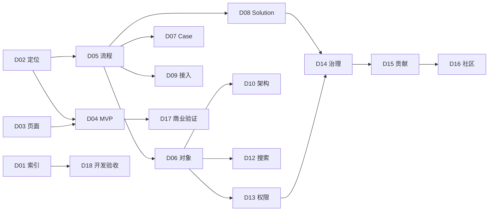

# Axiqra 文档中心

本文档是 Axiqra 产品文档体系入口，用于开发、排期、验收、测试和后续维护。

Axiqra 的定位是：

```text
AI Agent 时代的工程方案记忆层。
```

它不是知识库，不是提示词库，不是论坛，不是 Cursor / Claude Code / Codex 替代品，也不是第一阶段自研 Agent。Axiqra 让外部 AI 工具在工程任务前调用真实工程记忆，在任务后回传完整工程轨迹，并通过 Case、Solution、Invocation、Feedback、Review 和 Authorization 形成持续进化闭环。

## 0. 当前补强状态

本轮已经把 D05-D18 从“体系骨架版”补强到“v0.2 开发规格增强版”。重点补充了流程到开发规格映射、对象字段矩阵、状态迁移条件、MCP / API / CLI 草案、技术模块边界、搜索排序规则、RBAC / ABAC、自动审核规则、贡献账本、社区仲裁、冷启动内容池和日本式开发 Gate。

当前仍不是最终 4000-8000 个末级功能点清单，但已经具备继续扩 Excel、拆开发任务、写验收标准和组织评审的基础。

## 1. 阅读顺序

| 顺序 | 文档 | 作用 |
|---:|---|---|
| 1 | `01-文档总索引与来源继承表.md` | 全部文档体系、来源、状态和写作规则 |
| 2 | `00-Axiqra产品介绍与全流程总览.md` | 产品介绍和全流程理解 |
| 3 | `00-Axiqra产品闭环图谱.md` | 产品闭环、共享节点和后续图谱依据 |
| 4 | `02-产品核心定位、阶段边界与设计原则.md` | 产品根部定位和边界 |
| 5 | `03-完整原型与页面体系说明.md` | 页面、原型、交互和前端验收 |
| 6 | `04-MVP 实施范围与版本路线.md` | MVP、阶段路线和首版范围 |
| 7 | `05-用户、AI Agent 与人类学习双主线流程.md` | AI 调用、人类学习和工程轨迹回传流程 |
| 8 | `06-工程记忆对象模型与数据预留规范.md` | 核心对象和字段预留 |
| 9 | `07-Case、Public Case 与 Project Case 内容规范.md` | Case 内容、脱敏和公开规范 |
| 10 | `08-Solution 生命周期、状态机与验证等级.md` | Solution 状态机和 Verification Level |
| 11 | `09-AI工具接入、对话式自动接入、MCP、API、CLI与插件协议.md` | 外部 AI 工具接入和回传协议 |
| 12 | `10-技术架构设计说明书.md` | S1 MVP 技术架构 |
| 13 | `11-架构演进、升级迁移与规模化实施方案.md` | S2-S4 架构演进 |
| 14 | `12-搜索、索引、推荐、排序与评测体系.md` | Search Before Act、排序和评测 |
| 15 | `13-权限、空间、数据隔离与企业空间方案.md` | 空间、权限、企业和审计 |
| 16 | `14-内容治理、审核、可信来源与污染隔离机制.md` | 审核、污染隔离和可信来源 |
| 17 | `15-贡献者激励、收益池、积分与权益机制.md` | 贡献账本、认证和权益 |
| 18 | `16-社区贡献、维护者、仲裁与争议处理机制.md` | 社区治理、申诉和仲裁 |
| 19 | `17-冷启动、种子内容、传播页面与商业验证方案.md` | 冷启动、商业验证和传播 |
| 20 | `18-开发任务拆解、验收标准、风险与文档维护机制.md` | 日本式开发规格、验收、风险和维护 |

## 2. 核心文档

| 文档 | 是否核心 | 理由 |
|---|---|---|
| `02-产品核心定位、阶段边界与设计原则.md` | 是 | 防止产品跑偏 |
| `04-MVP 实施范围与版本路线.md` | 是 | 决定首版范围 |
| `05-用户、AI Agent 与人类学习双主线流程.md` | 是 | 定义主流程和闭环 |
| `06-工程记忆对象模型与数据预留规范.md` | 是 | 指导数据建模 |
| `08-Solution 生命周期、状态机与验证等级.md` | 是 | 决定可信机制 |
| `09-AI工具接入、对话式自动接入、MCP、API、CLI与插件协议.md` | 是 | 决定外部 AI 调用 |
| `12-搜索、索引、推荐、排序与评测体系.md` | 是 | 决定 Search Before Act |
| `13-权限、空间、数据隔离与企业空间方案.md` | 是 | 决定企业和私有边界 |
| `14-内容治理、审核、可信来源与污染隔离机制.md` | 是 | 决定公开和质量治理 |
| `18-开发任务拆解、验收标准、风险与文档维护机制.md` | 是 | 指导开发和 QA 验收 |

## 3. 开发必读

开发人员至少需要阅读：

1. `02-产品核心定位、阶段边界与设计原则.md`
2. `03-完整原型与页面体系说明.md`
3. `04-MVP 实施范围与版本路线.md`
4. `05-用户、AI Agent 与人类学习双主线流程.md`
5. `06-工程记忆对象模型与数据预留规范.md`
6. `09-AI工具接入、对话式自动接入、MCP、API、CLI与插件协议.md`
7. `10-技术架构设计说明书.md`
8. `12-搜索、索引、推荐、排序与评测体系.md`
9. `13-权限、空间、数据隔离与企业空间方案.md`
10. `18-开发任务拆解、验收标准、风险与文档维护机制.md`

## 4. 验收必读

QA 和验收人员至少需要阅读：

1. `04-MVP 实施范围与版本路线.md`
2. `05-用户、AI Agent 与人类学习双主线流程.md`
3. `07-Case、Public Case 与 Project Case 内容规范.md`
4. `08-Solution 生命周期、状态机与验证等级.md`
5. `13-权限、空间、数据隔离与企业空间方案.md`
6. `14-内容治理、审核、可信来源与污染隔离机制.md`
7. `18-开发任务拆解、验收标准、风险与文档维护机制.md`
8. `Axiqra_功能开发与验收明细.xlsx`

## 5. 文档关系



## 6. 交付物

| 交付物 | 路径 |
|---|---|
| 文档总索引 | `01-文档总索引与来源继承表.md` |
| 文档中心入口 | `README.md` |
| 产品总览 | `00-Axiqra产品介绍与全流程总览.md` |
| 闭环图谱 | `00-Axiqra产品闭环图谱.md` |
| Excel 开发与验收明细 | `Axiqra_功能开发与验收明细.xlsx` |
| 交付说明 | `交付说明.md` |

## 7. 明天验收建议顺序

1. 先看 `README.md` 和 `01-文档总索引与来源继承表.md`。
2. 再看 `02`、`04`、`05`，确认产品定位、MVP 范围和主流程。
3. 再看 `06`、`08`、`09`、`12`，确认对象、Solution、AI 接入和搜索。
4. 再看 `13`、`14`、`15`、`16`，确认企业、治理和贡献体系。
5. 最后打开 `Axiqra_功能开发与验收明细.xlsx`，按功能、任务、验收、测试和权限逐项抽查。
